# Making sea ice climatologies

Below, I describe how I make climatologies for certain sea ice variables for the `EC-Earth3P-HR` and `HadGEM3-GC31` models.
This assumes you have already gone through {doc}`Trimming data to the CAA region <../docs_data/trim_to_CAA_region>`, {doc}`Calculating 'siconc' from 'sithick' and 'sivol' <../docs_data/siconc_from_sithick_and_sivol>`, and {doc}`Trends in landfast ice over time  <../docs_analysis/landfast_trends>`.

## Contents

- [Introduction](#introduction)
- [Making a climatology](#making-a-climatology)
    - [Finding means of each month](#finding-means-of-each-month)
    - [Saving climatologies to file](#saving-climatologies-to-file)
- [Plotting Climatologies](#plotting-climatologies)
    - [Plotting Climatologies for EC-Earth3P-HR](#plotting-climatologies-for-ec-earth3p-hr)
    - [Plotting Climatologies for HadGEM3-GC31-MM](#plotting-climatologies-for-hadgem3-gc31-mm)
- [Climatology of landfast ice](#climatology-of-landfast-ice)
    - [Climatology of landfast ice for EC-Earth3P-HR](#climatology-of-landfast-ice-for-ec-earth3p-hr)
    - [Climatology of landfast ice for HadGEM3-GC31-MM](#climatology-of-landfast-ice-for-hadgem3-gc31-mm)

---

## Introduction
[back to top](#making-sea-ice-climatologies)

Climatologies are useful for giving context to long-term trends.
Below, I create climatologies of various sea ice variables over the first 20 years of the historical experiment of the models, 1959-1969.
These provide a baseline of the general state of the sea ice properties at the beginning of the time series against which long-term changes can be compared.

---

## Making a climatology
[back to top](#making-sea-ice-climatologies)

The climatology I want to make will be over just the years 1950 through 1969.
My first step is to use the `select_files_by_time()` function I wrote to just pick out the appropriate years for a particular variable. 
I will use `sithick` data from `EC-Earth3P-HR` as an example.
```python
from arctichoke.path import list_variable_files, select_files_by_time

filelist = list_variable_files(
    source_id = 'EC-Earth3P-HR',
    variable_id = 'sithick',
    variant_label = 'r1i1p2f1',
    with_modification = 'trim_CAA_',
    verbose = True,
)
filelist = select_files_by_time(
    filelist,
    start = 1950,
    end = 1969,
    verbose = True,
)
filelist
```
```console
(list_variable_files) Found 65 files.
(select_files_by_time) Found 20 files.
['/arctichoke_data/bergybits/data/CMIP6/HighResMIP/EC-Earth-Consortium/EC-Earth3P-HR/hist-1950/r1i1p2f1/SImon/sithick/gn/v20181212/trim_CAA_sithick_SImon_EC-Earth3P-HR_hist-1950_r1i1p2f1_gn_195001-195012.nc',
 '/arctichoke_data/bergybits/data/CMIP6/HighResMIP/EC-Earth-Consortium/EC-Earth3P-HR/hist-1950/r1i1p2f1/SImon/sithick/gn/v20181212/trim_CAA_sithick_SImon_EC-Earth3P-HR_hist-1950_r1i1p2f1_gn_195101-195112.nc',
 '/arctichoke_data/bergybits/data/CMIP6/HighResMIP/EC-Earth-Consortium/EC-Earth3P-HR/hist-1950/r1i1p2f1/SImon/sithick/gn/v20181212/trim_CAA_sithick_SImon_EC-Earth3P-HR_hist-1950_r1i1p2f1_gn_195201-195212.nc',
 '/arctichoke_data/bergybits/data/CMIP6/HighResMIP/EC-Earth-Consortium/EC-Earth3P-HR/hist-1950/r1i1p2f1/SImon/sithick/gn/v20181212/trim_CAA_sithick_SImon_EC-Earth3P-HR_hist-1950_r1i1p2f1_gn_195301-195312.nc',
 '/arctichoke_data/bergybits/data/CMIP6/HighResMIP/EC-Earth-Consortium/EC-Earth3P-HR/hist-1950/r1i1p2f1/SImon/sithick/gn/v20181212/trim_CAA_sithick_SImon_EC-Earth3P-HR_hist-1950_r1i1p2f1_gn_195401-195412.nc',
 '/arctichoke_data/bergybits/data/CMIP6/HighResMIP/EC-Earth-Consortium/EC-Earth3P-HR/hist-1950/r1i1p2f1/SImon/sithick/gn/v20181212/trim_CAA_sithick_SImon_EC-Earth3P-HR_hist-1950_r1i1p2f1_gn_195501-195512.nc',
 '/arctichoke_data/bergybits/data/CMIP6/HighResMIP/EC-Earth-Consortium/EC-Earth3P-HR/hist-1950/r1i1p2f1/SImon/sithick/gn/v20181212/trim_CAA_sithick_SImon_EC-Earth3P-HR_hist-1950_r1i1p2f1_gn_195601-195612.nc',
 '/arctichoke_data/bergybits/data/CMIP6/HighResMIP/EC-Earth-Consortium/EC-Earth3P-HR/hist-1950/r1i1p2f1/SImon/sithick/gn/v20181212/trim_CAA_sithick_SImon_EC-Earth3P-HR_hist-1950_r1i1p2f1_gn_195701-195712.nc',
 '/arctichoke_data/bergybits/data/CMIP6/HighResMIP/EC-Earth-Consortium/EC-Earth3P-HR/hist-1950/r1i1p2f1/SImon/sithick/gn/v20181212/trim_CAA_sithick_SImon_EC-Earth3P-HR_hist-1950_r1i1p2f1_gn_195801-195812.nc',
 '/arctichoke_data/bergybits/data/CMIP6/HighResMIP/EC-Earth-Consortium/EC-Earth3P-HR/hist-1950/r1i1p2f1/SImon/sithick/gn/v20181212/trim_CAA_sithick_SImon_EC-Earth3P-HR_hist-1950_r1i1p2f1_gn_195901-195912.nc',
 '/arctichoke_data/bergybits/data/CMIP6/HighResMIP/EC-Earth-Consortium/EC-Earth3P-HR/hist-1950/r1i1p2f1/SImon/sithick/gn/v20181212/trim_CAA_sithick_SImon_EC-Earth3P-HR_hist-1950_r1i1p2f1_gn_196001-196012.nc',
 '/arctichoke_data/bergybits/data/CMIP6/HighResMIP/EC-Earth-Consortium/EC-Earth3P-HR/hist-1950/r1i1p2f1/SImon/sithick/gn/v20181212/trim_CAA_sithick_SImon_EC-Earth3P-HR_hist-1950_r1i1p2f1_gn_196101-196112.nc',
 '/arctichoke_data/bergybits/data/CMIP6/HighResMIP/EC-Earth-Consortium/EC-Earth3P-HR/hist-1950/r1i1p2f1/SImon/sithick/gn/v20181212/trim_CAA_sithick_SImon_EC-Earth3P-HR_hist-1950_r1i1p2f1_gn_196201-196212.nc',
 '/arctichoke_data/bergybits/data/CMIP6/HighResMIP/EC-Earth-Consortium/EC-Earth3P-HR/hist-1950/r1i1p2f1/SImon/sithick/gn/v20181212/trim_CAA_sithick_SImon_EC-Earth3P-HR_hist-1950_r1i1p2f1_gn_196301-196312.nc',
 '/arctichoke_data/bergybits/data/CMIP6/HighResMIP/EC-Earth-Consortium/EC-Earth3P-HR/hist-1950/r1i1p2f1/SImon/sithick/gn/v20181212/trim_CAA_sithick_SImon_EC-Earth3P-HR_hist-1950_r1i1p2f1_gn_196401-196412.nc',
 '/arctichoke_data/bergybits/data/CMIP6/HighResMIP/EC-Earth-Consortium/EC-Earth3P-HR/hist-1950/r1i1p2f1/SImon/sithick/gn/v20181212/trim_CAA_sithick_SImon_EC-Earth3P-HR_hist-1950_r1i1p2f1_gn_196501-196512.nc',
 '/arctichoke_data/bergybits/data/CMIP6/HighResMIP/EC-Earth-Consortium/EC-Earth3P-HR/hist-1950/r1i1p2f1/SImon/sithick/gn/v20181212/trim_CAA_sithick_SImon_EC-Earth3P-HR_hist-1950_r1i1p2f1_gn_196601-196612.nc',
 '/arctichoke_data/bergybits/data/CMIP6/HighResMIP/EC-Earth-Consortium/EC-Earth3P-HR/hist-1950/r1i1p2f1/SImon/sithick/gn/v20181212/trim_CAA_sithick_SImon_EC-Earth3P-HR_hist-1950_r1i1p2f1_gn_196701-196712.nc',
 '/arctichoke_data/bergybits/data/CMIP6/HighResMIP/EC-Earth-Consortium/EC-Earth3P-HR/hist-1950/r1i1p2f1/SImon/sithick/gn/v20181212/trim_CAA_sithick_SImon_EC-Earth3P-HR_hist-1950_r1i1p2f1_gn_196801-196812.nc',
 '/arctichoke_data/bergybits/data/CMIP6/HighResMIP/EC-Earth-Consortium/EC-Earth3P-HR/hist-1950/r1i1p2f1/SImon/sithick/gn/v20181212/trim_CAA_sithick_SImon_EC-Earth3P-HR_hist-1950_r1i1p2f1_gn_196901-196912.nc']
```

### Finding means of each month
[back to top](#making-sea-ice-climatologies)

Next, I want to find the mean of each month. 
This involves taking the values for a particular month for every year and finding the mean.
Luckily, `xarray` has a built-in way of doing this.
First, I'll load the files I identified above as a dataset.
```python
import xarray as xr 

dataset = xr.open_mfdataset(filelist)
print(dataset)
```
```console
<xarray.Dataset> Size: 1GB
Dimensions:         (time: 240, bnds: 2, j: 199, i: 655, vertices: 4)
Coordinates:
  * time            (time) datetime64[ns] 2kB 1950-01-16T12:00:00 ... 1969-12...
  * j               (j) float64 2kB 852.0 853.0 854.0 ... 1.049e+03 1.05e+03
  * i               (i) float64 5kB 426.0 427.0 428.0 ... 1.079e+03 1.08e+03
    longitude       (j, i) float32 521kB dask.array<chunksize=(199, 655), meta=np.ndarray>
    latitude        (j, i) float32 521kB dask.array<chunksize=(199, 655), meta=np.ndarray>
Dimensions without coordinates: bnds, vertices
Data variables:
    time_bnds       (time, bnds) datetime64[ns] 4kB dask.array<chunksize=(1, 2), meta=np.ndarray>
    longitude_bnds  (time, j, i, vertices) float32 501MB dask.array<chunksize=(12, 199, 655, 4), meta=np.ndarray>
    latitude_bnds   (time, j, i, vertices) float32 501MB dask.array<chunksize=(12, 199, 655, 4), meta=np.ndarray>
    sithick         (time, j, i) float32 125MB dask.array<chunksize=(1, 199, 655), meta=np.ndarray>
Attributes: (12/48)
    CDI:                    Climate Data Interface version 2.5.1 (https://mpi...
    ...                     ...
```

Next, I'll use the `groupby()` method to apply `mean()` to each month of the year.
```python
dataset_clim = dataset.groupby('time.month').mean(dim='time')
print(dataset_clim)
```
```console
<xarray.Dataset> Size: 57MB
Dimensions:         (month: 12, bnds: 2, j: 199, i: 655, vertices: 4)
Coordinates:
  * month           (month) int64 96B 1 2 3 4 5 6 7 8 9 10 11 12
  * j               (j) float64 2kB 852.0 853.0 854.0 ... 1.049e+03 1.05e+03
  * i               (i) float64 5kB 426.0 427.0 428.0 ... 1.079e+03 1.08e+03
    longitude       (j, i) float32 521kB dask.array<chunksize=(199, 655), meta=np.ndarray>
    latitude        (j, i) float32 521kB dask.array<chunksize=(199, 655), meta=np.ndarray>
Dimensions without coordinates: bnds, vertices
Data variables:
    time_bnds       (month, bnds) datetime64[ns] 192B dask.array<chunksize=(1, 2), meta=np.ndarray>
    longitude_bnds  (month, j, i, vertices) float32 25MB dask.array<chunksize=(1, 199, 655, 4), meta=np.ndarray>
    latitude_bnds   (month, j, i, vertices) float32 25MB dask.array<chunksize=(1, 199, 655, 4), meta=np.ndarray>
    sithick         (month, j, i) float32 6MB dask.array<chunksize=(1, 199, 655), meta=np.ndarray>
Attributes: (12/48)
    CDI:                    Climate Data Interface version 2.5.1 (https://mpi...
    ...                     ...
```

I wrote this functionality into a function `sum_by_month()` which functions very similarly to `sum_by_year()` which I introduced in {doc}`Trends in landfast ice over time  <../docs_analysis/landfast_trends>`. 
I take the mean instead of the sum by using the argument `find_mean=True` and that function automatically adjusts the metadata attributes of the dataset to reflect the changes. 
```python
from arctichoke.analysis import sum_by_month 

dataset_clim = sum_by_month(
    dataset,
    find_mean=True,
    verbose = True,
)
print(dataset_clim)
print(dataset_clim['sithick_month_mean'])
```
```console
(sum_by_month) `save_as`: None
(sum_by_month) `data_var_list`: ['time_bnds', 'longitude_bnds', 'latitude_bnds', 'sithick']
(sum_by_month) Removing `meta_var`: time_bnds
(sum_by_month) Removing `meta_var`: latitude_bnds
(sum_by_month) Removing `meta_var`: longitude_bnds
(sum_by_month) Completed taking the mean by month.
(sum_by_month) Modifying the dataset attributes.

<xarray.Dataset> Size: 7MB
Dimensions:             (month: 12, j: 199, i: 655)
Coordinates:
  * month               (month) int64 96B 1 2 3 4 5 6 7 8 9 10 11 12
  * j                   (j) float64 2kB 852.0 853.0 854.0 ... 1.049e+03 1.05e+03
  * i                   (i) float64 5kB 426.0 427.0 428.0 ... 1.079e+03 1.08e+03
    longitude           (j, i) float32 521kB dask.array<chunksize=(199, 655), meta=np.ndarray>
    latitude            (j, i) float32 521kB dask.array<chunksize=(199, 655), meta=np.ndarray>
Data variables:
    sithick_month_mean  (month, j, i) float32 6MB dask.array<chunksize=(1, 199, 655), meta=np.ndarray>
Attributes: (12/48)
    CDI:                    Climate Data Interface version 2.5.1 (https://mpi...
    ...                     ...

<xarray.DataArray 'sithick_month_mean' (month: 12, j: 199, i: 655)> Size: 6MB
dask.array<concatenate, shape=(12, 199, 655), dtype=float32, chunksize=(1, 199, 655), chunktype=numpy.ndarray>
Coordinates:
  * month      (month) int64 96B 1 2 3 4 5 6 7 8 9 10 11 12
  * j          (j) float64 2kB 852.0 853.0 854.0 ... 1.049e+03 1.05e+03
  * i          (i) float64 5kB 426.0 427.0 428.0 ... 1.079e+03 1.08e+03
    longitude  (j, i) float32 521kB dask.array<chunksize=(199, 655), meta=np.ndarray>
    latitude   (j, i) float32 521kB dask.array<chunksize=(199, 655), meta=np.ndarray>
Attributes:
    standard_name:  sithick_month_mean
    long_name:      Monthly mean of Sea Ice Thickness
    units:          m
    comment:        Monthly mean of Actual (floe) thickness of sea ice (NOT v...
    original_name:  sithick_month_mean
    cell_methods:   area: time: mean where sea_ice (comment: mask=siconc or s...
    history:        2026-08-12T18:10:51Z altered by `arctichoke`: Calculated ...
    ...
```

I then wrote all the above code into a `make_climatology()` function where all I need to do is specify the model, variable, etc. and I will be given back a dataset which is the monthly climatology.
This function has arguments for `start_year` and `end_year`, but the defaults are set to 1950-1969.
The function also adds attributes which are then used by my plotting functions to adjust the titles and labels appropriately. 
Below, I plot the climatology for September.
```python
from arctichoke.analysis import make_climatology

dataset_clim = make_climatology(
    this_source_id = 'EC-Earth3P-HR',
    this_var = 'sithick',
    this_variant_label = 'r1i1p2f1',
    this_modification = 'trim_CAA_',
)

from arctichoke.plot import quadmesh_map

quadmesh_map(
    dataset_clim.sel(month=9),
    'sithick_month_mean',
    clims = [0,5],
)
```
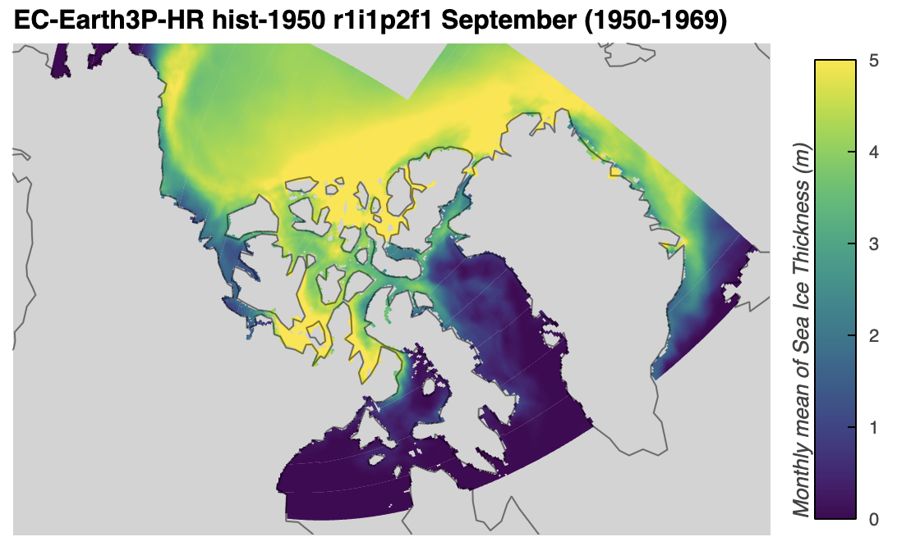

### Saving climatologies to file
[back to top](#making-sea-ice-climatologies)

I plan on using the data of these climatologies in further analyses, so I added a `save_files` argument to my `make_climatology()` function.
First, I'll generate the climatology files for regular variables. 
```python
from arctichoke.analysis import make_climatology

this_model = 'EC-Earth3P-HR'
set_verbose = False

for this_si_var in [
    'siconc',
    'sispeed',
    'sithick',
    'sivol',
]:
    for this_variant_label in [
        'r1i1p2f1', 
        'r2i1p2f1', 
        'r3i1p2f1',
    ]:
        make_climatology(
            this_source_id = this_model,
            this_var = this_si_var,
            this_variant_label = this_variant_label,
            this_modification = 'trim_CAA_',
            save_files = True,
            verbose = False,
        )
```
```console
	(save_climatology_files) Writing file `/arctichoke_data/bergybits/data/CMIP6/HighResMIP/EC-Earth-Consortium/EC-Earth3P-HR/hist-1950/r1i1p2f1/SImon/siconc_month_mean/gn/v20181212/trim_CAA_siconc_month_mean_SImon_EC-Earth3P-HR_hist-1950_r1i1p2f1_gn_195001-196912.nc`
	(save_climatology_files) Writing file `/arctichoke_data/bergybits/data/CMIP6/HighResMIP/EC-Earth-Consortium/EC-Earth3P-HR/hist-1950/r2i1p2f1/SImon/siconc_month_mean/gn/v20190625/trim_CAA_siconc_month_mean_SImon_EC-Earth3P-HR_hist-1950_r2i1p2f1_gn_195001-196912.nc`
	(save_climatology_files) Writing file `/arctichoke_data/bergybits/data/CMIP6/HighResMIP/EC-Earth-Consortium/EC-Earth3P-HR/hist-1950/r3i1p2f1/SImon/siconc_month_mean/gn/v20190214/trim_CAA_siconc_month_mean_SImon_EC-Earth3P-HR_hist-1950_r3i1p2f1_gn_195001-196912.nc`
	(save_climatology_files) Writing file `/arctichoke_data/bergybits/data/CMIP6/HighResMIP/EC-Earth-Consortium/EC-Earth3P-HR/hist-1950/r1i1p2f1/SImon/sispeed_month_mean/gn/v20181212/trim_CAA_sispeed_month_mean_SImon_EC-Earth3P-HR_hist-1950_r1i1p2f1_gn_195001-196912.nc`
	(save_climatology_files) Writing file `/arctichoke_data/bergybits/data/CMIP6/HighResMIP/EC-Earth-Consortium/EC-Earth3P-HR/hist-1950/r2i1p2f1/SImon/sispeed_month_mean/gn/v20190625/trim_CAA_sispeed_month_mean_SImon_EC-Earth3P-HR_hist-1950_r2i1p2f1_gn_195001-196912.nc`
	(save_climatology_files) Writing file `/arctichoke_data/bergybits/data/CMIP6/HighResMIP/EC-Earth-Consortium/EC-Earth3P-HR/hist-1950/r3i1p2f1/SImon/sispeed_month_mean/gn/v20190214/trim_CAA_sispeed_month_mean_SImon_EC-Earth3P-HR_hist-1950_r3i1p2f1_gn_195001-196912.nc`
	(save_climatology_files) Writing file `/arctichoke_data/bergybits/data/CMIP6/HighResMIP/EC-Earth-Consortium/EC-Earth3P-HR/hist-1950/r1i1p2f1/SImon/sithick_month_mean/gn/v20181212/trim_CAA_sithick_month_mean_SImon_EC-Earth3P-HR_hist-1950_r1i1p2f1_gn_195001-196912.nc`
	(save_climatology_files) Writing file `/arctichoke_data/bergybits/data/CMIP6/HighResMIP/EC-Earth-Consortium/EC-Earth3P-HR/hist-1950/r2i1p2f1/SImon/sithick_month_mean/gn/v20190625/trim_CAA_sithick_month_mean_SImon_EC-Earth3P-HR_hist-1950_r2i1p2f1_gn_195001-196912.nc`
	(save_climatology_files) Writing file `/arctichoke_data/bergybits/data/CMIP6/HighResMIP/EC-Earth-Consortium/EC-Earth3P-HR/hist-1950/r3i1p2f1/SImon/sithick_month_mean/gn/v20190214/trim_CAA_sithick_month_mean_SImon_EC-Earth3P-HR_hist-1950_r3i1p2f1_gn_195001-196912.nc`
	(save_climatology_files) Writing file `/arctichoke_data/bergybits/data/CMIP6/HighResMIP/EC-Earth-Consortium/EC-Earth3P-HR/hist-1950/r1i1p2f1/SImon/sivol_month_mean/gn/v20181212/trim_CAA_sivol_month_mean_SImon_EC-Earth3P-HR_hist-1950_r1i1p2f1_gn_195001-196912.nc`
	(save_climatology_files) Writing file `/arctichoke_data/bergybits/data/CMIP6/HighResMIP/EC-Earth-Consortium/EC-Earth3P-HR/hist-1950/r2i1p2f1/SImon/sivol_month_mean/gn/v20190625/trim_CAA_sivol_month_mean_SImon_EC-Earth3P-HR_hist-1950_r2i1p2f1_gn_195001-196912.nc`
	(save_climatology_files) Writing file `/arctichoke_data/bergybits/data/CMIP6/HighResMIP/EC-Earth-Consortium/EC-Earth3P-HR/hist-1950/r3i1p2f1/SImon/sivol_month_mean/gn/v20190214/trim_CAA_sivol_month_mean_SImon_EC-Earth3P-HR_hist-1950_r3i1p2f1_gn_195001-196912.nc`
```

Next, I'll generate them for the marker variables. 
Here, it is important to specify the `version_id` as this avoids accidentally including data from multiple `version_id`s for the same variable.
This becomes relevant in the next section [Plotting climatologies](#plotting-climatologies) as I generate versions of `silandfast` data files with the `version_id`s of `with_siconc_clim` and `with_sispeed_clim`. 
To be sure the files are generated as expected, use `verbose=True` and note the number of files found by `list_variable_files()` and `select_files_by_time()`.
```python
from arctichoke.analysis import make_climatology

this_model = 'EC-Earth3P-HR'
set_verbose = False

for this_si_var in [
    'silandfast',
    'sipacked',
    'sislow',
    'simultiyear',
]:
    for this_variant_label in [
        'r1i1p2f1', 
        'r2i1p2f1', 
        'r3i1p2f1',
    ]:
        make_climatology(
            this_source_id = this_model,
            this_var = this_si_var,
            this_variant_label = this_variant_label,
            this_modification = 'trim_CAA_',
            version_id = 'v20260617',
            save_files = True,
            verbose = False,
        )
```
```console
	(save_climatology_files) Writing file `/arctichoke_data/bergybits/data/CMIP6/HighResMIP/EC-Earth-Consortium/EC-Earth3P-HR/hist-1950/r1i1p2f1/SImon/silandfast_month_mean/gn/v20260617/trim_CAA_silandfast_month_mean_SImon_EC-Earth3P-HR_hist-1950_r1i1p2f1_gn_195001-196912.nc`
	(save_climatology_files) Writing file `/arctichoke_data/bergybits/data/CMIP6/HighResMIP/EC-Earth-Consortium/EC-Earth3P-HR/hist-1950/r2i1p2f1/SImon/silandfast_month_mean/gn/v20260617/trim_CAA_silandfast_month_mean_SImon_EC-Earth3P-HR_hist-1950_r2i1p2f1_gn_195001-196912.nc`
	(save_climatology_files) Writing file `/arctichoke_data/bergybits/data/CMIP6/HighResMIP/EC-Earth-Consortium/EC-Earth3P-HR/hist-1950/r3i1p2f1/SImon/silandfast_month_mean/gn/v20260617/trim_CAA_silandfast_month_mean_SImon_EC-Earth3P-HR_hist-1950_r3i1p2f1_gn_195001-196912.nc`
	(save_climatology_files) Writing file `/arctichoke_data/bergybits/data/CMIP6/HighResMIP/EC-Earth-Consortium/EC-Earth3P-HR/hist-1950/r1i1p2f1/SImon/sipacked_month_mean/gn/v20260617/trim_CAA_sipacked_month_mean_SImon_EC-Earth3P-HR_hist-1950_r1i1p2f1_gn_195001-196912.nc`
	(save_climatology_files) Writing file `/arctichoke_data/bergybits/data/CMIP6/HighResMIP/EC-Earth-Consortium/EC-Earth3P-HR/hist-1950/r2i1p2f1/SImon/sipacked_month_mean/gn/v20260617/trim_CAA_sipacked_month_mean_SImon_EC-Earth3P-HR_hist-1950_r2i1p2f1_gn_195001-196912.nc`
	(save_climatology_files) Writing file `/arctichoke_data/bergybits/data/CMIP6/HighResMIP/EC-Earth-Consortium/EC-Earth3P-HR/hist-1950/r3i1p2f1/SImon/sipacked_month_mean/gn/v20260617/trim_CAA_sipacked_month_mean_SImon_EC-Earth3P-HR_hist-1950_r3i1p2f1_gn_195001-196912.nc`
	(save_climatology_files) Writing file `/arctichoke_data/bergybits/data/CMIP6/HighResMIP/EC-Earth-Consortium/EC-Earth3P-HR/hist-1950/r1i1p2f1/SImon/sislow_month_mean/gn/v20260617/trim_CAA_sislow_month_mean_SImon_EC-Earth3P-HR_hist-1950_r1i1p2f1_gn_195001-196912.nc`
	(save_climatology_files) Writing file `/arctichoke_data/bergybits/data/CMIP6/HighResMIP/EC-Earth-Consortium/EC-Earth3P-HR/hist-1950/r2i1p2f1/SImon/sislow_month_mean/gn/v20260617/trim_CAA_sislow_month_mean_SImon_EC-Earth3P-HR_hist-1950_r2i1p2f1_gn_195001-196912.nc`
	(save_climatology_files) Writing file `/arctichoke_data/bergybits/data/CMIP6/HighResMIP/EC-Earth-Consortium/EC-Earth3P-HR/hist-1950/r3i1p2f1/SImon/sislow_month_mean/gn/v20260617/trim_CAA_sislow_month_mean_SImon_EC-Earth3P-HR_hist-1950_r3i1p2f1_gn_195001-196912.nc`
	(save_climatology_files) Writing file `/arctichoke_data/bergybits/data/CMIP6/HighResMIP/EC-Earth-Consortium/EC-Earth3P-HR/hist-1950/r1i1p2f1/SImon/simultiyear_month_mean/gn/v20260617/trim_CAA_simultiyear_month_mean_SImon_EC-Earth3P-HR_hist-1950_r1i1p2f1_gn_195001-196912.nc`
	(save_climatology_files) Writing file `/arctichoke_data/bergybits/data/CMIP6/HighResMIP/EC-Earth-Consortium/EC-Earth3P-HR/hist-1950/r2i1p2f1/SImon/simultiyear_month_mean/gn/v20260617/trim_CAA_simultiyear_month_mean_SImon_EC-Earth3P-HR_hist-1950_r2i1p2f1_gn_195001-196912.nc`
	(save_climatology_files) Writing file `/arctichoke_data/bergybits/data/CMIP6/HighResMIP/EC-Earth-Consortium/EC-Earth3P-HR/hist-1950/r3i1p2f1/SImon/simultiyear_month_mean/gn/v20260617/trim_CAA_simultiyear_month_mean_SImon_EC-Earth3P-HR_hist-1950_r3i1p2f1_gn_195001-196912.nc`
```

I'll now repeat the above process of generating climatology files for both regular and marker variables for the `HadGEM3-GC31-MM` model.
I am careful to specify the correct variant labels as well as `siconc2` as opposed to `siconc`, as was detailed in {doc}`Calculating 'siconc' from 'sithick' and 'sivol' <../docs_data/siconc_from_sithick_and_sivol>`.
```python
from arctichoke.analysis import make_climatology

this_model = 'HadGEM3-GC31-MM'
set_verbose = False

for this_si_var in [
    'siconc2',
    'sispeed',
    'sithick',
    'sivol',
]:
    for this_variant_label in [
        'r1i1p1f1', 
        'r1i2p1f1', 
        'r1i3p1f1',
    ]:
        make_climatology(
            this_source_id = this_model,
            this_var = this_si_var,
            this_variant_label = this_variant_label,
            this_modification = 'trim_CAA_',
            save_files = True,
            verbose = False,
        )
```
```console
	(save_climatology_files) Writing file `/arctichoke_data/bergybits/data/CMIP6/HighResMIP/MOHC/HadGEM3-GC31-MM/hist-1950/r1i1p1f1/SImon/siconc2_month_mean/gn/v20170928/trim_CAA_siconc2_month_mean_SImon_HadGEM3-GC31-MM_hist-1950_r1i1p1f1_gn_195001-196912.nc`
	(save_climatology_files) Writing file `/arctichoke_data/bergybits/data/CMIP6/HighResMIP/MOHC/HadGEM3-GC31-MM/hist-1950/r1i2p1f1/SImon/siconc2_month_mean/gn/v20190710/trim_CAA_siconc2_month_mean_SImon_HadGEM3-GC31-MM_hist-1950_r1i2p1f1_gn_195001-196912.nc`
	(save_climatology_files) Writing file `/arctichoke_data/bergybits/data/CMIP6/HighResMIP/MOHC/HadGEM3-GC31-MM/hist-1950/r1i3p1f1/SImon/siconc2_month_mean/gn/v20190710/trim_CAA_siconc2_month_mean_SImon_HadGEM3-GC31-MM_hist-1950_r1i3p1f1_gn_195001-196912.nc`
	(save_climatology_files) Writing file `/arctichoke_data/bergybits/data/CMIP6/HighResMIP/MOHC/HadGEM3-GC31-MM/hist-1950/r1i1p1f1/SImon/sispeed_month_mean/gn/v20170928/trim_CAA_sispeed_month_mean_SImon_HadGEM3-GC31-MM_hist-1950_r1i1p1f1_gn_195001-196912.nc`
	(save_climatology_files) Writing file `/arctichoke_data/bergybits/data/CMIP6/HighResMIP/MOHC/HadGEM3-GC31-MM/hist-1950/r1i2p1f1/SImon/sispeed_month_mean/gn/v20190710/trim_CAA_sispeed_month_mean_SImon_HadGEM3-GC31-MM_hist-1950_r1i2p1f1_gn_195001-196912.nc`
	(save_climatology_files) Writing file `/arctichoke_data/bergybits/data/CMIP6/HighResMIP/MOHC/HadGEM3-GC31-MM/hist-1950/r1i3p1f1/SImon/sispeed_month_mean/gn/v20190710/trim_CAA_sispeed_month_mean_SImon_HadGEM3-GC31-MM_hist-1950_r1i3p1f1_gn_195001-196912.nc`
	(save_climatology_files) Writing file `/arctichoke_data/bergybits/data/CMIP6/HighResMIP/MOHC/HadGEM3-GC31-MM/hist-1950/r1i1p1f1/SImon/sithick_month_mean/gn/v20170928/trim_CAA_sithick_month_mean_SImon_HadGEM3-GC31-MM_hist-1950_r1i1p1f1_gn_195001-196912.nc`
	(save_climatology_files) Writing file `/arctichoke_data/bergybits/data/CMIP6/HighResMIP/MOHC/HadGEM3-GC31-MM/hist-1950/r1i2p1f1/SImon/sithick_month_mean/gn/v20190710/trim_CAA_sithick_month_mean_SImon_HadGEM3-GC31-MM_hist-1950_r1i2p1f1_gn_195001-196912.nc`
	(save_climatology_files) Writing file `/arctichoke_data/bergybits/data/CMIP6/HighResMIP/MOHC/HadGEM3-GC31-MM/hist-1950/r1i3p1f1/SImon/sithick_month_mean/gn/v20190710/trim_CAA_sithick_month_mean_SImon_HadGEM3-GC31-MM_hist-1950_r1i3p1f1_gn_195001-196912.nc`
	(save_climatology_files) Writing file `/arctichoke_data/bergybits/data/CMIP6/HighResMIP/MOHC/HadGEM3-GC31-MM/hist-1950/r1i1p1f1/SImon/sivol_month_mean/gn/v20170928/trim_CAA_sivol_month_mean_SImon_HadGEM3-GC31-MM_hist-1950_r1i1p1f1_gn_195001-196912.nc`
	(save_climatology_files) Writing file `/arctichoke_data/bergybits/data/CMIP6/HighResMIP/MOHC/HadGEM3-GC31-MM/hist-1950/r1i2p1f1/SImon/sivol_month_mean/gn/v20190710/trim_CAA_sivol_month_mean_SImon_HadGEM3-GC31-MM_hist-1950_r1i2p1f1_gn_195001-196912.nc`
	(save_climatology_files) Writing file `/arctichoke_data/bergybits/data/CMIP6/HighResMIP/MOHC/HadGEM3-GC31-MM/hist-1950/r1i3p1f1/SImon/sivol_month_mean/gn/v20190710/trim_CAA_sivol_month_mean_SImon_HadGEM3-GC31-MM_hist-1950_r1i3p1f1_gn_195001-196912.nc`
```

```python
from arctichoke.analysis import make_climatology

this_model = 'HadGEM3-GC31-MM'
set_verbose = False

for this_si_var in [
    'silandfast',
    'sipacked',
    'sislow',
    'simultiyear',
]:
    for this_variant_label in [
        'r1i1p1f1', 
        'r1i2p1f1', 
        'r1i3p1f1',
    ]:
        make_climatology(
            this_source_id = this_model,
            this_var = this_si_var,
            this_variant_label = this_variant_label,
            this_modification = 'trim_CAA_',
            version_id = 'v20260617',
            save_files = True,
            verbose = set_verbose,
        )
```
```console
	(save_climatology_files) Writing file `/arctichoke_data/bergybits/data/CMIP6/HighResMIP/MOHC/HadGEM3-GC31-MM/hist-1950/r1i1p1f1/SImon/silandfast_month_mean/gn/v20170928/trim_CAA_silandfast_month_mean_SImon_HadGEM3-GC31-MM_hist-1950_r1i1p1f1_gn_195001-196912.nc`
	(save_climatology_files) Writing file `/arctichoke_data/bergybits/data/CMIP6/HighResMIP/MOHC/HadGEM3-GC31-MM/hist-1950/r1i2p1f1/SImon/silandfast_month_mean/gn/v20190710/trim_CAA_silandfast_month_mean_SImon_HadGEM3-GC31-MM_hist-1950_r1i2p1f1_gn_195001-196912.nc`
	(save_climatology_files) Writing file `/arctichoke_data/bergybits/data/CMIP6/HighResMIP/MOHC/HadGEM3-GC31-MM/hist-1950/r1i3p1f1/SImon/silandfast_month_mean/gn/v20190710/trim_CAA_silandfast_month_mean_SImon_HadGEM3-GC31-MM_hist-1950_r1i3p1f1_gn_195001-196912.nc`
	(save_climatology_files) Writing file `/arctichoke_data/bergybits/data/CMIP6/HighResMIP/MOHC/HadGEM3-GC31-MM/hist-1950/r1i1p1f1/SImon/sipacked_month_mean/gn/v20170928/trim_CAA_sipacked_month_mean_SImon_HadGEM3-GC31-MM_hist-1950_r1i1p1f1_gn_195001-196912.nc`
	(save_climatology_files) Writing file `/arctichoke_data/bergybits/data/CMIP6/HighResMIP/MOHC/HadGEM3-GC31-MM/hist-1950/r1i2p1f1/SImon/sipacked_month_mean/gn/v20190710/trim_CAA_sipacked_month_mean_SImon_HadGEM3-GC31-MM_hist-1950_r1i2p1f1_gn_195001-196912.nc`
	(save_climatology_files) Writing file `/arctichoke_data/bergybits/data/CMIP6/HighResMIP/MOHC/HadGEM3-GC31-MM/hist-1950/r1i3p1f1/SImon/sipacked_month_mean/gn/v20190710/trim_CAA_sipacked_month_mean_SImon_HadGEM3-GC31-MM_hist-1950_r1i3p1f1_gn_195001-196912.nc`
	(save_climatology_files) Writing file `/arctichoke_data/bergybits/data/CMIP6/HighResMIP/MOHC/HadGEM3-GC31-MM/hist-1950/r1i1p1f1/SImon/sislow_month_mean/gn/v20170928/trim_CAA_sislow_month_mean_SImon_HadGEM3-GC31-MM_hist-1950_r1i1p1f1_gn_195001-196912.nc`
	(save_climatology_files) Writing file `/arctichoke_data/bergybits/data/CMIP6/HighResMIP/MOHC/HadGEM3-GC31-MM/hist-1950/r1i2p1f1/SImon/sislow_month_mean/gn/v20190710/trim_CAA_sislow_month_mean_SImon_HadGEM3-GC31-MM_hist-1950_r1i2p1f1_gn_195001-196912.nc`
	(save_climatology_files) Writing file `/arctichoke_data/bergybits/data/CMIP6/HighResMIP/MOHC/HadGEM3-GC31-MM/hist-1950/r1i3p1f1/SImon/sislow_month_mean/gn/v20190710/trim_CAA_sislow_month_mean_SImon_HadGEM3-GC31-MM_hist-1950_r1i3p1f1_gn_195001-196912.nc`
	(save_climatology_files) Writing file `/arctichoke_data/bergybits/data/CMIP6/HighResMIP/MOHC/HadGEM3-GC31-MM/hist-1950/r1i1p1f1/SImon/simultiyear_month_mean/gn/v20170928/trim_CAA_simultiyear_month_mean_SImon_HadGEM3-GC31-MM_hist-1950_r1i1p1f1_gn_195001-196912.nc`
	(save_climatology_files) Writing file `/arctichoke_data/bergybits/data/CMIP6/HighResMIP/MOHC/HadGEM3-GC31-MM/hist-1950/r1i2p1f1/SImon/simultiyear_month_mean/gn/v20190710/trim_CAA_simultiyear_month_mean_SImon_HadGEM3-GC31-MM_hist-1950_r1i2p1f1_gn_195001-196912.nc`
	(save_climatology_files) Writing file `/arctichoke_data/bergybits/data/CMIP6/HighResMIP/MOHC/HadGEM3-GC31-MM/hist-1950/r1i3p1f1/SImon/simultiyear_month_mean/gn/v20190710/trim_CAA_simultiyear_month_mean_SImon_HadGEM3-GC31-MM_hist-1950_r1i3p1f1_gn_195001-196912.nc`
```

## Plotting Climatologies
[back to top](#making-sea-ice-climatologies)

### Plotting Climatologies for EC-Earth3P-HR
[back to top](#making-sea-ice-climatologies)

Below, I plot the climatologies of selected variables for the summer months. 
I do this by using the `select_months()` function to keep only the summer months, then taking the mean across all the remaining data.
In the case of marker variables, I instead take the sum across the remaining data to get the annual months of that marker. 
For brevity, I only plot these results for the first variant label of the model as all three variants are very similar in these cases. 
```python
import xarray as xr

from arctichoke.dataset import select_months
from arctichoke.path import list_variable_files
from arctichoke.params import sea_ice_vars
from arctichoke.plot import quadmesh_map

this_model = 'EC-Earth3P-HR'
this_experiment = 'hist-1950'
set_verbose = False

for this_si_var in [
    'siconc',
    'sispeed',
    'sithick',
    'sipacked',
    'sislow',
    'silandfast',
]:
    for variant_label in [
        'r1i1p2f1', 
        # 'r2i1p2f1', 
        # 'r3i1p2f1',
    ]:
        # Get the relevant file path
        sivar_clim_file = list_variable_files(
            source_id = this_model,
            variable_id = f'{this_si_var}_month_mean',
            experiment_id = this_experiment,
            variant_label = variant_label,
            with_modification = 'trim_CAA_',
            verbose = set_verbose,
        )
        # Open the file into a dataset
        dataset_clim = xr.open_mfdataset(sivar_clim_file)
        # Select just the summer months
        dataset_clim = select_months(dataset_clim, time_dim='month')
        # Determine whether this is a regular or marker variable
        if this_si_var in sea_ice_vars.keys():
            if sea_ice_vars[this_si_var]['marker_var']:
                # Take the sum across the 12 months
                dataset_clim = dataset_clim.sum(dim='month', min_count=1)
            else:
                # Take the mean across the 12 months
                dataset_clim = dataset_clim.mean(dim='month')
        else:
            raise ValueError(f"(Plotting climatologies) `this_si_var={this_si_var}` is not in the `sea_ice_vars` dictionary. Available variables: {sea_ice_vars.keys()}")
        # Adjust the `long_name` attribute to change the colorbar label
        dataset_clim[f'{this_si_var}_month_mean'].attrs['long_name'] = dataset_clim[f'{this_si_var}_month_mean'].attrs['long_name'].replace('onthly m', '')
        # Plot the data on a map
        this_map = quadmesh_map(
            dataset_clim,
            f'{this_si_var}_month_mean',
            clims = sea_ice_vars[this_si_var]['plot_range'],
            verbose = set_verbose,
        )
        display(this_map)
```
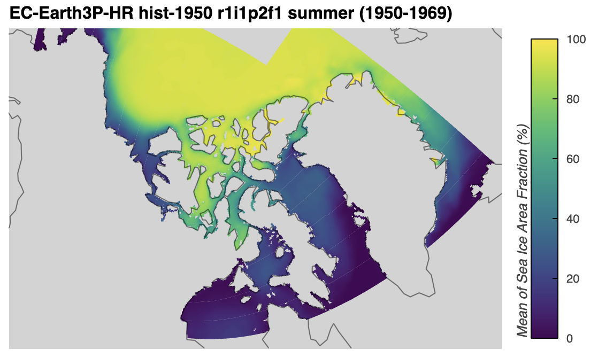

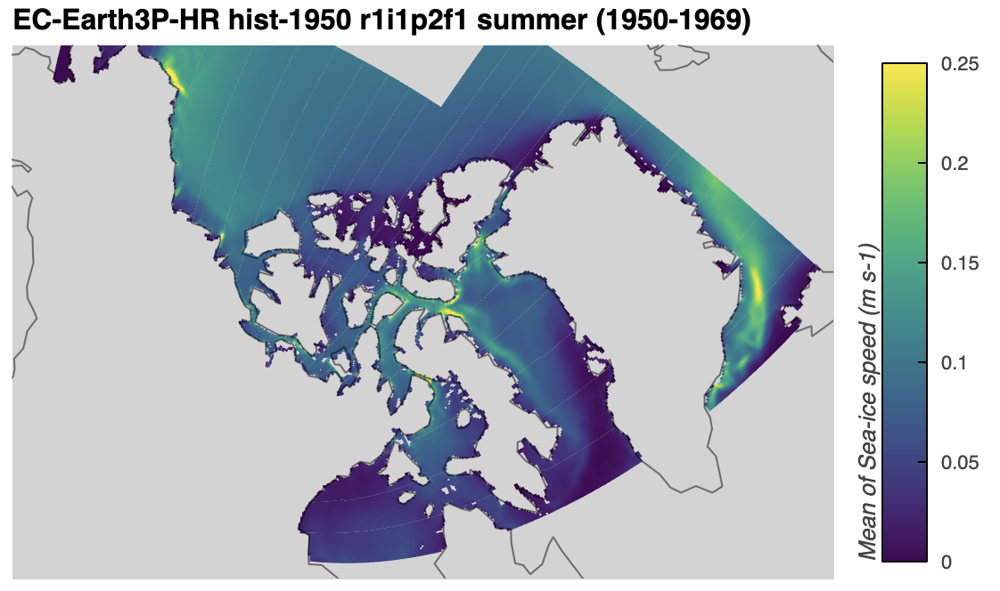

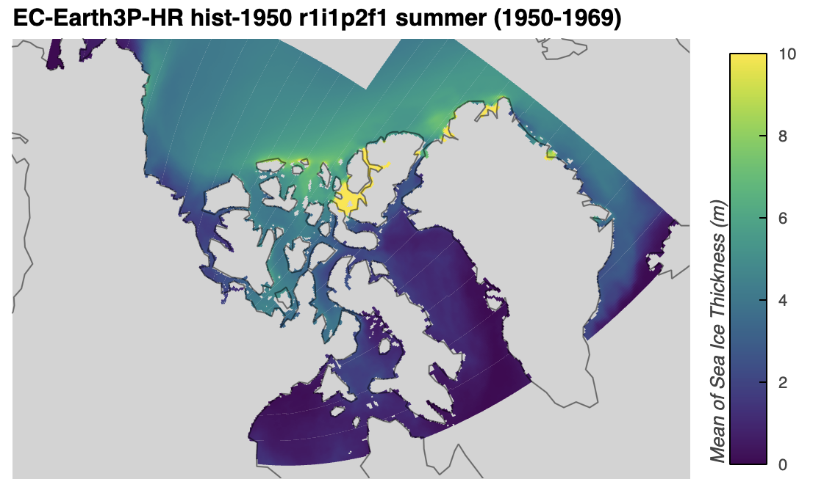

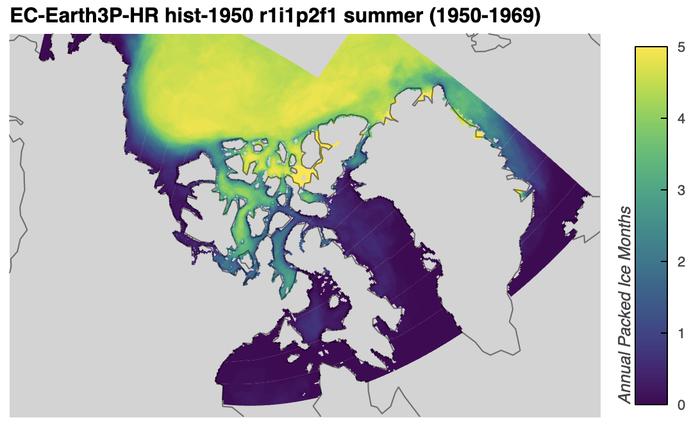

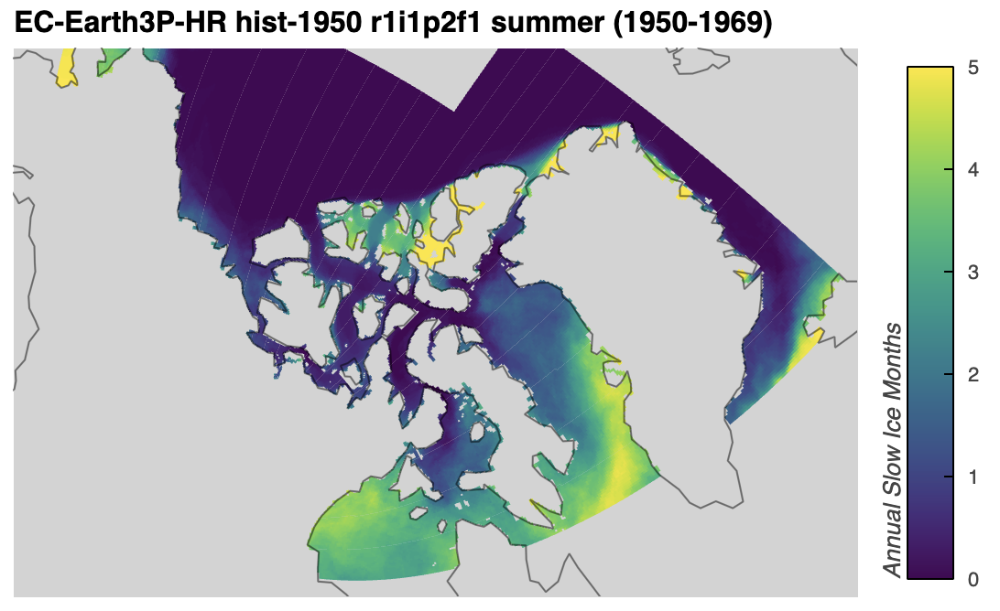

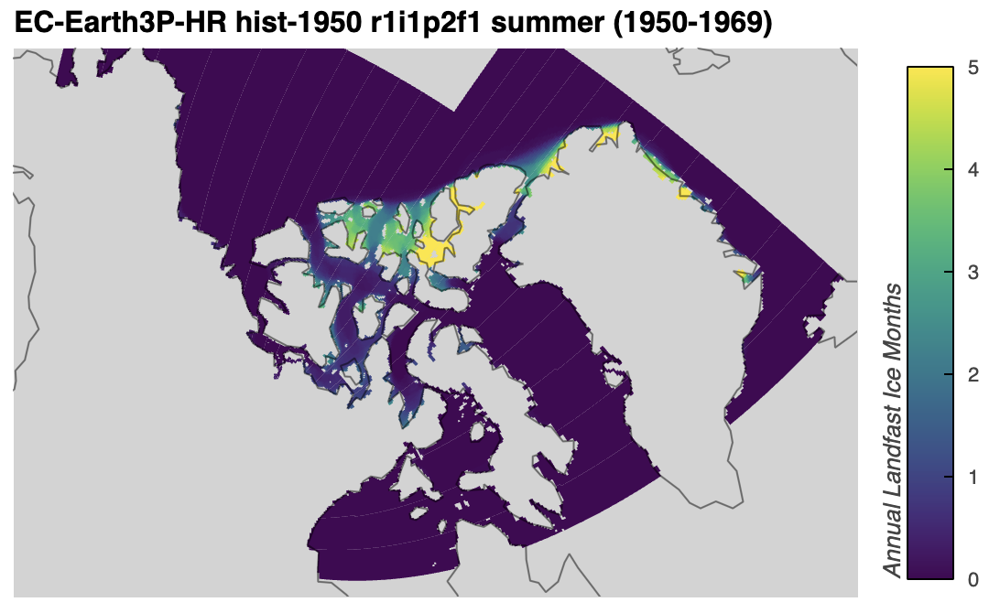

### Plotting Climatologies for HadGEM3-GC31-MM
[back to top](#making-sea-ice-climatologies)

Below, I plot repeat the above process of plotting the climatologies of the regular variables and then the marker variables for the summer months, this time for `HadGEM3-GC31-MM`. 
I do this by using the `select_months()` function to keep only the summer months, then taking the mean across all the remaining data. 
Again, I only plot the first variant label of the model because the corresponding plots for the other two variants are very similar. 
```python
import xarray as xr

from arctichoke.dataset import select_months
from arctichoke.path import list_variable_files
from arctichoke.params import sea_ice_vars
from arctichoke.plot import quadmesh_map

this_model = 'HadGEM3-GC31-MM'
this_experiment = 'hist-1950'
set_verbose = False

for this_si_var in [
    'siconc2',
    'sispeed',
    'sithick',
    'sipacked',
    'sislow',
    'silandfast',
]:
    for variant_label in [
        'r1i1p1f1', 
        # 'r1i2p1f1', 
        # 'r1i3p1f1',
    ]:
        # Get the relevant file path
        sivar_clim_file = list_variable_files(
            source_id = this_model,
            variable_id = f'{this_si_var}_month_mean',
            experiment_id = this_experiment,
            variant_label = variant_label,
            with_modification = 'trim_CAA_',
            verbose = set_verbose,
        )
        # Open the file into a dataset
        dataset_clim = xr.open_mfdataset(sivar_clim_file)
        # Select just the summer months
        dataset_clim = select_months(dataset_clim, time_dim='month')
        # Determine whether this is a regular or marker variable
        if this_si_var in sea_ice_vars.keys():
            if sea_ice_vars[this_si_var]['marker_var']:
                # Take the sum across the 12 months
                dataset_clim = dataset_clim.sum(dim='month', min_count=1)
            else:
                # Take the mean across the 12 months
                dataset_clim = dataset_clim.mean(dim='month')
        else:
            raise ValueError(f"(Plotting climatologies) `this_si_var={this_si_var}` is not in the `sea_ice_vars` dictionary. Available variables: {sea_ice_vars.keys()}")
        # Adjust the `long_name` attribute to change the colorbar label
        dataset_clim[f'{this_si_var}_month_mean'].attrs['long_name'] = dataset_clim[f'{this_si_var}_month_mean'].attrs['long_name'].replace('onthly m', '')
        # Plot the data on a map
        this_map = quadmesh_map(
            dataset_clim,
            f'{this_si_var}_month_mean',
            clims = sea_ice_vars[this_si_var]['plot_range'],
            verbose = set_verbose,
        )
        display(this_map)
```
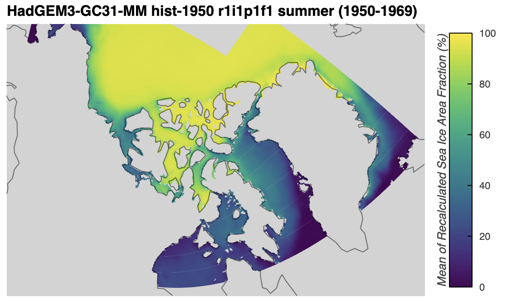

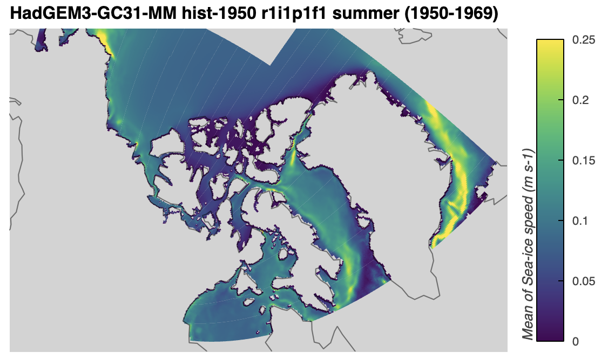

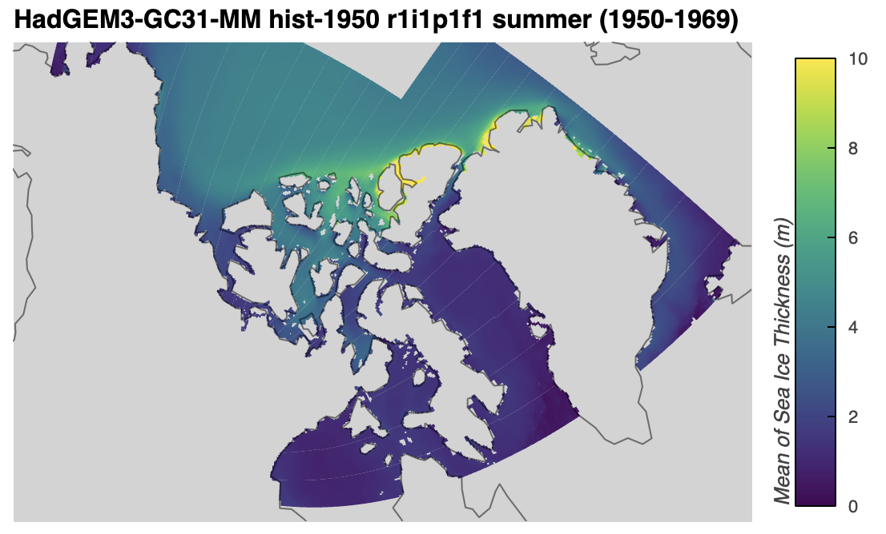

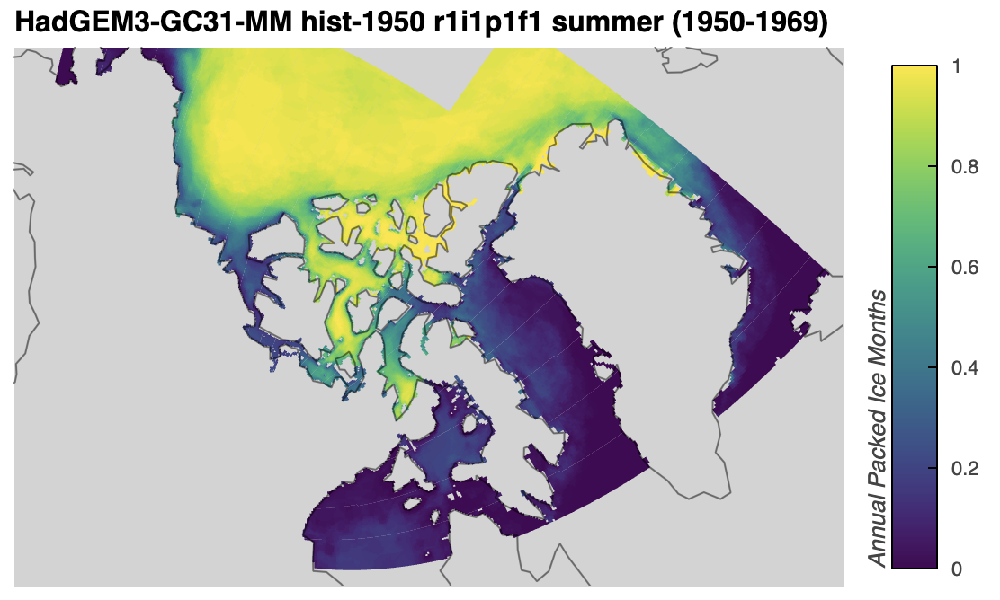

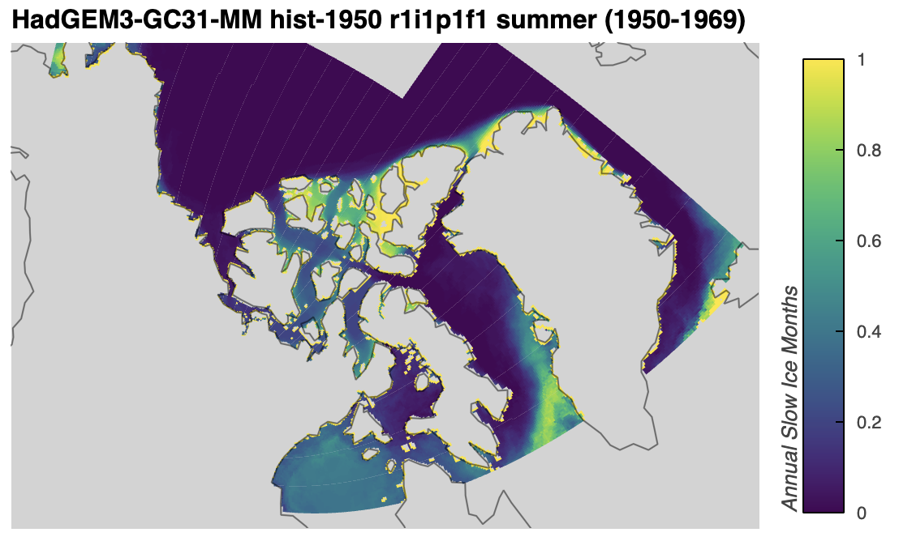

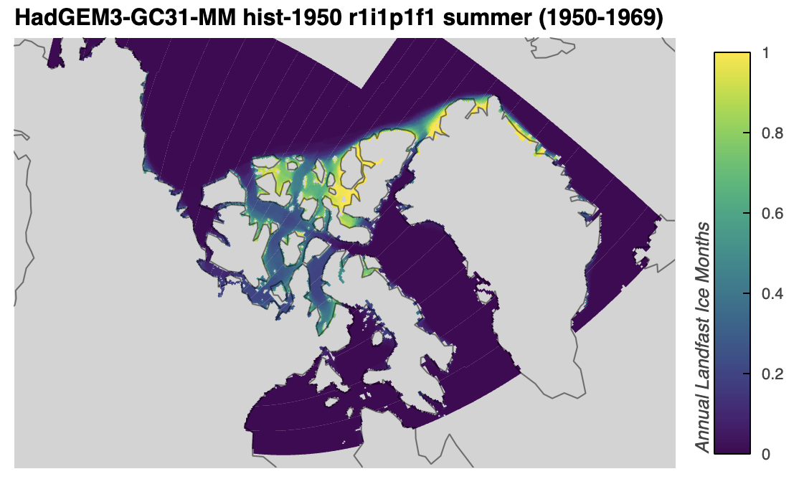

---

I then use the climatologies generated above in {doc}`Attributing changes in landfast ice  <../docs_analysis/landfast_attributing_changes>`.