# Investigating specific regions

Below, I describe how I investigate the specific regions of the Nares Strait and Parry Channel.
This assumes you have already gone through {doc}`Trimming data to the CAA region <../docs_data/trim_to_CAA_region>`.

## Contents

- [Defining specific regions](#defining-specific-regions)
    - [Defining the Nares Strait region](#defining-the-nares-strait-region)
    - [Defining the Parry Channel region](#defining-the-parry-channel-region)
- [Trimming data to specific regions](#trimming-data-to-specific-regions)
    - [Trimming data to Nares Strait](#trimming-data-to-nares-strait)
    - [Trimming data to Parry Channel](#trimming-data-to-parry-channel)
- [Finding spatial averages](#finding-spatial-averages)
- [Time series plots for specific regions](#time-series-plots-for-specific-regions)
    - [Time series plots for Nares Strait](#time-series-plots-for-nares-strait)
    - [Time series plots for Parry Channel](#time-series-plots-for-parry-channel)

---

## Defining specific regions
[back to top](#investigating-specific-regions)

For each specific region I'll investigate, I'll need to define a bounding box.

### Defining the Nares Strait region
[back to top](#investigating-specific-regions)

For this study, I'll define the Nares Strait region to go from Robeson Channel in the north to Smith Sound in the south.
On Wikipedia, [Robeson Channel](https://en.wikipedia.org/wiki/Robeson_Channel) is defined to be 82°00′N, 061°30′W, and [Smith Sound](https://en.wikipedia.org/wiki/Smith_Sound) is defined to be 78°25′N, 74°00′W.
I'll use those latitude values and define the longitude bounds to be wide enough to cover the entire channel, but narrow enough to not include anything outside the channel.
I define the bounding box for Nares Strait in the `params` module.
```python
from arctichoke.params import NS_BBOX

NS_BBOX
```
```console
[82, 78.4, -59, -77]
```

As an example, I'll load a `siconc` file from `EC-Earth3P-HR` and trim it to the Nares Strait region.
Then, I'll plot just that data for January 1950 on the map, including the `mark_bbox` argument to highlight the bounding box I selected.
```python
from arctichoke.dataset import trim_latlon
import arctichoke.params as sps

dataset = trim_latlon(
    dataset = '/arctichoke_data/bergybits/data/CMIP6/HighResMIP/EC-Earth-Consortium/EC-Earth3P-HR/hist-1950/r1i1p2f1/SImon/siconc/gn/v20181212/trim_CAA_siconc_SImon_EC-Earth3P-HR_hist-1950_r1i1p2f1_gn_195001-195012.nc',
    map_bbox = sps.NS_BBOX,
    precise_trim = True,
)

from arctichoke.plot import quadmesh_map

quadmesh_map(
    dataset.isel(time=0),
    'siconc',
    mark_bbox = sps.NS_BBOX,
    clims = sps.sea_ice_vars['siconc']['plot_range'],
    add_region = False,
)
```
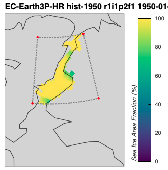

### Defining the Parry Channel region
[back to top](#investigating-specific-regions)

For this study, I am still looking to see whether I can find a citation where a bounding box for the Parry Channel is defined.
Using Cook et al. 2024 Figure 1 as a guide, I've chosen a set of coordinates which goes approximately from the M'Clure Strait in the west to Lancaster Sound in the west, and covering a north-south swath which covers most of the commonly used shipping tracks.
I define the bounding box for Parry Channel in the `params` module.
```python
from arctichoke.params import PC_BBOX

PC_BBOX
```
```console
[75, 73.5, -80, -120]
```

As an example, I'll load a `siconc` file from `EC-Earth3P-HR` and trim it to the Parry Channel region.
Then, I'll plot just that data for January 1950 on the map, including the `mark_bbox` argument to highlight the bounding box I selected.
```python
from arctichoke.dataset import trim_latlon
import arctichoke.params as sps

dataset = trim_latlon(
    dataset = '/arctichoke_data/bergybits/data/CMIP6/HighResMIP/EC-Earth-Consortium/EC-Earth3P-HR/hist-1950/r1i1p2f1/SImon/siconc/gn/v20181212/trim_CAA_siconc_SImon_EC-Earth3P-HR_hist-1950_r1i1p2f1_gn_195001-195012.nc',
    map_bbox = sps.PC_BBOX,
    precise_trim = True,
)

from arctichoke.plot import quadmesh_map

quadmesh_map(
    dataset.isel(time=0),
    'siconc',
    map_bbox=sps.PC_BBOX,
    mark_bbox=True,
    clims = sps.sea_ice_vars['siconc']['plot_range'],
    add_region = False,
)
```
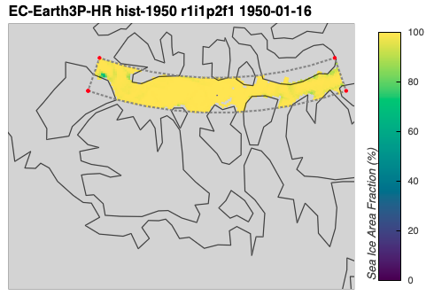

---

## Trimming data to specific regions
[back to top](#investigating-specific-regions)

In order to more easily call up data for these specific regions later, I'll use my `trim_files()` function to save the trimmed datasets to files.

### Trimming data to Nares Strait
[back to top](#investigating-specific-regions)

I can trim the data for `EC-Earth3P-HR` to the Nares Strait region.
This takes about 40 minutes to complete.
```python
import xarray as xr

from arctichoke.dataset import trim_files
from arctichoke.params import NS_BBOX
from arctichoke.path import list_variable_files

this_model = 'EC-Earth3P-HR'

for this_variant_label in [
    'r1i1p2f1', 
    'r2i1p2f1', 
    'r3i1p2f1',
]:
    for si_var in [
        'siconc',
        'sispeed',
        'sithick',
    ]:
        for this_experiment in ['hist-1950']:
            sivar_list = list_variable_files(
                source_id = this_model,
                variable_id = si_var,
                experiment_id = this_experiment,
                variant_label = this_variant_label,
            )
            trim_files(
                files_to_trim = sivar_list,
                name_prefix = 'trim_NS_',
                map_bbox = NS_BBOX,
                precise_trim = True,
            )
```
```console
(trim_files) `name_prefix`: trim_NS_
	(trim_files) Writing file `/arctichoke_data/bergybits/data/CMIP6/HighResMIP/EC-Earth-Consortium/EC-Earth3P-HR/hist-1950/r1i1p2f1/SImon/siconc/gn/v20181212/trim_NS_siconc_SImon_EC-Earth3P-HR_hist-1950_r1i1p2f1_gn_195001-195012.nc`.
	(trim_files) Writing file `/arctichoke_data/bergybits/data/CMIP6/HighResMIP/EC-Earth-Consortium/EC-Earth3P-HR/hist-1950/r1i1p2f1/SImon/siconc/gn/v20181212/trim_NS_siconc_SImon_EC-Earth3P-HR_hist-1950_r1i1p2f1_gn_195101-195112.nc`.
	(trim_files) Writing file `/arctichoke_data/bergybits/data/CMIP6/HighResMIP/EC-Earth-Consortium/EC-Earth3P-HR/hist-1950/r1i1p2f1/SImon/siconc/gn/v20181212/trim_NS_siconc_SImon_EC-Earth3P-HR_hist-1950_r1i1p2f1_gn_195201-195212.nc`.
    ...
	(trim_files) Writing file `/arctichoke_data/bergybits/data/CMIP6/HighResMIP/EC-Earth-Consortium/EC-Earth3P-HR/hist-1950/r3i1p2f1/SImon/sithick/gn/v20190214/trim_NS_sithick_SImon_EC-Earth3P-HR_hist-1950_r3i1p2f1_gn_201201-201212.nc`.
	(trim_files) Writing file `/arctichoke_data/bergybits/data/CMIP6/HighResMIP/EC-Earth-Consortium/EC-Earth3P-HR/hist-1950/r3i1p2f1/SImon/sithick/gn/v20190214/trim_NS_sithick_SImon_EC-Earth3P-HR_hist-1950_r3i1p2f1_gn_201301-201312.nc`.
	(trim_files) Writing file `/arctichoke_data/bergybits/data/CMIP6/HighResMIP/EC-Earth-Consortium/EC-Earth3P-HR/hist-1950/r3i1p2f1/SImon/sithick/gn/v20190214/trim_NS_sithick_SImon_EC-Earth3P-HR_hist-1950_r3i1p2f1_gn_201401-201412.nc`.
```

I can use my `list_available_variables()` function to confirm how many trimmed files were created for each variable.
```python
from arctichoke.path import list_available_variables

list_available_variables(
    source_id = 'EC-Earth3P-HR',
    experiment_id = 'hist-1950',
    list_var_mods = True,
)
```
```console
{'EC-Earth-Consortium/EC-Earth3P-HR': {'hist-1950': {'r1i1p2f1': {'SImon': {
     'siu': {'': 65},
     'siv': {'': 65},
     'sithick': {'': 130, 'trim_CAA_': 65, 'trim_NS_': 65,},
     'siage': {'': 65},
     'siconc': {'': 130, 'trim_CAA_': 65, 'trim_NS_': 65,},
     'sispeed': {'': 130, 'trim_CAA_': 65, 'trim_NS_': 65,},
...
```

As a test, I can then use these trimmed data files to create a map of trends in a particular variable. 
I'll choose `siconc`.
```python
from arctichoke.params import NS_BBOX
from arctichoke.plot import make_trend_map 

this_map = make_trend_map(
    this_source_id = 'EC-Earth3P-HR',
    this_var = 'siconc',
    this_variant_label = 'r1i1p2f1',
    this_modification = 'trim_NS_',
    select_summer = True,
    map_bbox = NS_BBOX,
    return_map = True,
)
display(this_map)
```
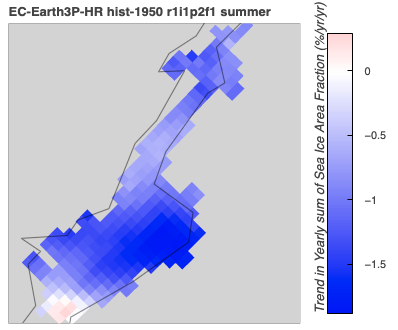

### Trimming data to Parry Channel
[back to top](#investigating-specific-regions)

I can trim the data for `EC-Earth3P-HR` to the Parry Channel region.
This takes about an hour to complete.
```python
import xarray as xr

from arctichoke.dataset import trim_files
from arctichoke.params import PC_BBOX
from arctichoke.path import list_variable_files

this_model = 'EC-Earth3P-HR'

for this_variant_label in [
    'r1i1p2f1', 
    'r2i1p2f1', 
    'r3i1p2f1',
]:
    for si_var in [
        'siconc',
        'sispeed',
        'sithick',
    ]:
        for this_experiment in ['hist-1950']:
            sivar_list = list_variable_files(
                source_id = this_model,
                variable_id = si_var,
                experiment_id = this_experiment,
                variant_label = this_variant_label,
            )
            trim_files(
                files_to_trim = sivar_list,
                name_prefix = 'trim_PC_',
                map_bbox = PC_BBOX,
                precise_trim = True,
            )
```
```console
(trim_files) `name_prefix`: trim_PC_
	(trim_files) Writing file `/arctichoke_data/bergybits/data/CMIP6/HighResMIP/EC-Earth-Consortium/EC-Earth3P-HR/hist-1950/r1i1p2f1/SImon/siconc/gn/v20181212/trim_PC_siconc_SImon_EC-Earth3P-HR_hist-1950_r1i1p2f1_gn_195001-195012.nc`.
	(trim_files) Writing file `/arctichoke_data/bergybits/data/CMIP6/HighResMIP/EC-Earth-Consortium/EC-Earth3P-HR/hist-1950/r1i1p2f1/SImon/siconc/gn/v20181212/trim_PC_siconc_SImon_EC-Earth3P-HR_hist-1950_r1i1p2f1_gn_195101-195112.nc`.
	(trim_files) Writing file `/arctichoke_data/bergybits/data/CMIP6/HighResMIP/EC-Earth-Consortium/EC-Earth3P-HR/hist-1950/r1i1p2f1/SImon/siconc/gn/v20181212/trim_PC_siconc_SImon_EC-Earth3P-HR_hist-1950_r1i1p2f1_gn_195201-195212.nc`.
    ...
	(trim_files) Writing file `/arctichoke_data/bergybits/data/CMIP6/HighResMIP/EC-Earth-Consortium/EC-Earth3P-HR/hist-1950/r3i1p2f1/SImon/sithick/gn/v20190214/trim_PC_sithick_SImon_EC-Earth3P-HR_hist-1950_r3i1p2f1_gn_201201-201212.nc`.
	(trim_files) Writing file `/arctichoke_data/bergybits/data/CMIP6/HighResMIP/EC-Earth-Consortium/EC-Earth3P-HR/hist-1950/r3i1p2f1/SImon/sithick/gn/v20190214/trim_PC_sithick_SImon_EC-Earth3P-HR_hist-1950_r3i1p2f1_gn_201301-201312.nc`.
	(trim_files) Writing file `/arctichoke_data/bergybits/data/CMIP6/HighResMIP/EC-Earth-Consortium/EC-Earth3P-HR/hist-1950/r3i1p2f1/SImon/sithick/gn/v20190214/trim_PC_sithick_SImon_EC-Earth3P-HR_hist-1950_r3i1p2f1_gn_201401-201412.nc`.
```

I can use my `list_available_variables()` function to confirm how many trimmed files were created for each variable.
```python
from arctichoke.path import list_available_variables

list_available_variables(
    source_id = 'EC-Earth3P-HR',
    experiment_id = 'hist-1950',
    list_var_mods = True,
)
```
```console
{'EC-Earth-Consortium/EC-Earth3P-HR': {'hist-1950': {'r1i1p2f1': {'SImon': {
     'siu': {'': 65},
     'siv': {'': 65},
     'sithick': {'': 195,
      'trim_CAA_': 65,
      'trim_NS_': 65,
      'trim_PC_': 65},
     'siage': {'': 65},
     'siconc': {'': 195,
      'trim_CAA_': 65,
      'trim_NS_': 65,
      'trim_PC_': 65},
     'sispeed': {'': 195,
      'trim_CAA_': 65,
      'trim_NS_': 65,
      'trim_PC_': 65},
     'silandfast': {'trim_CAA_': 195},
     'sivol': {'': 65, 'trim_CAA_': 65},
     'siconc2': {'trim_CAA_': 65},
     'sipacked': {'trim_CAA_': 65},
     'sislow': {'trim_CAA_': 65},
     'siage2': {'trim_CAA_': 65},
     'simultiyear': {'trim_CAA_': 65},
...
```

As a test, I can then use these trimmed data files to create a map of trends in a particular variable. 
I'll choose `siconc`.
```python
from arctichoke.params import PC_BBOX
from arctichoke.plot import make_trend_map 

this_map = make_trend_map(
    this_source_id = 'EC-Earth3P-HR',
    this_var = 'siconc',
    this_variant_label = 'r1i1p2f1',
    this_modification = 'trim_PC_',
    select_summer = True,
    map_bbox = PC_BBOX,
    return_map = True,
)
display(this_map)
```
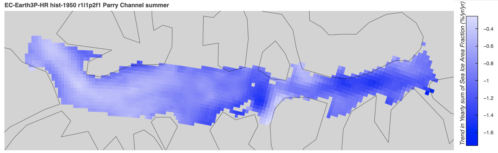

---

## Finding spatial averages
[back to top](#investigating-specific-regions)

My goal is to make a line plot of a time series to show how a particular variable changes within a specific region.
To do this, I will take the spatial average across a specific region for each time step.
First, I'll load the Nares Strait data for the first variant of `EC-Earth3P-HR` as an example.
```python
from arctichoke.path import list_variable_files

filelist = list_variable_files(
    source_id = 'EC-Earth3P-HR',
    variable_id = 'siconc',
    variant_label = 'r1i1p2f1',
    with_modification = 'trim_NS_',
    verbose = True,
)

import xarray as xr 

dataset = xr.open_mfdataset(filelist)
print(dataset) 
```
```console
(list_variable_files) Found 65 files.
/tmp/ipykernel_130/524186710.py:13: FutureWarning: In a future version of xarray the default value for data_vars will change from data_vars='all' to data_vars=None. This is likely to lead to different results when multiple datasets have matching variables with overlapping values. To opt in to new defaults and get rid of these warnings now use `set_options(use_new_combine_kwarg_defaults=True) or set data_vars explicitly.
  dataset = xr.open_mfdataset(filelist)
<xarray.Dataset> Size: 51MB
Dimensions:         (time: 780, bnds: 2, j: 41, i: 44, vertices: 4)
Coordinates:
  * time            (time) datetime64[ns] 6kB 1950-01-16T12:00:00 ... 2014-12...
  * j               (j) float64 328B 968.0 969.0 970.0 ... 1.007e+03 1.008e+03
  * i               (i) float64 352B 970.0 971.0 972.0 ... 1.012e+03 1.013e+03
    longitude       (j, i) float32 7kB dask.array<chunksize=(41, 44), meta=np.ndarray>
    latitude        (j, i) float32 7kB dask.array<chunksize=(41, 44), meta=np.ndarray>
Dimensions without coordinates: bnds, vertices
Data variables:
    time_bnds       (time, bnds) datetime64[ns] 12kB dask.array<chunksize=(1, 2), meta=np.ndarray>
    longitude_bnds  (time, j, i, vertices) float32 23MB dask.array<chunksize=(12, 41, 44, 4), meta=np.ndarray>
    latitude_bnds   (time, j, i, vertices) float32 23MB dask.array<chunksize=(12, 41, 44, 4), meta=np.ndarray>
    siconc          (time, j, i) float32 6MB dask.array<chunksize=(1, 41, 44), meta=np.ndarray>
Attributes: (12/48)
    CDI:                    Climate Data Interface version 2.5.1 (https://mpi...
    ...                     ...
    history:                Fri Aug 14 01:17:52 2026: cdo -O -s -f nc -sellon...
    CDO:                    Climate Data Operators version 2.5.1 (https://mpi...
```

Next, I'll use my `get_field_mean()` function which uses the `cdo.fldmean` command to calculate the spatially-weighted average of a variable.
```python
from arctichoke.dataset import get_field_mean

dataset_fldmean = get_field_mean(
    dataset,
    verbose = True,
)
print(dataset_fldmean)
```
```console
(get_field_mean) `save_as`: None
(get_field_mean) Dropping now-unnecessary dimensions: ('lat', 'lon')
<xarray.Dataset> Size: 22kB
Dimensions:    (time: 780, bnds: 2)
Coordinates:
  * time       (time) datetime64[ns] 6kB 1950-01-16T12:00:00 ... 2014-12-16T1...
Dimensions without coordinates: bnds
Data variables:
    time_bnds  (time, bnds) datetime64[ns] 12kB ...
    siconc     (time) float32 3kB ...
Attributes: (12/48)
    CDI:                    Climate Data Interface version 2.5.1 (https://mpi...
    ...                     ...
    history:                Mon Aug 17 15:19:14 2026: cdo -O -s -f nc -fldmea...
    CDO:                    Climate Data Operators version 2.5.1 (https://mpi...
```

The resulting dataset automatically drops the unnecessary latitude and longitude coordinates.

As a sanity check, I will plot the Nares Strait data for a few selected time slices and compare them to the spatial averages for the same time slices.
First, I'll plot January of 1950.
```python
from arctichoke.plot import quadmesh_map

quadmesh_map(
    dataset.sel(time='1950-01-16'),
    'siconc',
    map_bbox = NS_BBOX,
    clims = sps.sea_ice_vars['siconc']['plot_range'],
    add_region = False,
)
```
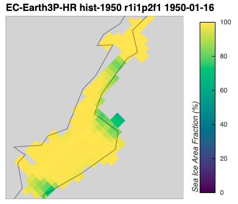

At this point in the model run, Nares Strait is almost completely ice covered.
I'll now see what the calculated spatial average is for this particular month.
```python
dataset_fldmean.sel(time='1950-01-16').compute()['siconc'].values
```
```console
array([96.435684], dtype=float32)
```

A spatial average of 96.44% seems reasonable given the map plotted above.

Now, I'll plot September of 2007, which was known to be a significant sea ice minimum.
```python
from arctichoke.plot import quadmesh_map

quadmesh_map(
    dataset.sel(time='2007-09-16'),
    'siconc',
    map_bbox = None,
)
```
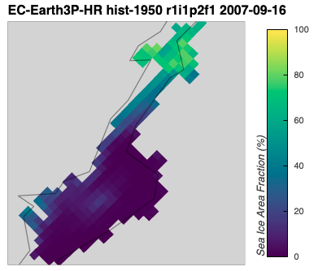

Indeed, the map shows that Nares Strait was almost ice-free during this month.
There is a small region of high sea ice concentration on the Northern part of the strait, possibly representing an ice arch.
```python
dataset_fldmean.sel(time='2007-09-16').compute()['siconc'].values
```
```console
array([17.717651], dtype=float32)
```

The calculated spatial average of 17.72% seems reasonable given the map plotted above.

---

## Time series plots for specific regions
[back to top](#investigating-specific-regions)

Now, I am ready to make the time series plots that I plan on including in my study.
I will make a time series for each variable separately, but plot both the yearly values and the trends for the three realizations (variant labels) on the same axis.

### Time series plots for Nares Strait
[back to top](#investigating-specific-regions)

First, I'll make time series plots for Nares Strait.
In between each variable, I need to call `plt.show()` to have the plot show up, then `plt.clf()` to clear the figure so that the lines for the next variable aren't plotted onto the same axis as those of the previous variable.
```python
import matplotlib.pyplot as plt 

from arctichoke.plot import plot_multi_time_series

for variable_id in [
    'sithick',
    'sispeed',
    'siconc',
]:
    plot_multi_time_series(
        this_source_id = 'EC-Earth3P-HR',
        this_var = variable_id,
        this_modification = 'trim_NS_',
        verbose = False,
    )
    # Need to show, then clear the figure so they aren't plotted on top of one another
    plt.show()
    plt.clf()
```
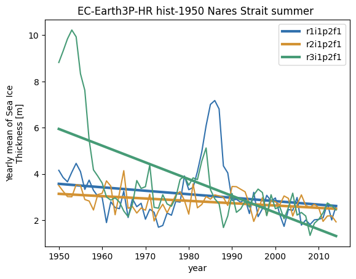

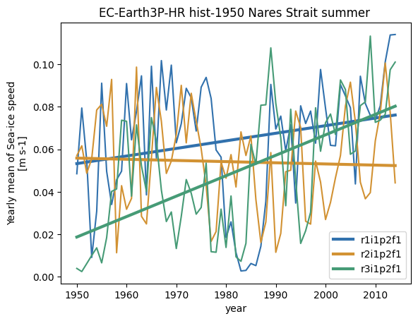

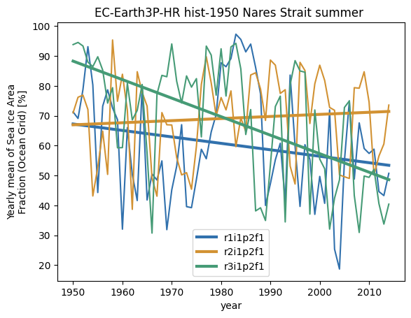

### Time series plots for Parry Channel
[back to top](#investigating-specific-regions)

Next, I'll make time series plots for Parry Channel.
Again, between each variable, I need to call `plt.show()` then `plt.clf()` to avoid all variables being plotted on the same axis.
```python
import matplotlib.pyplot as plt 

from arctichoke.plot import plot_multi_time_series

for variable_id in [
    'sithick',
    'sispeed',
    'siconc',
]:
    plot_multi_time_series(
        this_source_id = 'EC-Earth3P-HR',
        this_var = variable_id,
        this_modification = 'trim_PC_',
        verbose = False,
    )
    # Need to show, then clear the figure so they aren't plotted on top of one another
    plt.show()
    plt.clf()
```
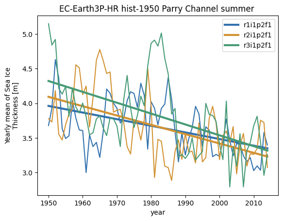

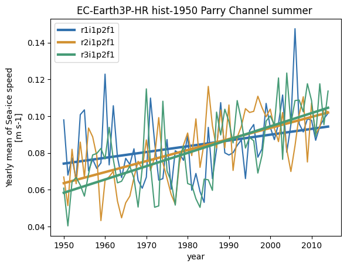

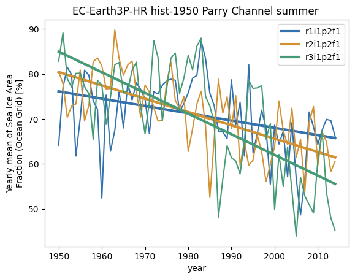