# Attributing changes in landfast ice

Below, I describe an experiment I ran to attribute changes in landfast ice to its two components, packed ice and slow ice, for the `EC-Earth3P-HR` and `HadGEM3-GC31` models.
This assumes you have already gone through {doc}`Trends in landfast ice over time  <../docs_analysis/landfast_trends>` and {doc}`Making sea ice climatologies  <../docs_analysis/climatologies>`.

## Contents

- [Introduction](#introduction)
- [Writing landfast ice data using climatologies](#writing-landfast-ice-data-using-climatologies)
    - [Writing landfast ice data using climatologies for EC-Earth3P-HR](#writing-landfast-ice-data-using-climatologies-for-ec-earth3p-hr)
    - [Writing landfast ice data using climatologies for HadGEM3-GC31-MM](#writing-landfast-ice-data-using-climatologies-for-hadgem3-gc31-mm)
- [Plotting trends in landfast ice with climatology components](#plotting-trends-in-landfast-ice-with-climatology-components)
    - [Plotting trends in landfast ice for EC-Earth3P-HR](#plotting-trends-in-landfast-ice-for-ec-earth3p-hr)
    - [Plotting trends in landfast ice for HadGEM3-GC31-MM](#plotting-trends-in-landfast-ice-for-hadgem3-gc31-mm)

---

## Introduction
[back to top](#attributing-changes-in-landfast-ice)

As was covered in {doc}`Identifying landfast ice  <../docs_analysis/landfast_ice>`, the calculation of `silandfast` involves calculating `sipacked` from `siconc` and calculating `sislow` from `sispeed`.
Therefore, the {doc}`Trends in landfast ice over time  <../docs_analysis/landfast_trends>` will be partly due to `siconc` and partly due to `sispeed`.

In order to attribute the changes in landfast ice to it's two components I perform the following experiment. 
I recalculate `silandfast` using the `siconc` data as usual, however, for the `sispeed` component, I instead use the 1950-1969 climatology for each of the 65 years. 
This way, any trends in `silandfast` with a version identifier I assign to be `with_sispeed_clim` will be entirely due to changes in `siconc` as the climatology values of `sispeed` do not change over time.
I then repeat this experiment except using the climatology for the `siconc` component and using the `sispeed` data as usual.
In this second version, any trends in the resulting `silandfast` data will be entirely due to changes in `sispeed`.

I can then compare the trend plots of these two experiments to the {doc}`Trends in landfast ice over time  <../docs_analysis/landfast_trends>`.

---

## Writing landfast ice data using climatologies
[back to top](#attributing-changes-in-landfast-ice)

In {doc}`Identifying landfast ice <../docs_analysis/landfast_ice>`, I generated `silandfast` data files for the 65 years of the historical experiment for each variant of the models. 
Here, I use the same function `make_landfast_files()`, except I'll substitute one of the lists of files for a list of 1 file, the relevant climatology file I generated in {doc}`Making sea ice climatologies  <../docs_analysis/climatologies>`. 
I modified the function `make_landfast_files()` to detect whether it was given a climatology file and, if so, reuse that file for every year of landfast ice data I generate.

### Writing landfast ice data using climatologies for EC-Earth3P-HR
[back to top](#attributing-changes-in-landfast-ice)

For `EC-Earth3P-HR`, I'll first generate new `silandfast` files using the climatology of sea ice concentration (`siconc_month_mean`).
I'll sort these files by giving them a new version ID, `with_siconc_clim`.
That way, I can easily call up the version of `silandfast` that I would like later.

This took about half an hour to run on my laptop.
```python
from arctichoke.path import list_variable_files
from arctichoke.analysis.landfast import make_landfast_files
from arctichoke.params import CAA_BBOX

this_model = 'EC-Earth3P-HR'
siconc_var = 'siconc_month_mean'
sispeed_var = 'sispeed'
set_verbose = False

for this_variant_label in [
    'r1i1p2f1', 
    'r2i1p2f1', 
    'r3i1p2f1',
]:
    for this_experiment in ['hist-1950']:
        siconc_list = list_variable_files(
            source_id = this_model,
            variable_id = siconc_var,
            experiment_id = this_experiment,
            variant_label = this_variant_label,
            with_modification = 'trim_CAA_',
            verbose = set_verbose,
        )
        sispeed_list = list_variable_files(
            source_id = this_model,
            variable_id = sispeed_var,
            experiment_id = this_experiment,
            variant_label = this_variant_label,
            with_modification = 'trim_CAA_',
            verbose = set_verbose,
        )
        make_landfast_files(
            siconc_files = siconc_list,
            sispeed_files = sispeed_list,
            version_id = 'with_siconc_clim',
            siconc_var = siconc_var,
            sispeed_var = sispeed_var,
            verbose = set_verbose,
        )
```
```console
	(make_landfast_files) Writing file `/arctichoke_data/bergybits/data/CMIP6/HighResMIP/EC-Earth-Consortium/EC-Earth3P-HR/hist-1950/r1i1p2f1/SImon/silandfast/gn/with_siconc_clim/trim_CAA_silandfast_SImon_EC-Earth3P-HR_hist-1950_r1i1p2f1_gn_195001-195012.nc`.
	(make_landfast_files) Writing file `/arctichoke_data/bergybits/data/CMIP6/HighResMIP/EC-Earth-Consortium/EC-Earth3P-HR/hist-1950/r1i1p2f1/SImon/silandfast/gn/with_siconc_clim/trim_CAA_silandfast_SImon_EC-Earth3P-HR_hist-1950_r1i1p2f1_gn_195101-195112.nc`.
	(make_landfast_files) Writing file `/arctichoke_data/bergybits/data/CMIP6/HighResMIP/EC-Earth-Consortium/EC-Earth3P-HR/hist-1950/r1i1p2f1/SImon/silandfast/gn/with_siconc_clim/trim_CAA_silandfast_SImon_EC-Earth3P-HR_hist-1950_r1i1p2f1_gn_195201-195212.nc`.
    ...
	(make_landfast_files) Writing file `/arctichoke_data/bergybits/data/CMIP6/HighResMIP/EC-Earth-Consortium/EC-Earth3P-HR/hist-1950/r3i1p2f1/SImon/silandfast/gn/with_siconc_clim/trim_CAA_silandfast_SImon_EC-Earth3P-HR_hist-1950_r3i1p2f1_gn_201201-201212.nc`.
	(make_landfast_files) Writing file `/arctichoke_data/bergybits/data/CMIP6/HighResMIP/EC-Earth-Consortium/EC-Earth3P-HR/hist-1950/r3i1p2f1/SImon/silandfast/gn/with_siconc_clim/trim_CAA_silandfast_SImon_EC-Earth3P-HR_hist-1950_r3i1p2f1_gn_201301-201312.nc`.
	(make_landfast_files) Writing file `/arctichoke_data/bergybits/data/CMIP6/HighResMIP/EC-Earth-Consortium/EC-Earth3P-HR/hist-1950/r3i1p2f1/SImon/silandfast/gn/with_siconc_clim/trim_CAA_silandfast_SImon_EC-Earth3P-HR_hist-1950_r3i1p2f1_gn_201401-201412.nc`.
```

Next, I generate the landfast ice files for the case of using the sea ice speed climatology, `sispeed_month_mean`. 
I'll give these files the version ID `with_sispeed_clim`.

This took around half an hour to complete.
```python
from arctichoke.path import list_variable_files
from arctichoke.analysis.landfast import make_landfast_files
from arctichoke.params import CAA_BBOX

this_model = 'EC-Earth3P-HR'
siconc_var = 'siconc'
sispeed_var = 'sispeed_month_mean'
set_verbose = False

for this_variant_label in [
    'r1i1p2f1', 
    'r2i1p2f1', 
    'r3i1p2f1',
]:
    for this_experiment in ['hist-1950']:
        siconc_list = list_variable_files(
            source_id = this_model,
            variable_id = siconc_var,
            experiment_id = this_experiment,
            variant_label = this_variant_label,
            with_modification = 'trim_CAA_',
            verbose = set_verbose,
        )
        sispeed_list = list_variable_files(
            source_id = this_model,
            variable_id = sispeed_var,
            experiment_id = this_experiment,
            variant_label = this_variant_label,
            with_modification = 'trim_CAA_',
            verbose = set_verbose,
        )
        make_landfast_files(
            siconc_files = siconc_list,
            sispeed_files = sispeed_list,
            version_id = 'with_sispeed_clim',
            siconc_var = siconc_var,
            sispeed_var = sispeed_var,
            verbose = set_verbose,
        )
```
```console
	(make_landfast_files) Writing file `/arctichoke_data/bergybits/data/CMIP6/HighResMIP/EC-Earth-Consortium/EC-Earth3P-HR/hist-1950/r1i1p2f1/SImon/silandfast/gn/with_sispeed_clim/trim_CAA_silandfast_SImon_EC-Earth3P-HR_hist-1950_r1i1p2f1_gn_195001-195012.nc`.
	(make_landfast_files) Writing file `/arctichoke_data/bergybits/data/CMIP6/HighResMIP/EC-Earth-Consortium/EC-Earth3P-HR/hist-1950/r1i1p2f1/SImon/silandfast/gn/with_sispeed_clim/trim_CAA_silandfast_SImon_EC-Earth3P-HR_hist-1950_r1i1p2f1_gn_195101-195112.nc`.
	(make_landfast_files) Writing file `/arctichoke_data/bergybits/data/CMIP6/HighResMIP/EC-Earth-Consortium/EC-Earth3P-HR/hist-1950/r1i1p2f1/SImon/silandfast/gn/with_sispeed_clim/trim_CAA_silandfast_SImon_EC-Earth3P-HR_hist-1950_r1i1p2f1_gn_195201-195212.nc`.
    ...
	(make_landfast_files) Writing file `/arctichoke_data/bergybits/data/CMIP6/HighResMIP/EC-Earth-Consortium/EC-Earth3P-HR/hist-1950/r3i1p2f1/SImon/silandfast/gn/with_sispeed_clim/trim_CAA_silandfast_SImon_EC-Earth3P-HR_hist-1950_r3i1p2f1_gn_201201-201212.nc`.
	(make_landfast_files) Writing file `/arctichoke_data/bergybits/data/CMIP6/HighResMIP/EC-Earth-Consortium/EC-Earth3P-HR/hist-1950/r3i1p2f1/SImon/silandfast/gn/with_sispeed_clim/trim_CAA_silandfast_SImon_EC-Earth3P-HR_hist-1950_r3i1p2f1_gn_201301-201312.nc`.
	(make_landfast_files) Writing file `/arctichoke_data/bergybits/data/CMIP6/HighResMIP/EC-Earth-Consortium/EC-Earth3P-HR/hist-1950/r3i1p2f1/SImon/silandfast/gn/with_sispeed_clim/trim_CAA_silandfast_SImon_EC-Earth3P-HR_hist-1950_r3i1p2f1_gn_201401-201412.nc`.
```

### Writing landfast ice data using climatologies for HadGEM3-GC31-MM
[back to top](#attributing-changes-in-landfast-ice)

Next, I'll generate the new `silandfast` files for `HadGEM3-GC31-MM`, using the climatology of sea ice concentration (`siconc_month_mean`).
Again, I'll give them a new version ID, `with_siconc_clim`.
```python
from arctichoke.path import list_variable_files
from arctichoke.analysis.landfast import make_landfast_files
from arctichoke.params import CAA_BBOX

this_model = 'HadGEM3-GC31-MM'
siconc_var = 'siconc2_month_mean'
sispeed_var = 'sispeed'
set_verbose = False

for this_variant_label in [
    'r1i1p1f1', 
    'r1i2p1f1', 
    'r1i3p1f1',
]:
    for this_experiment in ['hist-1950']:
        siconc_list = list_variable_files(
            source_id = this_model,
            variable_id = siconc_var,
            experiment_id = this_experiment,
            variant_label = this_variant_label,
            with_modification = 'trim_CAA_',
            verbose = set_verbose,
        )
        sispeed_list = list_variable_files(
            source_id = this_model,
            variable_id = sispeed_var,
            experiment_id = this_experiment,
            variant_label = this_variant_label,
            with_modification = 'trim_CAA_',
            verbose = set_verbose,
        )
        make_landfast_files(
            siconc_files = siconc_list,
            sispeed_files = sispeed_list,
            version_id = 'with_siconc_clim',
            siconc_var = siconc_var,
            sispeed_var = sispeed_var,
            verbose = set_verbose,
        )
```
```console
	(make_landfast_files) Writing file `/arctichoke_data/bergybits/data/CMIP6/HighResMIP/MOHC/HadGEM3-GC31-MM/hist-1950/r1i1p1f1/SImon/silandfast/gn/with_siconc_clim/trim_CAA_silandfast_SImon_HadGEM3-GC31-MM_hist-1950_r1i1p1f1_gn_195001-195012.nc`.
	(make_landfast_files) Writing file `/arctichoke_data/bergybits/data/CMIP6/HighResMIP/MOHC/HadGEM3-GC31-MM/hist-1950/r1i1p1f1/SImon/silandfast/gn/with_siconc_clim/trim_CAA_silandfast_SImon_HadGEM3-GC31-MM_hist-1950_r1i1p1f1_gn_195101-195112.nc`.
	(make_landfast_files) Writing file `/arctichoke_data/bergybits/data/CMIP6/HighResMIP/MOHC/HadGEM3-GC31-MM/hist-1950/r1i1p1f1/SImon/silandfast/gn/with_siconc_clim/trim_CAA_silandfast_SImon_HadGEM3-GC31-MM_hist-1950_r1i1p1f1_gn_195201-195212.nc`.
    ...
	(make_landfast_files) Writing file `/arctichoke_data/bergybits/data/CMIP6/HighResMIP/MOHC/HadGEM3-GC31-MM/hist-1950/r1i3p1f1/SImon/silandfast/gn/with_siconc_clim/trim_CAA_silandfast_SImon_HadGEM3-GC31-MM_hist-1950_r1i3p1f1_gn_201201-201212.nc`.
	(make_landfast_files) Writing file `/arctichoke_data/bergybits/data/CMIP6/HighResMIP/MOHC/HadGEM3-GC31-MM/hist-1950/r1i3p1f1/SImon/silandfast/gn/with_siconc_clim/trim_CAA_silandfast_SImon_HadGEM3-GC31-MM_hist-1950_r1i3p1f1_gn_201301-201312.nc`.
	(make_landfast_files) Writing file `/arctichoke_data/bergybits/data/CMIP6/HighResMIP/MOHC/HadGEM3-GC31-MM/hist-1950/r1i3p1f1/SImon/silandfast/gn/with_siconc_clim/trim_CAA_silandfast_SImon_HadGEM3-GC31-MM_hist-1950_r1i3p1f1_gn_201401-201412.nc`.
```

```python
from arctichoke.path import list_variable_files
from arctichoke.analysis.landfast import make_landfast_files
from arctichoke.params import CAA_BBOX

this_model = 'HadGEM3-GC31-MM'
siconc_var = 'siconc2'
sispeed_var = 'sispeed_month_mean'
set_verbose = False

for this_variant_label in [
    'r1i1p1f1', 
    'r1i2p1f1', 
    'r1i3p1f1',
]:
    for this_experiment in ['hist-1950']:
        siconc_list = list_variable_files(
            source_id = this_model,
            variable_id = siconc_var,
            experiment_id = this_experiment,
            variant_label = this_variant_label,
            with_modification = 'trim_CAA_',
            verbose = set_verbose,
        )
        sispeed_list = list_variable_files(
            source_id = this_model,
            variable_id = sispeed_var,
            experiment_id = this_experiment,
            variant_label = this_variant_label,
            with_modification = 'trim_CAA_',
            verbose = set_verbose,
        )
        make_landfast_files(
            siconc_files = siconc_list,
            sispeed_files = sispeed_list,
            version_id = 'with_sispeed_clim',
            siconc_var = siconc_var,
            sispeed_var = sispeed_var,
            verbose = set_verbose,
        )
```
```console
	(make_landfast_files) Writing file `/arctichoke_data/bergybits/data/CMIP6/HighResMIP/MOHC/HadGEM3-GC31-MM/hist-1950/r1i1p1f1/SImon/silandfast/gn/with_sispeed_clim/trim_CAA_silandfast_SImon_HadGEM3-GC31-MM_hist-1950_r1i1p1f1_gn_195001-195012.nc`.
	(make_landfast_files) Writing file `/arctichoke_data/bergybits/data/CMIP6/HighResMIP/MOHC/HadGEM3-GC31-MM/hist-1950/r1i1p1f1/SImon/silandfast/gn/with_sispeed_clim/trim_CAA_silandfast_SImon_HadGEM3-GC31-MM_hist-1950_r1i1p1f1_gn_195101-195112.nc`.
	(make_landfast_files) Writing file `/arctichoke_data/bergybits/data/CMIP6/HighResMIP/MOHC/HadGEM3-GC31-MM/hist-1950/r1i1p1f1/SImon/silandfast/gn/with_sispeed_clim/trim_CAA_silandfast_SImon_HadGEM3-GC31-MM_hist-1950_r1i1p1f1_gn_195201-195212.nc`.
    ...
	(make_landfast_files) Writing file `/arctichoke_data/bergybits/data/CMIP6/HighResMIP/MOHC/HadGEM3-GC31-MM/hist-1950/r1i3p1f1/SImon/silandfast/gn/with_sispeed_clim/trim_CAA_silandfast_SImon_HadGEM3-GC31-MM_hist-1950_r1i3p1f1_gn_201201-201212.nc`.
	(make_landfast_files) Writing file `/arctichoke_data/bergybits/data/CMIP6/HighResMIP/MOHC/HadGEM3-GC31-MM/hist-1950/r1i3p1f1/SImon/silandfast/gn/with_sispeed_clim/trim_CAA_silandfast_SImon_HadGEM3-GC31-MM_hist-1950_r1i3p1f1_gn_201301-201312.nc`.
	(make_landfast_files) Writing file `/arctichoke_data/bergybits/data/CMIP6/HighResMIP/MOHC/HadGEM3-GC31-MM/hist-1950/r1i3p1f1/SImon/silandfast/gn/with_sispeed_clim/trim_CAA_silandfast_SImon_HadGEM3-GC31-MM_hist-1950_r1i3p1f1_gn_201401-201412.nc`.
Output is truncated. View as a scrollable element or open in a text editor. Adjust cell output settings...
```

---

## Plotting trends in landfast ice with climatology components
[back to top](#attributing-changes-in-landfast-ice)

Similar to {doc}`Trends in landfast ice over time  <../docs_analysis/landfast_trends>`, I now use the `make_trend_map()` function to make maps of trends in landfast ice over time.
Here, I specify the `version_id` such that I use the data I generated above where one component is a climatology. 

### Plotting trends in landfast ice for EC-Earth3P-HR
[back to top](#attributing-changes-in-landfast-ice)

First, here are the trends in landfast ice when I use the sea ice concentration climatology.
```python
from arctichoke.params import sea_ice_vars
from arctichoke.plot import make_trend_map

for this_variant in [
    'r1i1p2f1',
    'r2i1p2f1',
    'r3i1p2f1',
]:
    make_trend_map(
        this_source_id = 'EC-Earth3P-HR',
        this_var = 'silandfast',
        this_variant_label = this_variant,
        this_modification = 'trim_CAA_',
        version_id = 'with_siconc_clim',
        clims = sea_ice_vars['silandfast']['trend_clims'],
        select_summer = True,
        verbose = False,
    )
```
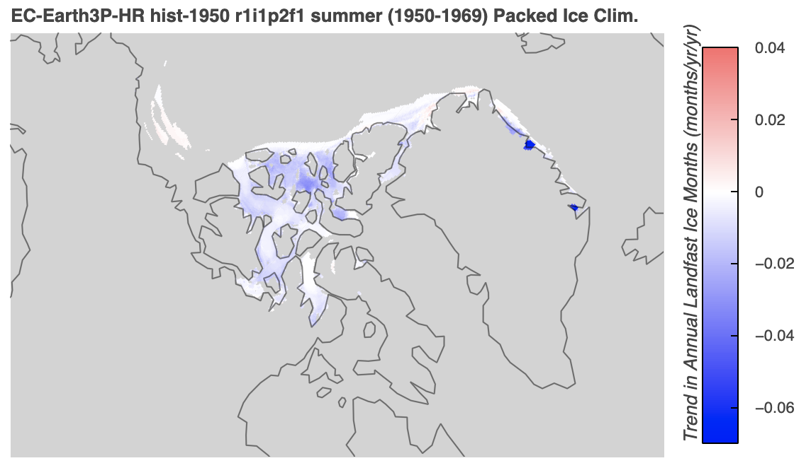

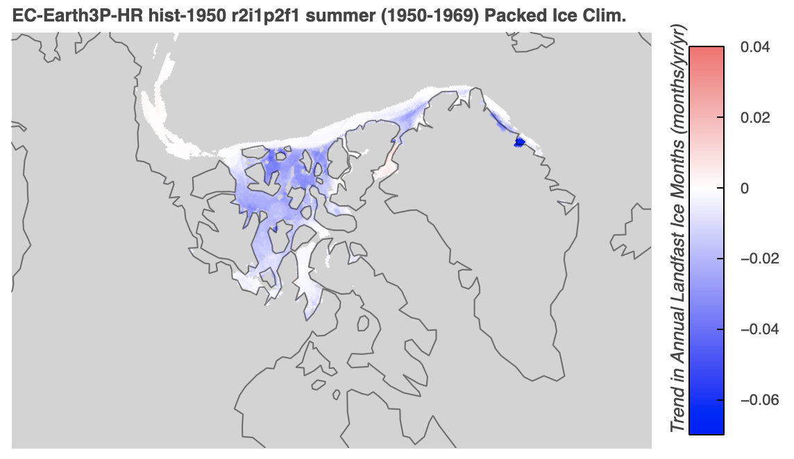

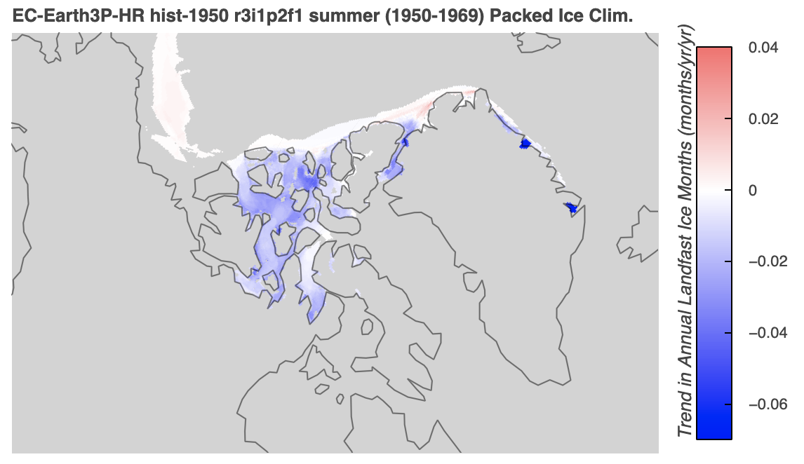

Next, I'll make the corresponding plots with the landfast ice data using the sea ice speed climatology.
```python
from arctichoke.params import sea_ice_vars
from arctichoke.plot import make_trend_map

for this_variant in [
    'r1i1p2f1',
    'r2i1p2f1',
    'r3i1p2f1',
]:
    make_trend_map(
        this_source_id = 'EC-Earth3P-HR',
        this_var = 'silandfast',
        this_variant_label = this_variant,
        this_modification = 'trim_CAA_',
        version_id = 'with_sispeed_clim',
        clims = sea_ice_vars['silandfast']['trend_clims'],
        select_summer = True,
        verbose = False,
    )
```
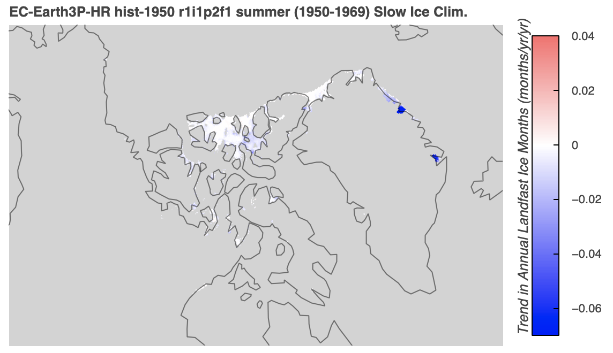


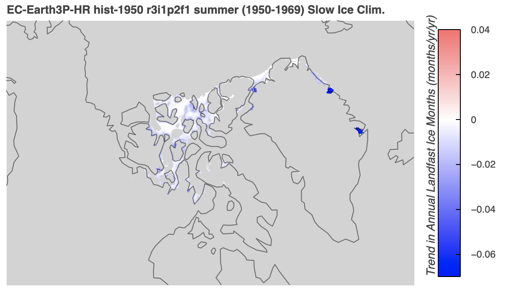

### Plotting trends in landfast ice for HadGEM3-GC31-MM
[back to top](#attributing-changes-in-landfast-ice)

Next, I'll repeat the same plots, but for `HadGEM3-GC31-MM`.
```python
from arctichoke.params import sea_ice_vars
from arctichoke.plot import make_trend_map

for this_variant in [
    'r1i1p1f1', 
    'r1i2p1f1', 
    'r1i3p1f1',
]:
    make_trend_map(
        this_source_id = 'HadGEM3-GC31-MM',
        this_var = 'silandfast',
        this_variant_label = this_variant,
        this_modification = 'trim_CAA_',
        version_id = 'with_siconc_clim',
        clims = sea_ice_vars['silandfast']['trend_clims'],
        select_summer = True,
        verbose = False,
    )
```
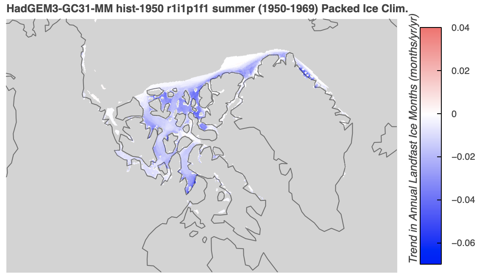

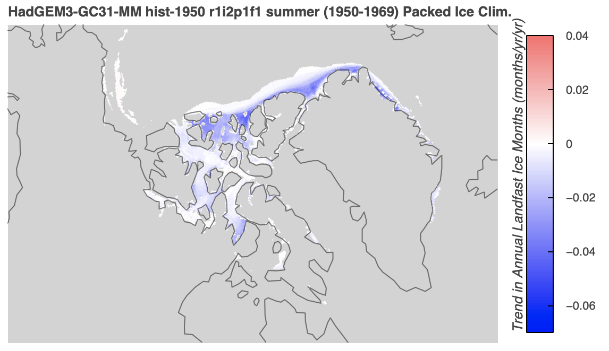

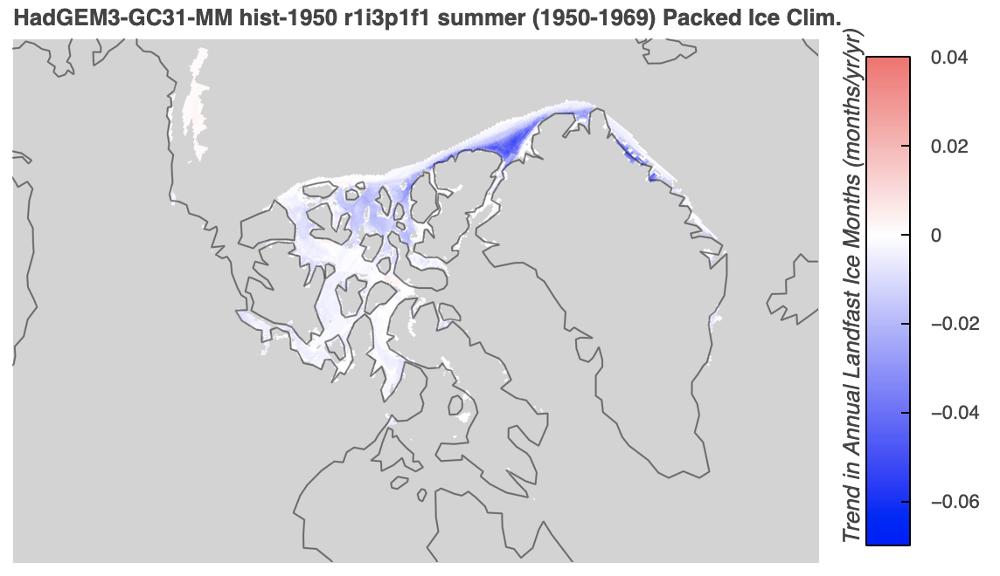

```python
from arctichoke.params import sea_ice_vars
from arctichoke.plot import make_trend_map

for this_variant in [
    'r1i1p1f1', 
    'r1i2p1f1', 
    'r1i3p1f1',
]:
    make_trend_map(
        this_source_id = 'HadGEM3-GC31-MM',
        this_var = 'silandfast',
        this_variant_label = this_variant,
        this_modification = 'trim_CAA_',
        version_id = 'with_sispeed_clim',
        clims = sea_ice_vars['silandfast']['trend_clims'],
        select_summer = True,
        verbose = False,
    )
```
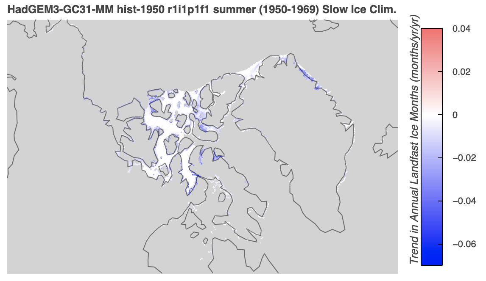

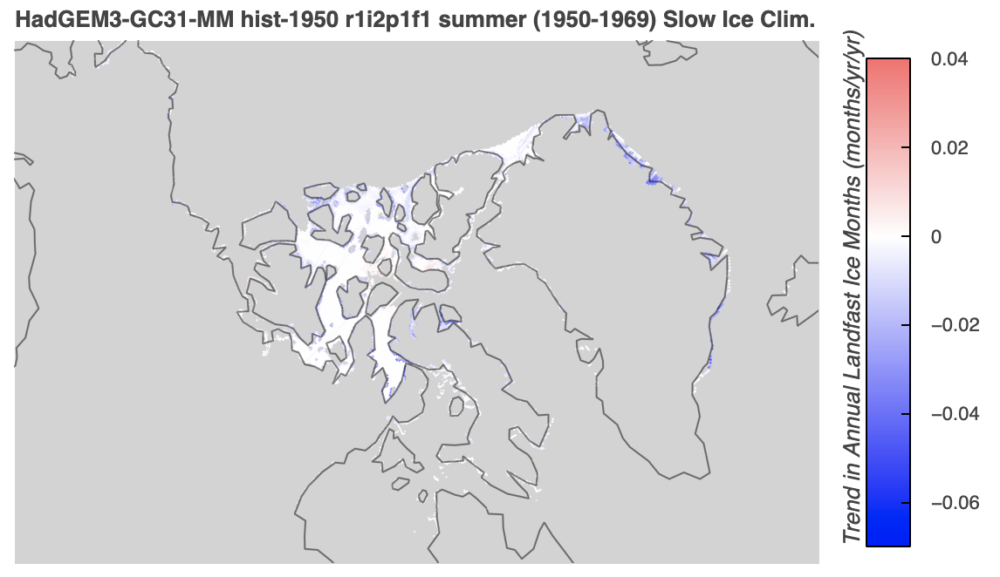

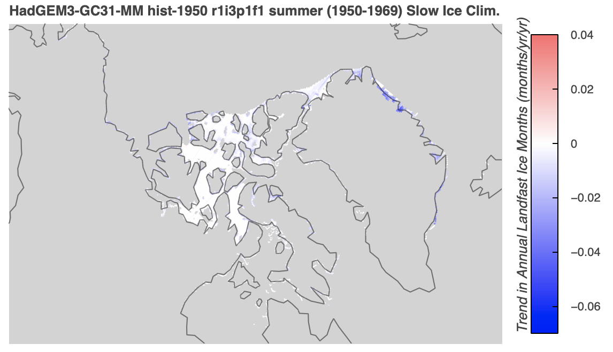