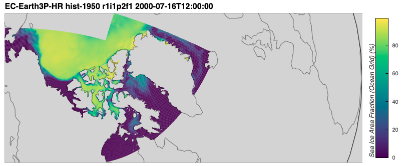
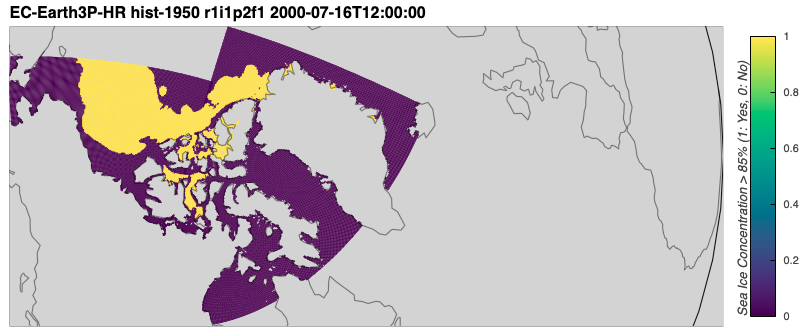
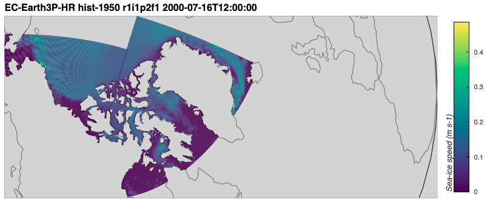
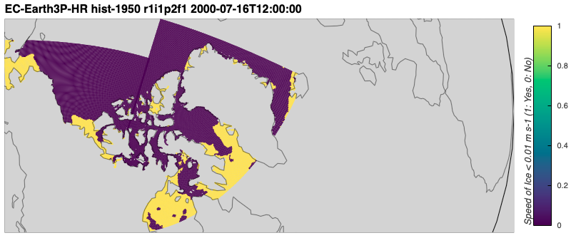
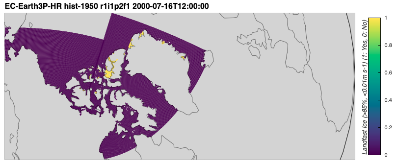
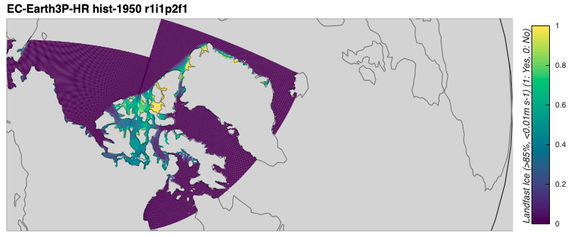
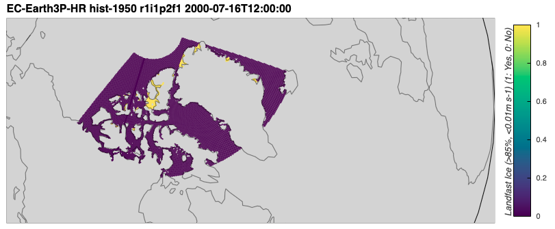

# Identifying landfast ice

Below, I describe how I mark landfast sea ice (`silandfast`) using sea ice concentration (`siconc`) and sea ice speed (`sispeed`) for the `EC-Earth3P-HR` and `HadGEM3-GC31` models.
This assumes you have already gone through {doc}`Trimming data to the CAA region <../docs_data/trim_to_CAA_region>` and {doc}`Calculating 'siconc' from 'sithick' and 'sivol'  <../docs_data/siconc_from_sithick_and_sivol>`.

## Contents

- [Introduction](#introduction)
- [Calculating landfast ice for an example dataset](#calculating-landfast-ice-for-an-example-dataset)
    - [Packed ice](#packed-ice)
    - [Slow ice](#slow-ice)
    - [Landfast ice](#landfast-ice)
- [Writing landfast ice to file](#writing-landfast-ice-to-file)
    - [Example with one file](#example-with-one-file)
    - [Writing all files for EC-Earth3P-HR](#writing-all-files-for-ec-earth3p-hr)
    - [Writing all files for HadGEM3-GC31-MM](#writing-all-files-for-hadgem3-gc31-mm)
    - [Writing all files for HadGEM3-GC31-HM](#writing-all-files-for-hadgem3-gc31-hm)
    - [Writing all files for HadGEM3-GC31-HH](#writing-all-files-for-hadgem3-gc31-hh)

---

## Introduction
[back to top](#identifying-landfast-ice)

When choke points form, the sea ice in that area is locked in place, meaning that it is densely packed together and moving very slowly, if at all.
Laliberté et al. 2018[^Laliberte2018] investigated landfast ice, which is packed and slow-moving, in models.
However, models generally do not have an output variable which identifies landfast ice.

> "To circumvent this limitation, we use daily sea ice thickness (hereafter, `sit`), sea ice concentration (hereafter, `sic`) and sea ice velocities (hereafter, `usi` and `vsi`) to synthetically characterize landfast sea ice conditions using the following procedure:  
> 1. On the original model grid, we set the land mask to its nearest neighbour and remap using a nearest-neighbour remapping `usi`, `vsi` and `sit` to the `sic` native grid. Finally, we use a nearest-neighbour remapping to put all variables on a EASE 2.0 grid.  
> 2. The sea ice speed (hereafter, `speedsi`) is computed from `usi` and `vsi` on this new grid.  
> 3. Daily `speedsi`, `sit` and `sic` are averaged to weekly means.  
> 4. A grid cell is identified as having “packed ice” if the remapped weekly mean `sic` is larger than 85 %.  
> 5. A grid cell is identified as having “slow ice” if the remapped weekly mean `speedsi` is less than 1 cm s$^{−1}$ ($\sim$ 1 km day$^{−1}$).  
> 6. Slow, packed ice is used as a proxy for landfast ice.  
> 
> At each grid cell we then compute the number of months in each year with slow, packed ice. Using slow, packed ice is representative because we are interested in one specific aspect of landfast ice: the fact that its growth is primarily driven by thermodynamics and not by the import/export of sea ice." [^Laliberte2018] (on page 2-3 / 3578-3579)

Below, I implement this scheme for identifying landfast ice in the models I investigate for this project.

[^Laliberte2018]: Laliberté, F., S. Howell, J-F. Lemieux, F. Dupont, J. Lei (2018), "What historical landfast ice observations tell us about projected ice conditions in Arctic archipelagoes and marginal seas under anthropogenic forcing", _The Cryosphere_, 12(11):3577-3588, doi:10.5194/tc-12-3577-2018

---

## Calculating landfast ice for an example dataset
[back to top](#identifying-landfast-ice)

Here, I'll calculate landfast ice for one year of monthly data as an example, choosing the year 2000 from EC-Earth3P-HR.
That model has `sispeed` available, which I will use instead of calculating the speed from `siu` and `siv` manually.
Because I'm starting with monthly data and the `siconc` and `sispeed` variables are on the same grid, I'll follow Laliberté et al. 2018's[^Laliberte2018] procedure starting at step 4.

```python
import xarray as xr

month_index = 6

from arctichoke.params import CAA_BBOX
# Define the boundaries of the CAA
CAA_BBOX
```

### Packed ice
[back to top](#identifying-landfast-ice)

Here, I'll identify packed ice as sea ice concentration values above 85%.
First, I'll load an example sea ice concentration file.
Then, I'll plot this data in July such that I can see a good pattern of data.
```python
EC_Earth3P_HR_hist_siconc_2000 = '/arctichoke_data/bergybits/data/CMIP6/HighResMIP/EC-Earth-Consortium/EC-Earth3P-HR/hist-1950/r1i1p2f1/SImon/siconc/gn/v20181212/siconc_SImon_EC-Earth3P-HR_hist-1950_r1i1p2f1_gn_200001-200012.nc'

from arctichoke.dataset.trim_dataset import trim_latlon

EC_Earth3P_HR_hist_siconc_2000_xr_trim = trim_latlon(
    xr.open_dataset(EC_Earth3P_HR_hist_siconc_2000),
    map_bbox = CAA_BBOX,
    precise_trim = False,
)

from arctichoke.plot.hvplots import quadmesh_map

EC_Earth3P_HR_hist_siconc_2000_trim_map = quadmesh_map(
    EC_Earth3P_HR_hist_siconc_2000_xr_trim.isel(time=month_index),
    'siconc',
    map_projection = 'Orthographic',
)
EC_Earth3P_HR_hist_siconc_2000_trim_map
```


Next, I'll use a function I made, which employs the `cdo` function `setrtoc2` to mark just the packed ice, which is where sea ice concentration is over 85%.
```python
from arctichoke.analysis.landfast import find_packed_ice

EC_Earth3P_HR_hist_sipacked_2000_xr_trim = find_packed_ice(
    EC_Earth3P_HR_hist_siconc_2000_xr_trim,
    packed_threshold = 85,
)

from arctichoke.plot.hvplots import quadmesh_map

EC_Earth3P_HR_hist_sipacked_2000_trim_map = quadmesh_map(
    EC_Earth3P_HR_hist_sipacked_2000_xr_trim.isel(time=month_index),
    'sipacked',
    map_projection = 'Orthographic',
)
EC_Earth3P_HR_hist_sipacked_2000_trim_map
```


This makes sense to me as it shows packed ice mainly in the Beaufort Sea, the CAA and the coast of Greenland.

### Slow ice
[back to top](#identifying-landfast-ice)

Here, I'll identify slow ice as sea ice speed values below 1 cm/s.
First, I'll load an example sea ice speed file, then plot it in July, just as above.
```python
EC_Earth3P_HR_hist_sispeed_2000 = '/arctichoke_data/bergybits/data/CMIP6/HighResMIP/EC-Earth-Consortium/EC-Earth3P-HR/hist-1950/r1i1p2f1/SImon/sispeed/gn/v20181212/sispeed_SImon_EC-Earth3P-HR_hist-1950_r1i1p2f1_gn_200001-200012.nc'

from arctichoke.dataset.trim_dataset import trim_latlon

EC_Earth3P_HR_hist_sispeed_2000_xr_trim = trim_latlon(
    xr.open_dataset(EC_Earth3P_HR_hist_sispeed_2000),
    map_bbox = CAA_BBOX,
    precise_trim = False,
)

from arctichoke.plot.hvplots import quadmesh_map

EC_Earth3P_HR_hist_sispeed_2000_trim_map = quadmesh_map(
    EC_Earth3P_HR_hist_sispeed_2000_xr_trim.isel(time=month_index),
    'sispeed',
    map_projection = 'Orthographic',
)
EC_Earth3P_HR_hist_sispeed_2000_trim_map
```


Next, I'll use a function I made, which employs the `cdo` function `setrtoc2` to mark just the slow ice, which is where sea ice speed is below 1 cm/s. Note, this includes areas with no sea ice.
```python
from arctichoke.analysis.landfast import find_slow_ice

EC_Earth3P_HR_hist_sislow_2000_xr_trim = find_slow_ice(
    EC_Earth3P_HR_hist_sispeed_2000_xr_trim,
    slow_threshold = 0.01,
)

from arctichoke.plot.hvplots import quadmesh_map

EC_Earth3P_HR_hist_sislow_2000_trim_map = quadmesh_map(
    EC_Earth3P_HR_hist_sislow_2000_xr_trim.isel(time=month_index),
    'sislow',
    map_projection = 'Orthographic',
)
EC_Earth3P_HR_hist_sislow_2000_trim_map
```


This also makes sense to me as it shows slow ice along the shores of landmasses. 
It also shows "slow ice" in regions that aren't actually covered in sea ice, as can be seen from the sea ice concentration plot above. 
This is because the default value for `sispeed` is 0 and, in those areas, since there is no sea ice, the value of `sispeed` defaults to 0. 

### Landfast ice
[back to top](#identifying-landfast-ice)

Next, I'll combine my functions for finding packed and slow ice. Where they overlap, I'll call that landfast ice, following Laliberté et al. 2018[^Laliberte2018].
```python
from arctichoke.analysis.landfast import find_landfast_ice

EC_Earth3P_HR_hist_silandfast_2000_xr_trim = find_landfast_ice(
    siconc_dataset = EC_Earth3P_HR_hist_siconc_2000_xr_trim,
    sispeed_dataset = EC_Earth3P_HR_hist_sispeed_2000_xr_trim,
)

from arctichoke.plot.hvplots import quadmesh_map

EC_Earth3P_HR_hist_silandfast_2000_trim_map = quadmesh_map(
    EC_Earth3P_HR_hist_silandfast_2000_xr_trim.isel(time=month_index),
    'silandfast',
    map_projection = 'Orthographic',
)
EC_Earth3P_HR_hist_silandfast_2000_trim_map
```


Then, I'll take that dataset and get the mean over time, which can give me an idea of which locations have landfast ice and how often.
```python
EC_Earth3P_HR_hist_silandfast_2000_mean_xr_trim = EC_Earth3P_HR_hist_silandfast_2000_xr_trim.mean(dim='time', skipna=False)

from arctichoke.plot.hvplots import quadmesh_map

EC_Earth3P_HR_hist_silandfast_2000_mean_trim_map = quadmesh_map(
    EC_Earth3P_HR_hist_silandfast_2000_mean_xr_trim,
    'silandfast',
    map_projection = 'Orthographic',
)
EC_Earth3P_HR_hist_silandfast_2000_mean_trim_map
```


I can check to confirm that the values of this mean in `silandfast` over time fall between 0 and 1.
```python
from arctichoke.dataset.get_min_max import get_min_max

get_min_max(EC_Earth3P_HR_hist_silandfast_2000_mean_xr_trim, 'silandfast')
```
```console
(0.0, 1.0)
```

---

## Writing landfast ice to file
[back to top](#identifying-landfast-ice)

In order to have access to the landfast data more easily, I'll save the result of the calculation to file. 
I'll give the file the prefix `trim_CAA_` because I will trim the data to the CAA in the process.
I'll also follow the naming conventions of EC-Earth3P-HR and the directory structure given by `esgpull`.

### Example with one file
[back to top](#identifying-landfast-ice)

Below, I'll demonstrate doing a precise trim around the CAA for the year 2000.
```python
siconc_filepath = '/arctichoke_data/bergybits/data/CMIP6/HighResMIP/EC-Earth-Consortium/EC-Earth3P-HR/hist-1950/r1i1p2f1/SImon/siconc/gn/v20181212/siconc_SImon_EC-Earth3P-HR_hist-1950_r1i1p2f1_gn_200001-200012.nc'
sispeed_filepath = '/arctichoke_data/bergybits/data/CMIP6/HighResMIP/EC-Earth-Consortium/EC-Earth3P-HR/hist-1950/r1i1p2f1/SImon/sispeed/gn/v20181212/sispeed_SImon_EC-Earth3P-HR_hist-1950_r1i1p2f1_gn_200001-200012.nc'

from arctichoke.analysis.landfast import make_landfast_files
from arctichoke.params import CAA_BBOX

make_landfast_files(
    siconc_files = siconc_filepath,
    sispeed_files = sispeed_filepath,
    map_bbox = CAA_BBOX,
    precise_trim = True,
)
```
```console
	(make_landfast_files) Writing file `/seaicecp_data/bergybits/data/CMIP6/HighResMIP/EC-Earth-Consortium/EC-Earth3P-HR/hist-1950/r1i1p2f1/SImon/silandfast/gn/v20260617/trim_CAA_silandfast_SImon_EC-Earth3P-HR_hist-1950_r1i1p2f1_gn_200001-200012.nc`.
```
The above function created a new directory (if needed) for `silandfast` in the existing directory structure given by the provided files, then created a new netCDF file in that directory.
```python
import xarray as xr

EC_Earth3P_HR_hist_silandfast_2000_CAA = '/arctichoke_data/bergybits/data/CMIP6/HighResMIP/EC-Earth-Consortium/EC-Earth3P-HR/hist-1950/r1i1p2f1/SImon/silandfast/gn/v20260617/trim_CAA_silandfast_SImon_EC-Earth3P-HR_hist-1950_r1i1p2f1_gn_200001-200012.nc'
EC_Earth3P_HR_hist_silandfast_2000_CAA_xr = xr.open_dataset(EC_Earth3P_HR_hist_silandfast_2000_CAA)

from arctichoke.plot.hvplots import quadmesh_map

EC_Earth3P_HR_hist_silandfast_2000_CAA_map = quadmesh_map(
    EC_Earth3P_HR_hist_silandfast_2000_CAA_xr.isel(time=month_index),
    'silandfast',
    map_projection = 'Orthographic',
)
EC_Earth3P_HR_hist_silandfast_2000_CAA_map
```


This matches what I saw before, just trimmed precisely around the CAA bounding box.

### Writing all files for EC-Earth3P-HR
[back to top](#identifying-landfast-ice)

Below, I have written a loop to calculate and write the landfast ice files for all of the ensemble members of EC-Earth3P-HR.
I have specified `precise_trim = False` to both speed up the computations as well as keep more of the spatial area in the files. 
This took 70 minutes to complete.
```python
from arctichoke.path import list_variable_files
from arctichoke.analysis.landfast import make_landfast_files
from arctichoke.params import CAA_BBOX

this_model = 'EC-Earth3P-HR'

for this_variant_label in [
    'r1i1p2f1', 
    'r2i1p2f1', 
    'r3i1p2f1',
]:
    for this_experiment in ['hist-1950']:#, 'highres-future']:
        siconc_list = list_variable_files(
            source_id = this_model,
            variable_id = 'siconc',
            experiment_id = this_experiment,
            variant_label = this_variant_label,
        )
        sispeed_list = list_variable_files(
            source_id = this_model,
            variable_id = 'sispeed',
            experiment_id = this_experiment,
            variant_label = this_variant_label,
        )
        make_landfast_files(
            siconc_files = siconc_list,
            sispeed_files = sispeed_list,
            map_bbox = CAA_BBOX,
            precise_trim = False,
        )
```
```console
	(make_landfast_files) Writing file `/seaicecp_data/bergybits/data/CMIP6/HighResMIP/EC-Earth-Consortium/EC-Earth3P-HR/hist-1950/r1i1p2f1/SImon/silandfast/gn/v20260617/trim_CAA_silandfast_SImon_EC-Earth3P-HR_hist-1950_r1i1p2f1_gn_195001-195012.nc`.
	(make_landfast_files) Writing file `/seaicecp_data/bergybits/data/CMIP6/HighResMIP/EC-Earth-Consortium/EC-Earth3P-HR/hist-1950/r1i1p2f1/SImon/silandfast/gn/v20260617/trim_CAA_silandfast_SImon_EC-Earth3P-HR_hist-1950_r1i1p2f1_gn_195101-195112.nc`.
    ...
	(make_landfast_files) Writing file `/seaicecp_data/bergybits/data/CMIP6/HighResMIP/EC-Earth-Consortium/EC-Earth3P-HR/hist-1950/r3i1p2f1/SImon/silandfast/gn/v20260617/trim_CAA_silandfast_SImon_EC-Earth3P-HR_hist-1950_r3i1p2f1_gn_201301-201312.nc`.
	(make_landfast_files) Writing file `/seaicecp_data/bergybits/data/CMIP6/HighResMIP/EC-Earth-Consortium/EC-Earth3P-HR/hist-1950/r3i1p2f1/SImon/silandfast/gn/v20260617/trim_CAA_silandfast_SImon_EC-Earth3P-HR_hist-1950_r3i1p2f1_gn_201401-201412.nc`.
```
I can confirm how many landfast ice files were created using the `list_available_variables()` function.
```python
from arctichoke.path.variable_paths import list_available_variables

list_available_variables(
    source_id = 'EC-Earth3P-HR',
    experiment_id = 'hist-1950',
    list_var_mods = True,
)
```
```console
{'EC-Earth-Consortium/EC-Earth3P-HR': {'hist-1950': {
    'r1i1p2f1': {'SImon': {'siu': {'': 65},
     'siv': {'': 65},
     'sithick': {'': 65, 'trim_NWP_': 65},
     'siage': {'': 65},
     'siconc': {'': 65, 'trim_NWP_': 65},
     'sispeed': {'': 65, 'trim_NWP_': 65},
     'silandfast': {'trim_CAA_': 65},
     'sivol': {'': 65},
     'siconc2': {'trim_CAA_': 65}}},
   'r2i1p2f1': {'SImon': {'siage': {'': 65},
     'sithick': {'': 65, 'trim_NWP_': 65},
     'siv': {'': 65},
     'siu': {'': 65},
     'siconc': {'': 65, 'trim_NWP_': 65},
     'sispeed': {'': 65, 'trim_NWP_': 65},
     'silandfast': {'trim_CAA_': 65},
     'sivol': {'': 65},
     'siconc2': {'trim_CAA_': 65}}},
   'r3i1p2f1': {'SImon': {'sithick': {'': 65, 'trim_NWP_': 65},
     'siage': {'': 65, 'trim_NWP_': 65},
     'siu': {'': 65},
     'siv': {'': 65},
     'siconc': {'': 65, 'trim_NWP_': 65},
     'sispeed': {'': 65, 'trim_NWP_': 65},
     'silandfast': {'trim_CAA_': 65},
     'sivol': {'': 65},
     'siconc2': {'trim_CAA_': 65}}}}}}
```

### Writing all files for HadGEM3-GC31-MM
[back to top](#identifying-landfast-ice)

```python
from arctichoke.path import list_variable_files
from arctichoke.analysis.landfast import make_landfast_files
from arctichoke.params import CAA_BBOX

this_model = 'HadGEM3-GC31-MM'

for this_variant_label in [
    'r1i1p1f1', 
    'r1i2p1f1', 
    'r1i3p1f1',
]:
    for this_experiment in ['hist-1950']:
        siconc_list = list_variable_files(
            source_id = this_model,
            variable_id = 'siconc2',
            experiment_id = this_experiment,
            variant_label = this_variant_label,
            with_modification = 'trim_CAA_',
        )
        sispeed_list = list_variable_files(
            source_id = this_model,
            variable_id = 'sispeed',
            experiment_id = this_experiment,
            variant_label = this_variant_label,
            with_modification = 'trim_CAA_',
        )
        make_landfast_files(
            siconc_files = siconc_list,
            sispeed_files = sispeed_list,
            precise_trim = False,
            siconc_var = 'siconc2',
        )
```
```console
	(make_landfast_files) Writing file `/seaicecp_data/bergybits/data/CMIP6/HighResMIP/MOHC/HadGEM3-GC31-MM/hist-1950/r1i3p1f1/SImon/silandfast/gn/v20260617/trim_CAA_silandfast_SImon_HadGEM3-GC31-MM_hist-1950_r1i3p1f1_gn_195001-195012.nc`.
	(make_landfast_files) Writing file `/seaicecp_data/bergybits/data/CMIP6/HighResMIP/MOHC/HadGEM3-GC31-MM/hist-1950/r1i3p1f1/SImon/silandfast/gn/v20260617/trim_CAA_silandfast_SImon_HadGEM3-GC31-MM_hist-1950_r1i3p1f1_gn_195101-195112.nc`.
    ...
	(make_landfast_files) Writing file `/seaicecp_data/bergybits/data/CMIP6/HighResMIP/MOHC/HadGEM3-GC31-MM/hist-1950/r1i3p1f1/SImon/silandfast/gn/v20260617/trim_CAA_silandfast_SImon_HadGEM3-GC31-MM_hist-1950_r1i3p1f1_gn_201301-201312.nc`.
	(make_landfast_files) Writing file `/seaicecp_data/bergybits/data/CMIP6/HighResMIP/MOHC/HadGEM3-GC31-MM/hist-1950/r1i3p1f1/SImon/silandfast/gn/v20260617/trim_CAA_silandfast_SImon_HadGEM3-GC31-MM_hist-1950_r1i3p1f1_gn_201401-201412.nc`.
```

```python
from arctichoke.path.variable_paths import list_available_variables

list_available_variables(
    source_id = 'MOHC/HadGEM3-GC31-MM',
    experiment_id = 'hist-1950',
    list_var_mods = True,
)
```
```console
{'MOHC/HadGEM3-GC31-MM': {'hist-1950': {
    'r1i1p1f1': {'Ofx': {'areacello': {'': 1}},
    'SImon': {'siu': {'': 65},
     'sithick': {'': 65},
     'siage': {'': 65},
     'siconc': {'': 65},
     'siv': {'': 65},
     'sispeed': {'': 65, 'trim_CAA_': 65},
     'sivol': {'': 65},
     'siconc2': {'trim_CAA_': 65},
     'silandfast': {'trim_CAA_': 65}}},
   'r1i2p1f1': {'SImon': {'sithick': {'': 65},
     'siv': {'': 65},
     'siu': {'': 65},
     'siage': {'': 65},
     'siconc': {'': 65},
     'sispeed': {'': 65, 'trim_CAA_': 65},
     'sivol': {'': 65},
     'siconc2': {'trim_CAA_': 65},
     'silandfast': {'trim_CAA_': 65}}},
   'r1i3p1f1': {'SImon': {'siu': {'': 65},
     'siconc': {'': 65},
     'sithick': {'': 65},
     'siage': {'': 65},
     'siv': {'': 65},
     'sispeed': {'': 65, 'trim_CAA_': 65},
     'sivol': {'': 65},
     'siconc2': {'trim_CAA_': 65},
     'silandfast': {'trim_CAA_': 65}}}}}}
```

### Writing all files for HadGEM3-GC31-HM
[back to top](#identifying-landfast-ice)

```python
from arctichoke.path import list_variable_files
from arctichoke.analysis.landfast import make_landfast_files
from arctichoke.params import CAA_BBOX

this_model = 'HadGEM3-GC31-HM'

for this_variant_label in [
    'r1i1p1f1', 
    'r1i2p1f1', 
    'r1i3p1f1',
]:
    for this_experiment in ['hist-1950']:
        siconc_list = list_variable_files(
            source_id = this_model,
            variable_id = 'siconc2',
            experiment_id = this_experiment,
            variant_label = this_variant_label,
            with_modification = 'trim_CAA_',
        )
        sispeed_list = list_variable_files(
            source_id = this_model,
            variable_id = 'sispeed',
            experiment_id = this_experiment,
            variant_label = this_variant_label,
            with_modification = 'trim_CAA_',
        )
        make_landfast_files(
            siconc_files = siconc_list,
            sispeed_files = sispeed_list,
            precise_trim = False,
            siconc_var = 'siconc2',
        )
        
```
```console
	(make_landfast_files) Writing file `/seaicecp_data/bergybits/data/CMIP6/HighResMIP/NERC/HadGEM3-GC31-HM/hist-1950/r1i2p1f1/SImon/silandfast/gn/v20260617/trim_CAA_silandfast_SImon_HadGEM3-GC31-HM_hist-1950_r1i2p1f1_gn_195001-195012.nc`.
	(make_landfast_files) Writing file `/seaicecp_data/bergybits/data/CMIP6/HighResMIP/NERC/HadGEM3-GC31-HM/hist-1950/r1i2p1f1/SImon/silandfast/gn/v20260617/
    ...
	(make_landfast_files) Writing file `/seaicecp_data/bergybits/data/CMIP6/HighResMIP/MOHC/HadGEM3-GC31-HM/hist-1950/r1i3p1f1/SImon/silandfast/gn/v20260617/trim_CAA_silandfast_SImon_HadGEM3-GC31-HM_hist-1950_r1i3p1f1_gn_201301-201312.nc`.
	(make_landfast_files) Writing file `/seaicecp_data/bergybits/data/CMIP6/HighResMIP/MOHC/HadGEM3-GC31-HM/hist-1950/r1i3p1f1/SImon/silandfast/gn/v20260617/trim_CAA_silandfast_SImon_HadGEM3-GC31-HM_hist-1950_r1i3p1f1_gn_201401-201412.nc`.
```

### Writing all files for HadGEM3-GC31-HH
[back to top](#identifying-landfast-ice)

```python
from arctichoke.path.variable_paths import list_available_variables

list_available_variables(
    source_id = 'NERC/HadGEM3-GC31-HH',
    experiment_id = 'hist-1950',
    list_var_mods = True,
)
```
```console
{'NERC/HadGEM3-GC31-HH': {'hist-1950': {
    'r1i1p1f1': {'SImon': {'sithick': {'': 65,
      'trim_CAA_': 65},
     'siv': {'': 65},
     'siu': {'': 65},
     'siconc': {'': 64},
     'siage': {'': 65, 'trim_CAA_': 65},
     'sispeed': {'': 65, 'trim_CAA_': 65},
     'sivol': {'': 65, 'trim_CAA_': 65},
     'siconc2': {'trim_CAA_': 65}}}}}}
```
```python
from arctichoke.path import list_variable_files
from arctichoke.analysis.landfast import make_landfast_files
from arctichoke.params import CAA_BBOX

this_model = 'HadGEM3-GC31-HH'

for this_variant_label in [
    'r1i1p1f1', 
]:
    for this_experiment in ['hist-1950']:
        siconc_list = list_variable_files(
            source_id = this_model,
            variable_id = 'siconc2',
            experiment_id = this_experiment,
            variant_label = this_variant_label,
            with_modification = 'trim_CAA_',
        )
        sispeed_list = list_variable_files(
            source_id = this_model,
            variable_id = 'sispeed',
            experiment_id = this_experiment,
            variant_label = this_variant_label,
            with_modification = 'trim_CAA_',
        )
        make_landfast_files(
            siconc_files = siconc_list,
            sispeed_files = sispeed_list,
            precise_trim = False,
            siconc_var = 'siconc2',
        )
```
```console
	(make_landfast_files) Writing file `/seaicecp_data/bergybits/data/CMIP6/HighResMIP/NERC/HadGEM3-GC31-HH/hist-1950/r1i1p1f1/SImon/silandfast/gn/v20260617/trim_CAA_silandfast_SImon_HadGEM3-GC31-HH_hist-1950_r1i1p1f1_gn_195001-195012.nc`.
	(make_landfast_files) Writing file `/seaicecp_data/bergybits/data/CMIP6/HighResMIP/NERC/HadGEM3-GC31-HH/hist-1950/r1i1p1f1/SImon/silandfast/gn/v20260617/trim_CAA_silandfast_SImon_HadGEM3-GC31-HH_hist-1950_r1i1p1f1_gn_195101-195112.nc`.
    ...
	(make_landfast_files) Writing file `/seaicecp_data/bergybits/data/CMIP6/HighResMIP/NERC/HadGEM3-GC31-HH/hist-1950/r1i1p1f1/SImon/silandfast/gn/v20260617/trim_CAA_silandfast_SImon_HadGEM3-GC31-HH_hist-1950_r1i1p1f1_gn_201301-201312.nc`.
	(make_landfast_files) Writing file `/seaicecp_data/bergybits/data/CMIP6/HighResMIP/NERC/HadGEM3-GC31-HH/hist-1950/r1i1p1f1/SImon/silandfast/gn/v20260617/trim_CAA_silandfast_SImon_HadGEM3-GC31-HH_hist-1950_r1i1p1f1_gn_201401-201412.nc`.
```

Now, with all the landfast ice files created, I can move on to {doc}`Calculating trends in landfast ice over time <../docs_analysis/landfast_trends>`.