# Trends in landfast ice over time

Below, I describe how I find trends of landfast ice over the historical experiment (`hist-1950`).
This directly uses the `silandfast` datafiles generated in {doc}`Identifying landfast ice <../docs_analysis/landfast_ice>`.

## Contents

- [Calculating trends in landfast ice](#calculating-trends-in-landfast-ice)
    - [Annual landfast ice months](#annual-landfast-ice-months)
    - [Annual landfast months trend for one grid cell](#annual-landfast-months-trend-for-one-grid-cell)
- [Maps of landfast ice trends](#maps-of-landfast-ice-trends)
    - [EC-Earth3P-HR landfast ice trend maps](#ec-earth3p-hr-landfast-ice-trend-maps)
    - [HadGEM3-GC31-MM landfast ice trend maps](#hadgem3-gc31-mm-landfast-ice-trend-maps)
    - [HadGEM3-GC31-HM landfast ice trend maps](#hadgem3-gc31-hm-landfast-ice-trend-maps)
    - [HadGEM3-GC31-HH landfast ice trend map](#hadgem3-gc31-hh-landfast-ice-trend-map)

---
## Calculating trends in landfast ice
[back to top](#trends-in-landfast-ice-over-time)

My overall goal is to quantify the changes in landfast ice in the CAA over the period of time 1950-2015. 
While there are many ways this could be done, the procedure I demonstrate below is the following:
1. Find the number of months per year each grid cell is marked as landfast.
2. Plot those numbers on a graph across the 65 years for one grid cell.
3. Find the trend in that line.
4. Calculate the trend in that manner for every grid cell. 
5. Plot the slope of those trends on a map.

### Annual landfast ice months
[back to top](#trends-in-landfast-ice-over-time)

The first step is to find the number of months per year that each grid cell is marked as having landfast ice.
Here, I'll use an example from `EC-Earth3P-HR` for the year 2000. 
```python
import xarray as xr

EC_Earth3P_HR_hist_silandfast_2000_CAA = '/arctichoke_data/bergybits/data/CMIP6/HighResMIP/EC-Earth-Consortium/EC-Earth3P-HR/hist-1950/r1i1p2f1/SImon/silandfast/gn/v20260617/trim_CAA_silandfast_SImon_EC-Earth3P-HR_hist-1950_r1i1p2f1_gn_200001-200012.nc'
EC_Earth3P_HR_hist_silandfast_2000_CAA_xr = xr.open_dataset(EC_Earth3P_HR_hist_silandfast_2000_CAA)
```

In the files I generated in {doc}`Identifying landfast ice <../docs_analysis/landfast_ice>`, the `silandfast` variable was either 1 if a cell had landfast ice in that month or 0 if not.
Therefore, finding the annual number of landfast ice months is simply summing those `silandfast` files over each year. 
The `xarray` package provides the `Dataset.sum()` function for this type of operation.

When using the `xarray.sum()` function, it is important in this case to pass a value to the `min_count` argument. 
This prevents `nan` values from being interpreted as zeros, which results in a strange spiky artifact on the map because the `nan` values over land become zeros and get mapped to latitude = 0 and longitude = 0, creating a spike going from regions over land to off the coast of Africa.
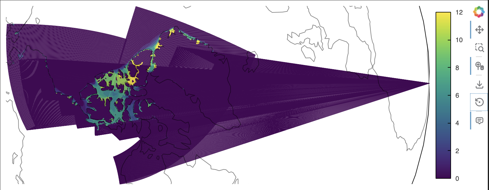

Passing an integer value to `min_count()` prevents this because the `sum()` function needs to find at least that many non `nan` values when summing, otherwise it just puts in a `nan` value for that cell.
I've found that passing `min_count=1` is sufficient to resolve this issue. 

If I take this dataset and try to immediately sum it along the time dimension, I get an error because the `time_bnds` variable doesn't have a data type that can be added together.
```python
EC_Earth3P_HR_hist_silandfast_CAA_sum_2000_xr = EC_Earth3P_HR_hist_silandfast_2000_CAA_xr.sum(dim='time', min_count=1)
```
```console
UFuncTypeError: ufunc 'add' cannot use operands with types dtype('<M8[ns]') and dtype('<M8[ns]')
```

If the `time_bnds` variable is first removed, then the summing works just fine.
```python
EC_Earth3P_HR_hist_silandfast_CAA_sum_2000_xr = EC_Earth3P_HR_hist_silandfast_2000_CAA_xr.drop(labels=['time_bnds']).sum(dim='time', min_count=1)

from arctichoke.plot.hvplots import quadmesh_map

EC_Earth3P_HR_hist_silandfast_sum_2000_CAA_map = quadmesh_map(
    EC_Earth3P_HR_hist_silandfast_CAA_sum_2000_xr,
    'silandfast',
    projection = 'Orthographic',
)
EC_Earth3P_HR_hist_silandfast_sum_2000_CAA_map
```
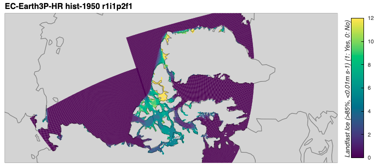

I wrote that functionality into the `sum_by_year()` function, adding the `groupby('time.year')` function such that it would give me one value for each year when working with datasets that span multiple years.
The `groupby` is unnecessary the plot below as there is just one year, but it will be important when I load data from many years later.
This function gives me the same plot as above, but with a modified title and colorbar label.
```python
from arctichoke.analysis.sum_by_year import sum_by_year

EC_Earth3P_HR_hist_silandfast_CAA_sum_2000_xr = sum_by_year(
    EC_Earth3P_HR_hist_silandfast_2000_CAA_xr,
    verbose = True,
)

from arctichoke.params import CAA_BBOX
from arctichoke.plot.hvplots import quadmesh_map

EC_Earth3P_HR_hist_silandfast_sum_2000_CAA_map = quadmesh_map(
    EC_Earth3P_HR_hist_silandfast_CAA_sum_2000_xr,
    'silandfast_year_sum',
    projection = 'Orthographic',
)
EC_Earth3P_HR_hist_silandfast_sum_2000_CAA_map
```
```console
(sum_by_year) `save_as`: None
(sum_by_year) `data_var_list`: ['time_bnds', 'longitude_bnds', 'latitude_bnds', 'silandfast']
(sum_by_year) Removing `meta_var`: time_bnds
(sum_by_year) Completed summing by year.
(sum_by_year) Modifying the dataset attributes.
```
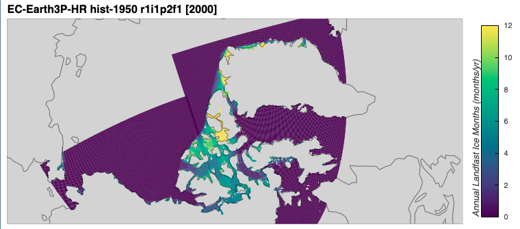

Next, I'll load more datafiles to find the annual landfast months per year across 1950-2015.

```python
from arctichoke.path.file_lists import list_variable_files

EC_Earth3P_HR_hist_silandfast_CAA_filelist = list_variable_files(
    source_id = 'EC-Earth3P-HR',
    variable_id = 'silandfast',
    variant_label = 'r1i1p2f1',
    with_modification = 'trim_CAA_',
)
EC_Earth3P_HR_hist_silandfast_CAA_filelist
```
```console
['/arctichoke_data/bergybits/data/CMIP6/HighResMIP/EC-Earth-Consortium/EC-Earth3P-HR/hist-1950/r1i1p2f1/SImon/silandfast/gn/v20260617/trim_CAA_silandfast_SImon_EC-Earth3P-HR_hist-1950_r1i1p2f1_gn_195001-195012.nc',
 '/arctichoke_data/bergybits/data/CMIP6/HighResMIP/EC-Earth-Consortium/EC-Earth3P-HR/hist-1950/r1i1p2f1/SImon/silandfast/gn/v20260617/trim_CAA_silandfast_SImon_EC-Earth3P-HR_hist-1950_r1i1p2f1_gn_195101-195112.nc',
...
 '/arctichoke_data/bergybits/data/CMIP6/HighResMIP/EC-Earth-Consortium/EC-Earth3P-HR/hist-1950/r1i1p2f1/SImon/silandfast/gn/v20260617/trim_CAA_silandfast_SImon_EC-Earth3P-HR_hist-1950_r1i1p2f1_gn_201301-201312.nc',
 '/arctichoke_data/bergybits/data/CMIP6/HighResMIP/EC-Earth-Consortium/EC-Earth3P-HR/hist-1950/r1i1p2f1/SImon/silandfast/gn/v20260617/trim_CAA_silandfast_SImon_EC-Earth3P-HR_hist-1950_r1i1p2f1_gn_201401-201412.nc']
```

I built the `sum_by_year()` function to handle datasets with more than one year using the `groupby` method, resulting in one time slice per year.
Below, sum `silandfast` data in that list of files and plot the year 1950 from that summed dataset.
```python
from arctichoke.analysis.sum_by_year import sum_by_year

EC_Earth3P_HR_hist_silandfast_CAA_sum_xr = sum_by_year(
    EC_Earth3P_HR_hist_silandfast_CAA_filelist,
    verbose = True,
)

from arctichoke.plot.hvplots import quadmesh_map

EC_Earth3P_HR_hist_silandfast_sum_CAA_map = quadmesh_map(
    EC_Earth3P_HR_hist_silandfast_CAA_sum_xr.sel(year=1950),
    'silandfast_year_sum',
    projection = 'Orthographic',
)
EC_Earth3P_HR_hist_silandfast_sum_CAA_map
```
```console
(sum_by_year) When passing a list of files, ensure their coordinates match as that is not verified in this function.
(sum_by_year) `save_as`: None
(sum_by_year) `data_var_list`: ['time_bnds', 'longitude_bnds', 'latitude_bnds', 'silandfast']
(sum_by_year) Removing `meta_var`: time_bnds
(sum_by_year) Completed summing by year.
(sum_by_year) Modifying the dataset attributes.
```
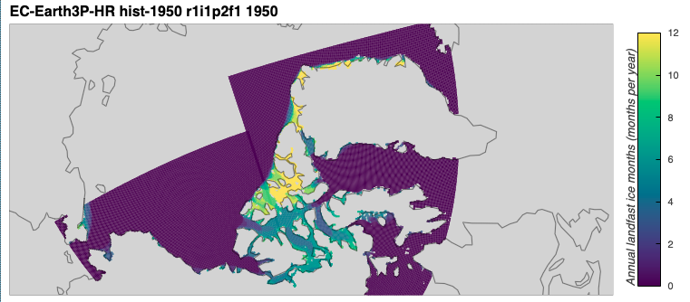

### Annual landfast months trend for one grid cell
[back to top](#trends-in-landfast-ice-over-time)

Next, I'll look at the `silandfast_year_sum` data from above across time for just one grid cell.
I chose the indices of `j` and `i` below by trial and error to locate a spot near Ittoqqortoormiit, Greenland.
```python
test_spot_xr = EC_Earth3P_HR_hist_silandfast_CAA_sum_xr.isel(j=40, i=625)
print(f"Latitude: {test_spot_xr['latitude'].values}")
print(f"Longitude: {test_spot_xr['longitude'].values}")
```
```console
Latitude: 70.64608001708984
Longitude: 335.64935302734375
```
For this chosen spot, I can then use the `numpy.polyfit()` function to get trend line, a process which I've written into my `plot_time_series()` function.
```python
from arctichoke.plot import make_title, plot_time_series

# Make the plot title
this_lon = f"{test_spot_xr['longitude'].values:.2f}"
this_lat = f"{test_spot_xr['latitude'].values:.2f}"
this_plot_title = f"{make_title(test_spot_xr)} at ({this_lat}, {this_lon})"

this_plot = plot_time_series(
    test_spot_xr,
    'silandfast_year_sum',
    plt_title = this_plot_title,
    add_regression = True,
    verbose = True,
)
```
```console
(plot_time_series) `save_as`: None
(plot_time_series) Slope of regression line: -0.1037587412587413
```
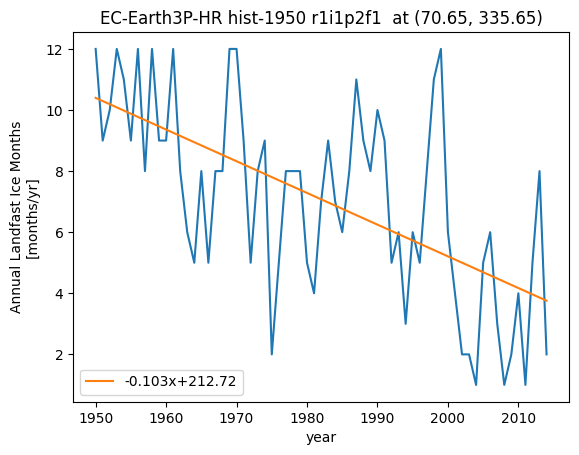

For this particular spot, the trend in landfast ice is -0.10376 months per year per year, meaning it has approximately 1 fewer months of annual landfast ice per decade. 
I deliberately chose that location to demonstrate one of the largest trends I find.
Most of the trends in the CAA are much smaller, for example the one below for a spot between the smaller islands of the northwestern CAA.
```python
test_spot_xr = EC_Earth3P_HR_hist_silandfast_CAA_sum_xr.isel(j=198, i=518)

from arctichoke.plot import make_title, plot_time_series

# Make the plot title
this_lon = f"{test_spot_xr['longitude'].values:.2f}"
this_lat = f"{test_spot_xr['latitude'].values:.2f}"
this_plot_title = f"{make_title(test_spot_xr)} at ({this_lat}, {this_lon})"

this_plot = plot_time_series(
    test_spot_xr,
    'silandfast_year_sum',
    plt_title = this_plot_title,
    add_regression = True,
    verbose = True,
)
```
```console
(plot_time_series) `save_as`: None
(plot_time_series) Slope of regression line: -0.0193181818181819
```
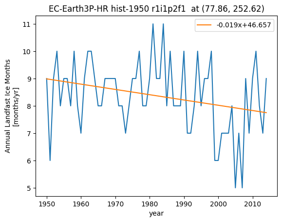

## Maps of landfast ice trends
[back to top](#trends-in-landfast-ice-over-time)

Now, I will find the trend in annual landfast ice months over the `hist-1950` experiment for several models, making a map for each variant. 
The `make_trend_map()` function calls the `trend_in_time()` function which uses the `np.polyfit()` function to get the regressions, as shown above. 
When dealing with datasets, it also converts the time values to the expected data type and masks out grid cells that have a value of zero across all time depending on the value of the `mask_where_zero_across_time` argument. 

### EC-Earth3P-HR landfast ice trend maps
[back to top](#trends-in-landfast-ice-over-time)

It takes about 2 minutes to make all the plots.
```python
from arctichoke.plot import make_trend_map

for this_variant in [
    'r1i1p2f1',
    'r2i1p2f1',
    'r3i1p2f1',
]:
    make_trend_map(
        this_source_id = 'EC-Earth3P-HR',
        this_var = 'silandfast',
        this_variant_label = this_variant,
        this_modification = 'trim_CAA_',
    )
```
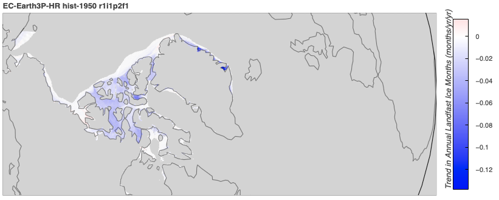
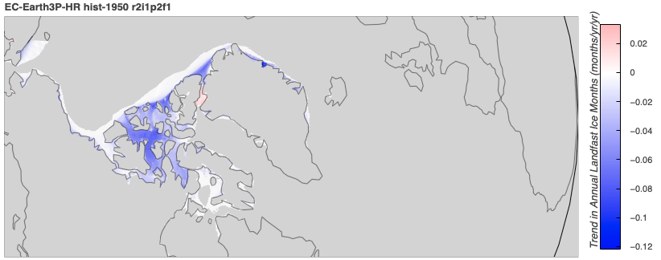
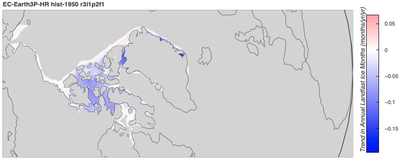

### HadGEM3-GC31-MM landfast ice trend maps
[back to top](#trends-in-landfast-ice-over-time)

It takes about 2 minutes to make all the plots.
```python
from arctichoke.plot import make_trend_map

for this_variant in [
    'r1i1p1f1',
    'r1i2p1f1',
    'r1i3p1f1',
]:
    make_trend_map(
        this_source_id = 'HadGEM3-GC31-MM',
        this_var = 'silandfast',
        this_variant_label = this_variant,
        this_modification = 'trim_CAA_',
    )
```
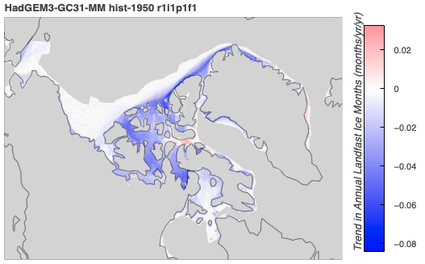
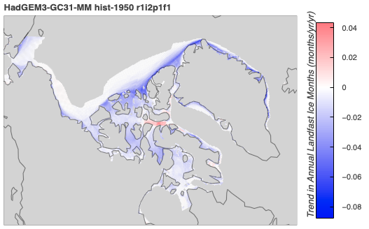
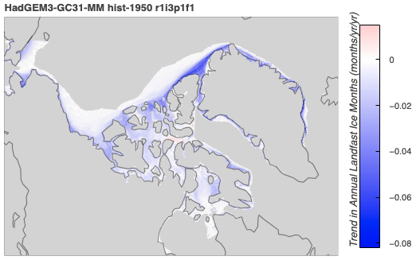

### HadGEM3-GC31-HM landfast ice trend maps
[back to top](#trends-in-landfast-ice-over-time)

It takes about 2 minutes to make all the plots.
```python
from arctichoke.plot import make_trend_map

for this_variant in [
    'r1i1p1f1',
    'r1i2p1f1',
    'r1i3p1f1',
]:
    make_trend_map(
        this_source_id = 'HadGEM3-GC31-HM',
        this_var = 'silandfast',
        this_variant_label = this_variant,
        this_modification = 'trim_CAA_',
    )
```
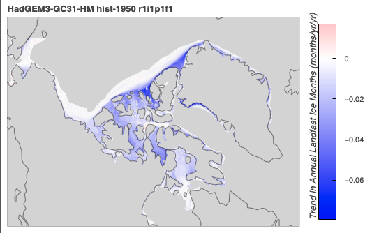
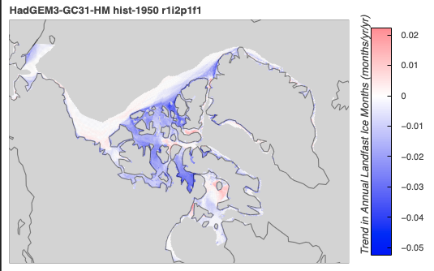
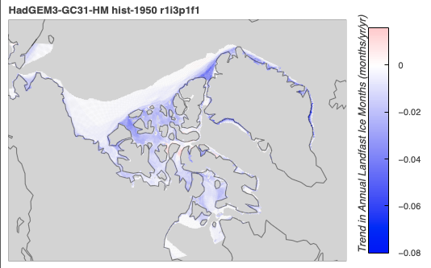

### HadGEM3-GC31-HH landfast ice trend map
[back to top](#trends-in-landfast-ice-over-time)

There is only one variant for HadGEM3-GC31-HM.
I turned `mask_where_zero_across_time` to `False` because when it is set to `True`, the kernel crashes due to running out of memory.
This takes about 2 minutes to plot.
```python
from arctichoke.plot import make_trend_map

make_trend_map(
    this_source_id = 'HadGEM3-GC31-HH',
    this_var = 'silandfast',
    this_variant_label = 'r1i1p1f1',
    this_modification = 'trim_CAA_',
    mask_where_zero_across_time = False,
    verbose = True,
)
```
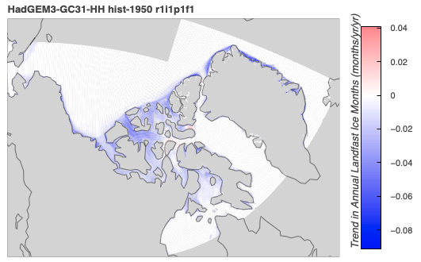