# Masking ice-free areas

Below, I describe how I mask out ice-free areas in maps that I plot.
This assumes you have already gone through {doc}`Trimming data to the CAA region <../docs_data/trim_to_CAA_region>` and {doc}`Making sea ice climatologies <../docs_analysis/climatologies>`.

## Contents

- [Introduction](#introduction)
- [Masking a single time slice](#masking-a-single-time-slice)
- [Masking with the climatology](#masking-with-the-climatology)
- [Masking trend maps](#masking-trend-maps)

---

## Introduction
[back to top](#masking-ice-free-areas)

When I plot maps of different variables, I am generally not using the `precise_trim` option set to `True` which, as detailed in {doc}`Trimming data to the CAA region <../docs_data/trim_to_CAA_region>` leads to keeping a larger spatial region than just between the corner coordinates I've chosen for a particular region.
There are then cases where regions that are usually ice-free are included when I plot the CAA.
The notable regions are around Iceland, as well as the southern sections of Greenland and Baffin Island.

This can become an issue when analyzing certain variables.
Notably, sea ice speed (`sispeed`) is defined as zero when no sea ice is present in some models, including `EC-Earth3P-HR`.
Therefore, it might be misleading to include ice-free areas when making maps of `sispeed` or another variable which uses `sispeed` in its calculation.

My plan for this is to create a mask that will remove data from the areas where there is very little sea ice.
I have chosen a threshold of 15% sea ice concentration, so that, when this mask is applied to a map, only regions where sea ice concentration is greater than 15% will be shown.

I do not plan on applying this mask to maps of the trends in landfast ice, however.
In those cases, I will mask out all grid cells which have no landfast ice over the entire time period.
This is to distinguish those grid cells from other grid cells where there is landfast ice in at least one year of the time series, but the change over time results in a trend of 0. 

---

## Masking a single time slice
[back to top](#masking-ice-free-areas)

I will start by taking a single time slice of a `siconc` data file for the first variant of `EC-Earth3P-HR`.
First, I will load the example from the file.
```python
import xarray as xr 

dataset = xr.open_dataset('/arctichoke_data/bergybits/data/CMIP6/HighResMIP/EC-Earth-Consortium/EC-Earth3P-HR/hist-1950/r1i1p2f1/SImon/siconc/gn/v20181212/trim_CAA_siconc_SImon_EC-Earth3P-HR_hist-1950_r1i1p2f1_gn_195001-195012.nc')
print(dataset)
```
```console
<xarray.Dataset> Size: 11MB
Dimensions:         (time: 12, bnds: 2, j: 199, i: 655, vertices: 4)
Coordinates:
  * time            (time) datetime64[ns] 96B 1950-01-16T12:00:00 ... 1950-12...
  * j               (j) float64 2kB 852.0 853.0 854.0 ... 1.049e+03 1.05e+03
  * i               (i) float64 5kB 426.0 427.0 428.0 ... 1.079e+03 1.08e+03
    longitude       (j, i) float32 521kB ...
    latitude        (j, i) float32 521kB ...
Dimensions without coordinates: bnds, vertices
Data variables:
    time_bnds       (time, bnds) datetime64[ns] 192B ...
    longitude_bnds  (j, i, vertices) float32 2MB ...
    latitude_bnds   (j, i, vertices) float32 2MB ...
    siconc          (time, j, i) float32 6MB ...
Attributes: (12/48)
    CDI:                    Climate Data Interface version 2.5.1 (https://mpi...
    Conventions:            CF-1.7 CMIP-6.2
    source:                 EC-Earth3P-HR (2017): \naerosol: none\natmos: IFS...
    institution:            AEMET, Spain; BSC, Spain; CNR-ISAC, Italy; DMI, D...
    activity_id:            HighResMIP
    ...                     ...
```

Then, I will plot the data for January of 1950.
```python
from arctichoke.plot import quadmesh_map
from arctichoke.params import sea_ice_vars

quadmesh_map(
    dataset.isel(time=0),
    'siconc',
    clims = sea_ice_vars['siconc']['plot_range'],
)
```
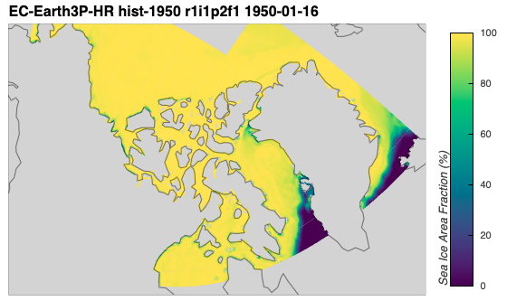

Here, I can see that this particular time slice has two regions of low ice concentration.

I then use the function I wrote `make_mask()` to create a mask of the data, setting all data with a concentration of 15% or less to `nan` and all above to 1.
```python
import numpy as np

from arctichoke.dataset import make_mask

# Get the maximum possible integer to cover all values of `siconc`
numpy_int32_max = np.iinfo(np.int32).max
# Make the mask of sea ice thicker than 2 meters
siconc_gt_15_var = 'siconc_gt_15'
siconc_gt_15_dataset = make_mask(
    dataset,
    var = 'siconc',
    mask_var_name = siconc_gt_15_var,
    mask_this_range = [15, numpy_int32_max],
    val_inside_range = 1,
    val_outside_range = np.nan,
    add_mask_attrs = True,
    verbose = True,
)

from arctichoke.plot import quadmesh_map

quadmesh_map(
    siconc_gt_15_dataset.isel(time=0),
    siconc_gt_15_var,
)
```
```console
(make_mask) `save_as`: None
(make_mask) `input_command`: cdo setrtoc2,15,2147483647,1,nan dataset
(add_mask_attributes) Adding mask-related attributes to the dataset.
```
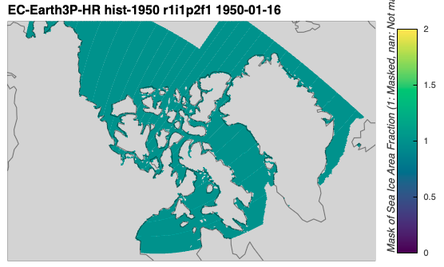

The mask seems to match up with what I would expect. 

Now, I will take this mask and apply it back onto the original sea ice concentration data.
The ice-free areas will be multiplied by `nan` and will thus be masked out while all other areas will be multiplied by `1`, and so will not change in value from the first map.
```python
dataset['siconc_masked'] = dataset['siconc'] * siconc_gt_15_dataset['siconc_gt_15']
print(dataset)
```
```console
<xarray.Dataset> Size: 18MB
Dimensions:         (time: 12, bnds: 2, j: 199, i: 655, vertices: 4)
Coordinates:
  * time            (time) datetime64[ns] 96B 1950-01-16T12:00:00 ... 1950-12...
  * j               (j) float64 2kB 852.0 853.0 854.0 ... 1.049e+03 1.05e+03
  * i               (i) float64 5kB 426.0 427.0 428.0 ... 1.079e+03 1.08e+03
    longitude       (j, i) float32 521kB ...
    latitude        (j, i) float32 521kB ...
Dimensions without coordinates: bnds, vertices
Data variables:
    time_bnds       (time, bnds) datetime64[ns] 192B ...
    longitude_bnds  (j, i, vertices) float32 2MB ...
    latitude_bnds   (j, i, vertices) float32 2MB ...
    siconc          (time, j, i) float32 6MB ...
    siconc_masked   (time, j, i) float32 6MB 99.03 99.09 99.45 ... 98.81 98.74
Attributes: (12/48)
    CDI:                    Climate Data Interface version 2.5.1 (https://mpi...
    Conventions:            CF-1.7 CMIP-6.2
    source:                 EC-Earth3P-HR (2017): \naerosol: none\natmos: IFS...
    institution:            AEMET, Spain; BSC, Spain; CNR-ISAC, Italy; DMI, D...
    activity_id:            HighResMIP
    ...                     ...
```
```python
from arctichoke.plot import quadmesh_map

quadmesh_map(
    dataset.isel(time=0),
    'siconc_masked',
    clims = sea_ice_vars['siconc']['plot_range'],
)
```
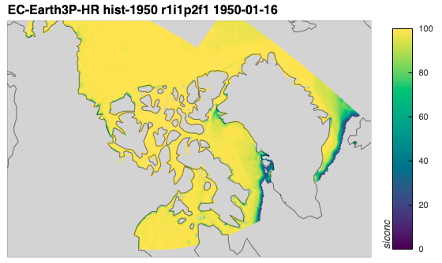

Indeed, I can see that no regions where concentration is less than 15% are shown in this map.

---

## Masking with the climatology
[back to top](#masking-ice-free-areas)

None of the maps I will include in this study span only one time slice, however.
Applying an ice-free mask to a dataset as shown above will result in a different mask for each time slice.
For consistency, I am choosing to create a mask from the climatology of sea ice concentration.
This only includes the years 1950-1969, and it should be noted that, since sea ice concentration is generally on the decline, using this climatology may include areas that are ice-free later in the time series.

I wrote the function `make_clim_mask()` to do the following procedure:
- Get the list of appropriate climatology files.
- Select only the summer months, if applicable.
- Take either the mean or sum of the climatology variable across the specified months.
- Use this mean dataset to create a mask.
```python
from arctichoke.dataset.clim_mask import make_clim_mask
from arctichoke.plot import quadmesh_map

this_var = 'siconc'
set_verbose = False

for variant_label in [
    'r1i1p2f1',
    'r2i1p2f1',
    'r3i1p2f1',
]:
    clim_mask_dataset = make_clim_mask(
        this_source_id = 'EC-Earth3P-HR',
        this_experiment = 'hist-1950',
        this_var = 'siconc',
        this_variant_label = variant_label,
        this_modification = 'trim_CAA_',
        verbose = set_verbose
    )

    # Plot the data on a map
    this_map = quadmesh_map(
        clim_mask_dataset,
        f'{this_var}_clim_mask',
        verbose = set_verbose,
    )
    display(this_map)
```
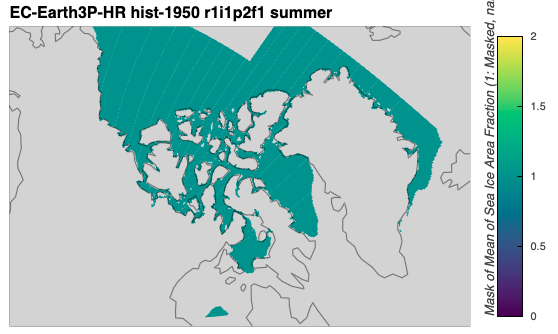


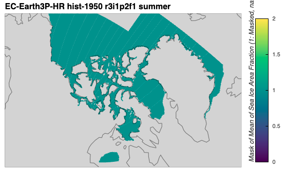

With this function to create masks based on climatologies, I will now apply these masks to maps of other variables.
```python
import xarray as xr

from arctichoke.dataset import select_months
from arctichoke.dataset.clim_mask import make_clim_mask
from arctichoke.path import list_variable_files
from arctichoke.params import sea_ice_vars
from arctichoke.plot import quadmesh_map

this_model = 'EC-Earth3P-HR'
this_experiment = 'hist-1950'
this_modification = 'trim_CAA_'
set_verbose = False

for variant_label in [
    'r1i1p2f1', 
    # 'r2i1p2f1', 
    # 'r3i1p2f1',
]:
    # Create the sea ice mask
    clim_mask_dataset = make_clim_mask(
        this_source_id = this_model,
        this_experiment = this_experiment,
        this_var = 'siconc',
        this_variant_label = variant_label,
        this_modification = this_modification,
        verbose = set_verbose
    )
    for this_si_var in [
        'sithick',
        'sispeed',
        'siconc',
        'siconc_si2mthick',
    ]:
        # Get the relevant file path
        sivar_clim_file = list_variable_files(
            source_id = this_model,
            variable_id = f'{this_si_var}_month_mean',
            experiment_id = this_experiment,
            variant_label = variant_label,
            with_modification = this_modification,
            verbose = set_verbose,
        )
        # Select just the summer months
        dataset_clim = select_months(sivar_clim_file, time_dim='month')
        # Determine whether this is a regular or marker variable
        if this_si_var in sea_ice_vars.keys():
            if sea_ice_vars[this_si_var]['marker_var']:
                # Take the sum across the 12 months
                dataset_clim = dataset_clim.sum(dim='month', min_count=1)
            else:
                # Take the mean across the 12 months
                dataset_clim = dataset_clim.mean(dim='month')
        else:
            raise ValueError(f"(Plotting climatologies) `this_si_var={this_si_var}` is not in the `sea_ice_vars` dictionary. Available variables: {sea_ice_vars.keys()}")
        # Copy the variable attributes
        keep_these_attrs = dataset_clim[f'{this_si_var}_month_mean'].attrs
        # Apply the sea ice mask
        dataset_clim[f'{this_si_var}_month_mean'] = dataset_clim[f'{this_si_var}_month_mean'] * clim_mask_dataset['siconc_clim_mask']
        # Put the variable attributes back
        dataset_clim[f'{this_si_var}_month_mean'].attrs = keep_these_attrs
        # Adjust the `long_name` attribute to change the colorbar label
        dataset_clim[f'{this_si_var}_month_mean'].attrs['long_name'] = dataset_clim[f'{this_si_var}_month_mean'].attrs['long_name'].replace('onthly m', '')
        # Plot the data on a map
        this_map = quadmesh_map(
            dataset_clim,
            f'{this_si_var}_month_mean',
            clims = sea_ice_vars[this_si_var]['plot_range'],
            verbose = set_verbose,
        )
        display(this_map)
```
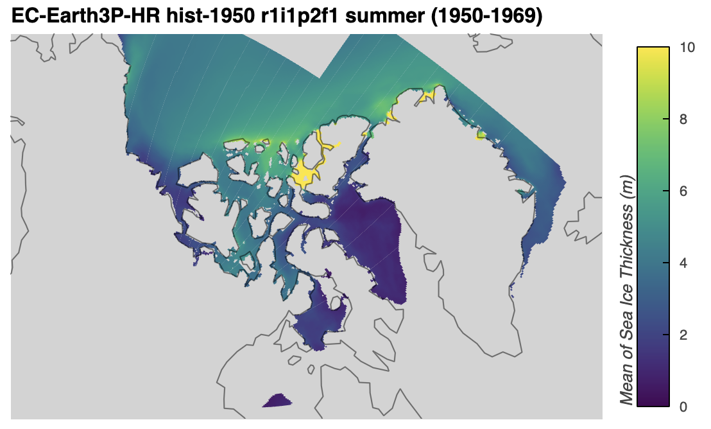

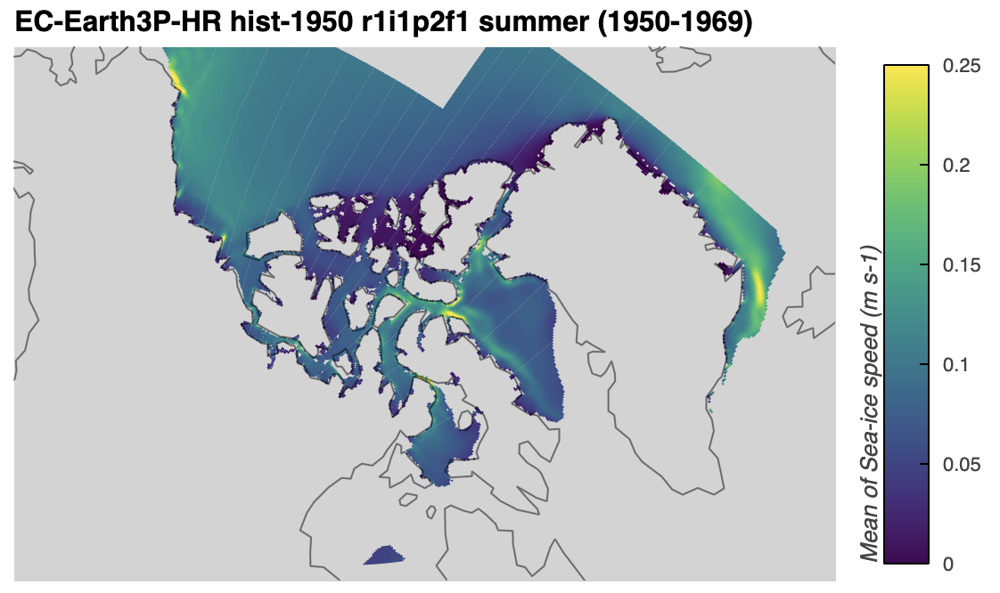

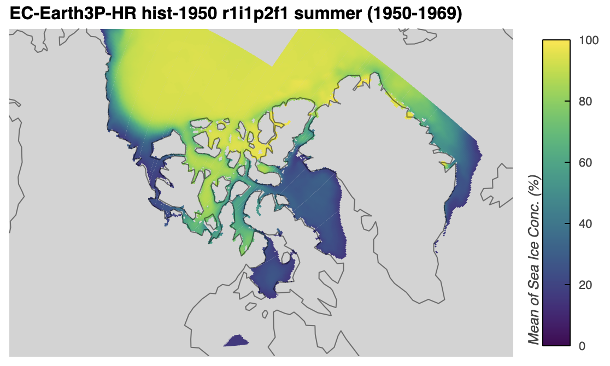

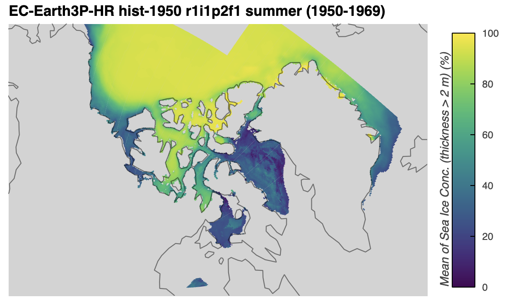

---

## Masking trend maps
[back to top](#masking-ice-free-areas)

When masking out ice free areas on maps of trends in particular variables, the code can be a bit more streamlined as I implemented an argument called `mask_where_zero_across_time`.
The argument's name comes from the fact that I originally added it such that if it is set to `True`, then the code will find all grid cells where the variable's value is zero across all points in time.
I extended this argument such that, if a data array is given, it will apply that data array to the variable being plotted.
This means, if I pass the resulting mask created with the `make_clim_mask()` function to `make_trend_map()` as the `mask_where_zero_across_time` argument, it will multiply the variable to be plotted by the given mask.

Below, I demonstrate how I applied the same mask as above to trends in sea ice thickness, speed, and concentration.
```python
from arctichoke.dataset.clim_mask import make_clim_mask
from arctichoke.params import sea_ice_vars
from arctichoke.plot import make_trend_map

this_model = 'EC-Earth3P-HR'
this_experiment = 'hist-1950'
this_modification = 'trim_CAA_'
set_verbose = False

for variant_label in [
    'r1i1p2f1',
    # 'r2i1p2f1',
    # 'r3i1p2f1',
]:
    # Create the sea ice mask
    clim_mask_dataset = make_clim_mask(
        this_source_id = this_model,
        this_experiment = this_experiment,
        this_var = 'siconc',
        this_variant_label = variant_label,
        this_modification = this_modification,
        verbose = set_verbose
    )
    for variable_id in [
        'sithick',
        'sispeed',
        'siconc',
    ]:
        this_map = make_trend_map(
            this_source_id = this_model,
            this_var = variable_id,
            this_variant_label = variant_label, 
            this_modification = this_modification,
            mask_where_zero_across_time = clim_mask_dataset['siconc_clim_mask'],
            select_summer = True,
            call_sum_by_year = True,
            time_dim = 'time',
            find_mean = True,
            clims = sea_ice_vars[variable_id]['trend_clims'],
            return_map = True,
            verbose = set_verbose,
        )
        display(this_map)
```
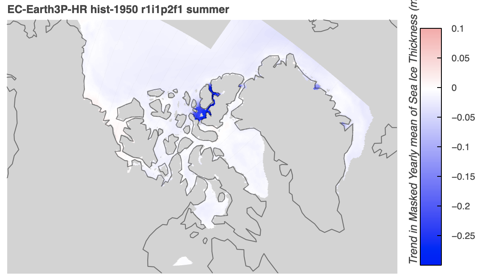

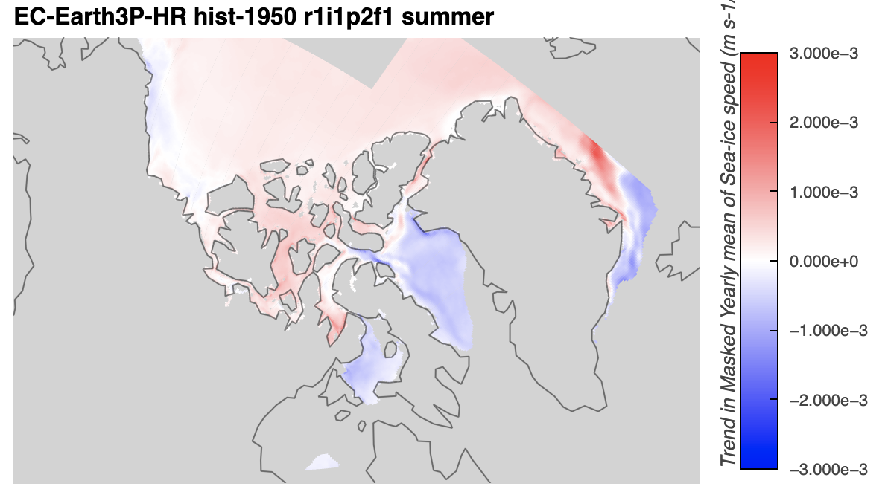

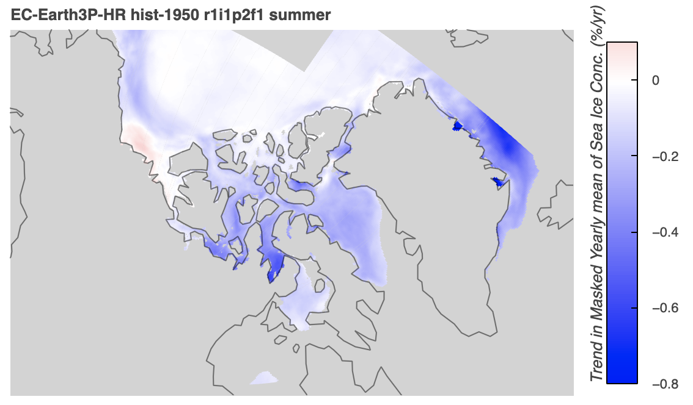

---