# Identifying multi-year ice

Below, I describe how I mark multi-year sea ice (`simultiyear`) using sea ice age (`siage`) for the `EC-Earth3P-HR` and `HadGEM3-GC31-MM` models.
I ended up not using sea ice age or multi-year ice in my study, but I document what I find below regardless.
This assumes you have already gone through {doc}`Trimming data to the CAA region <../docs_data/trim_to_CAA_region>`.

## Contents

- [Introduction](#introduction)
- [Preparing the sea ice age data](#preparing-the-sea-ice-age-data)
    - [Spiky artifact in EC-Earth3P-HR data](#spiky-artifact-in-ec-earth3p-hr-data)
    - [Unusually old sea ice](#unusually-old-sea-ice)
- [Generating `siage2` files](#generating-siage2-files)
- [Generating multi-year sea ice files](#generating-multi-year-sea-ice-files)
- [Plotting trends in multi-year sea ice](#plotting-trends-in-multi-year-sea-ice)

---

## Introduction
[back to top](#identifying-multi-year-ice)

Choke points form when sea ice gets locked in place.
This can often happen when thick, multi-year ice flows through narrow passages.
Marking ice as multi-year could be a helpful indicator as to where choke points form.
However, as discussed below, I decided to not include this in my study due to issues with the sea ice age data.

---

## Preparing the sea ice age data
[back to top](#identifying-multi-year-ice)

The sea ice age (`siage`) data for the `EC-Earth3P-HR` and `HadGEM3-GC31` models is recorded in units of seconds.
For that reason and the issue with the `EC-Earth3P-HR` sea ice age data files discussed below, I decided to write a function to create files of `siage2`, the variable which is ready for calculating the multi-year ice marker data.

### Spiky artifact in EC-Earth3P-HR data
[back to top](#identifying-multi-year-ice)

When plotting the `siage` data for `EC-Earth3P-HR` directly, a spiky artifact appears on the map.
Here is an example with data from July of 2000.
```python
import xarray as xr

from arctichoke.params import CAA_BBOX

siage_2000 = '/arctichoke_data/bergybits/data/CMIP6/HighResMIP/EC-Earth-Consortium/EC-Earth3P-HR/hist-1950/r1i1p2f1/SImon/siage/gn/v20181212/siage_SImon_EC-Earth3P-HR_hist-1950_r1i1p2f1_gn_200001-200012.nc'

from arctichoke.dataset.trim_dataset import trim_latlon

siage_2000_xr_trim = trim_latlon(
    xr.open_dataset(siage_2000),
    map_bbox = CAA_BBOX,
    precise_trim = False,
)

from arctichoke.plot.hvplots import quadmesh_map

siage_2000_trim_map = quadmesh_map(
    siage_2000_xr_trim.isel(time=6),
    'siage',
    map_projection = 'Orthographic',
    verbose = True,
)
siage_2000_trim_map
```
```console
(quadmesh_map) `save_as`: None
(quadmesh_map) `lat_var`: latitude
(quadmesh_map) `lon_var`: longitude
(quadmesh_map) `diverging_cbar`: False
(quadmesh_map) `cmin`: 0.0, `cmax`: 3.155692772830838e+27
```
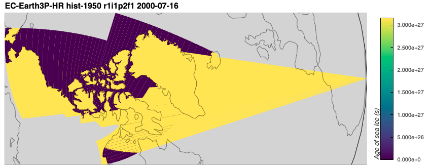

As can be seen in the verbose output, the maximum value on the plot is `3.155692772830838e+27`.
Converting that from seconds to years gives a number far too large to be reasonable.
```python
3.155692772830838e+27 / (365 * 24 * 60 * 60)
```
```console
1.0006636139113515e+20
```

I assume this must be the value used to indicate missing data, however it is not noted in the metadata of the files.
This is supported by the fact that most of the regions on the map with that value are over land.
The reason for the spiky artifact is due to the fact that the bounds on the latitude and longitude values in the cells over land sometimes contain zeros, meaning that one corner of the cell which is drawn gets mapped to be off the coast of Africa.

I can remove the spiky artifact by setting all values above `1e+27` to be `nan`.
In the function `calc_siage()`, I check for these spurious large values and, if present, map them to `nan` while also converting from seconds to years.
```python
from arctichoke.analysis import calc_siage

siage_2000_xr_trim = calc_siage(
    siage_2000_xr_trim,
    verbose = True,
)

from arctichoke.plot.hvplots import quadmesh_map

siage_2000_trim_map = quadmesh_map(
    siage_2000_xr_trim.isel(time=6),
    'siage2',
    map_projection = 'Orthographic',
    verbose = True,
)
siage_2000_trim_map
```
```console
(calc_siage) `save_as`: None
(calc_siage) Maximum value of `siage` found to be 3.155692772830838e+27. Mapping large values to `nan`.
(calc_siage) `input_command`: cdo setrtoc,1e+27,1.7976931348623157e+308,nan dataset
(calc_siage) Found units of `s`. Dividing by 31536000 to get units of years.
(quadmesh_map) `save_as`: None
(quadmesh_map) `lat_var`: latitude
(quadmesh_map) `lon_var`: longitude
(quadmesh_map) `diverging_cbar`: False
(quadmesh_map) `cmin`: 0.0, `cmax`: 122.23867797851562
```
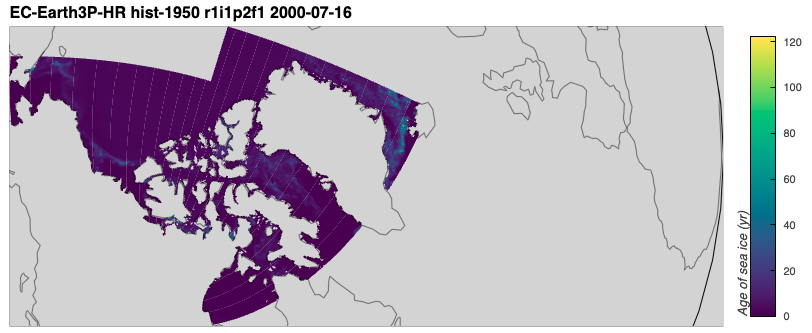

However, this led me to the next issue.
The ice is too old.

### Unusually old sea ice
[back to top](#identifying-multi-year-ice)

As can be seen in the output of making the plot above, the maximum sea ice age value is over 122 years.
That seems odd.
I can restrict the colorbar of the above plot to see more detail.
```python
from arctichoke.plot.hvplots import quadmesh_map

siage_2000_trim_map = quadmesh_map(
    siage_2000_xr_trim.isel(time=6),
    'siage2',
    map_projection = 'Orthographic',
    clims = [0,40],
)
siage_2000_trim_map
```
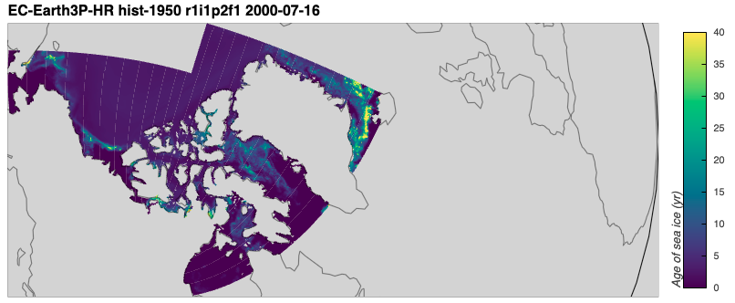

If I make a similar plot for the `HadGEM3-GC31-MM` model, I also see that the sea ice age values are unusually old in certain places.
First, I'll make a plot showing the original values from the `siage` file.
```python
import xarray as xr

from arctichoke.params import CAA_BBOX

siage_2000 = '/arctichoke_data/bergybits/data/CMIP6/HighResMIP/MOHC/HadGEM3-GC31-MM/hist-1950/r1i1p1f1/SImon/siage/gn/v20170928/siage_SImon_HadGEM3-GC31-MM_hist-1950_r1i1p1f1_gn_200001-200012.nc'

from arctichoke.dataset.trim_dataset import trim_latlon

siage_2000_xr_trim = trim_latlon(
    xr.open_dataset(siage_2000),
    map_bbox = CAA_BBOX,
    precise_trim = False,
)

from arctichoke.plot.hvplots import quadmesh_map

siage_2000_trim_map = quadmesh_map(
    siage_2000_xr_trim.isel(time=6),
    'siage',
    map_projection = 'Orthographic',
    verbose = True,
)
siage_2000_trim_map
```
```console
(quadmesh_map) `save_as`: None
(quadmesh_map) `lat_var`: latitude
(quadmesh_map) `lon_var`: longitude
(quadmesh_map) `diverging_cbar`: False
(quadmesh_map) `cmin`: 0.0, `cmax`: 1324738304.0
```
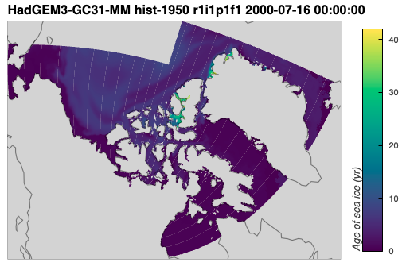

In the next plot, I use `calc_siage()` to convert from seconds to years.
```python
from arctichoke.analysis import calc_siage

siage_2000_xr = calc_siage(siage_2000_xr_trim)

from arctichoke.plot.hvplots import quadmesh_map

siage_2000_trim_map = quadmesh_map(
    siage_2000_xr.isel(time=6),
    'siage2',
    map_projection = 'Orthographic',
    verbose = True,
)
siage_2000_trim_map
```
```console
(quadmesh_map) `save_as`: None
(quadmesh_map) `lat_var`: latitude
(quadmesh_map) `lon_var`: longitude
(quadmesh_map) `diverging_cbar`: False
(quadmesh_map) `cmin`: 0.0, `cmax`: 42.00717544555664
```
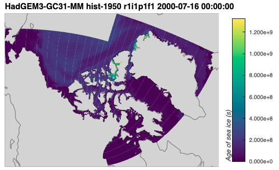

The maximum sea ice age value here is 42 years.
That is unusually high, however it is a bit more believable that these values occur along the northern parts of the CAA and Greenland close to shore.

---

## Generating `siage2` files
[back to top](#identifying-multi-year-ice)

Even though I found some [unusually old sea ice](#unusually-old-sea-ice), I decided to go ahead and calculate multi-year ice trends.
The first step in this process is generating the `siage2` files.
```python
from arctichoke.path import list_variable_files
from arctichoke.analysis import make_siage_files
from arctichoke.params import CAA_BBOX
this_model = 'EC-Earth3P-HR'
for this_variant_label in [
    'r1i1p2f1', 
    'r2i1p2f1', 
    'r3i1p2f1',
]:
    for this_experiment in ['hist-1950']:
        siage_list = list_variable_files(
            source_id = this_model,
            variable_id = 'siage',
            experiment_id = this_experiment,
            variant_label = this_variant_label,
        )
        make_siage_files(
            siage_files = siage_list,
            map_bbox = CAA_BBOX,
            precise_trim = False,
        )
```
```console
	(make_siage_files) Writing file `/arctichoke_data/bergybits/data/CMIP6/HighResMIP/EC-Earth-Consortium/EC-Earth3P-HR/hist-1950/r1i1p2f1/SImon/siage2/gn/v20260617/trim_CAA_siage2_SImon_EC-Earth3P-HR_hist-1950_r1i1p2f1_gn_195001-195012.nc`.
	(make_siage_files) Writing file `/arctichoke_data/bergybits/data/CMIP6/HighResMIP/EC-Earth-Consortium/EC-Earth3P-HR/hist-1950/r1i1p2f1/SImon/siage2/gn/v20260617/trim_CAA_siage2_SImon_EC-Earth3P-HR_hist-1950_r1i1p2f1_gn_195101-195112.nc`.
    ...
	(make_siage_files) Writing file `/arctichoke_data/bergybits/data/CMIP6/HighResMIP/EC-Earth-Consortium/EC-Earth3P-HR/hist-1950/r3i1p2f1/SImon/siage2/gn/v20260617/trim_CAA_siage2_SImon_EC-Earth3P-HR_hist-1950_r3i1p2f1_gn_201301-201312.nc`.
	(make_siage_files) Writing file `/arctichoke_data/bergybits/data/CMIP6/HighResMIP/EC-Earth-Consortium/EC-Earth3P-HR/hist-1950/r3i1p2f1/SImon/siage2/gn/v20260617/trim_CAA_siage2_SImon_EC-Earth3P-HR_hist-1950_r3i1p2f1_gn_201401-201412.nc`.
```

```python
from arctichoke.path import list_variable_files
from arctichoke.analysis import make_siage_files
from arctichoke.params import CAA_BBOX
this_model = 'HadGEM3-GC31-MM'
for this_variant_label in [
    'r1i1p1f1', 
    'r1i2p1f1', 
    'r1i3p1f1',
]:
    for this_experiment in ['hist-1950']:
        siage_list = list_variable_files(
            source_id = this_model,
            variable_id = 'siage',
            experiment_id = this_experiment,
            variant_label = this_variant_label,
        )
        make_siage_files(
            siage_files = siage_list,
            map_bbox = CAA_BBOX,
            precise_trim = False,
        )
```
```console
	(make_siage_files) Writing file `/arctichoke_data/bergybits/data/CMIP6/HighResMIP/MOHC/HadGEM3-GC31-MM/hist-1950/r1i1p1f1/SImon/siage2/gn/v20260617/trim_CAA_siage2_SImon_HadGEM3-GC31-MM_hist-1950_r1i1p1f1_gn_195001-195012.nc`.
	(make_siage_files) Writing file `/arctichoke_data/bergybits/data/CMIP6/HighResMIP/MOHC/HadGEM3-GC31-MM/hist-1950/r1i1p1f1/SImon/siage2/gn/v20260617/trim_CAA_siage2_SImon_HadGEM3-GC31-MM_hist-1950_r1i1p1f1_gn_195101-195112.nc`.
    ...
	(make_siage_files) Writing file `/arctichoke_data/bergybits/data/CMIP6/HighResMIP/MOHC/HadGEM3-GC31-MM/hist-1950/r1i3p1f1/SImon/siage2/gn/v20260617/trim_CAA_siage2_SImon_HadGEM3-GC31-MM_hist-1950_r1i3p1f1_gn_201301-201312.nc`.
	(make_siage_files) Writing file `/arctichoke_data/bergybits/data/CMIP6/HighResMIP/MOHC/HadGEM3-GC31-MM/hist-1950/r1i3p1f1/SImon/siage2/gn/v20260617/trim_CAA_siage2_SImon_HadGEM3-GC31-MM_hist-1950_r1i3p1f1_gn_201401-201412.nc`.
```

---

## Generating multi-year sea ice files
[back to top](#identifying-multi-year-ice)

Next, I generate the multi-year sea ice files, setting a threshold that mult-year ice is over 2 years old.
```python
from arctichoke.path import list_variable_files
from arctichoke.analysis import make_multiyear_files
from arctichoke.params import CAA_BBOX
this_model = 'EC-Earth3P-HR'
for this_variant_label in [
    'r1i1p2f1', 
    'r2i1p2f1', 
    'r3i1p2f1',
]:
    for this_experiment in ['hist-1950']:
        siage_list = list_variable_files(
            source_id = this_model,
            variable_id = 'siage2',
            experiment_id = this_experiment,
            variant_label = this_variant_label,
            with_modification = 'trim_CAA_',
        )
        make_multiyear_files(
            siage_files = siage_list,
            siage_var = 'siage2',
            precise_trim = False,
        )
```
```console
	(make_multiyear_files) Writing file `/arctichoke_data/bergybits/data/CMIP6/HighResMIP/EC-Earth-Consortium/EC-Earth3P-HR/hist-1950/r1i1p2f1/SImon/simultiyear/gn/v20260617/trim_CAA_simultiyear_SImon_EC-Earth3P-HR_hist-1950_r1i1p2f1_gn_195001-195012.nc`.
	(make_multiyear_files) Writing file `/arctichoke_data/bergybits/data/CMIP6/HighResMIP/EC-Earth-Consortium/EC-Earth3P-HR/hist-1950/r1i1p2f1/SImon/simultiyear/gn/v20260617/trim_CAA_simultiyear_SImon_EC-Earth3P-HR_hist-1950_r1i1p2f1_gn_195101-195112.nc`.
    ...
	(make_multiyear_files) Writing file `/arctichoke_data/bergybits/data/CMIP6/HighResMIP/EC-Earth-Consortium/EC-Earth3P-HR/hist-1950/r3i1p2f1/SImon/simultiyear/gn/v20260617/trim_CAA_simultiyear_SImon_EC-Earth3P-HR_hist-1950_r3i1p2f1_gn_201301-201312.nc`.
	(make_multiyear_files) Writing file `/arctichoke_data/bergybits/data/CMIP6/HighResMIP/EC-Earth-Consortium/EC-Earth3P-HR/hist-1950/r3i1p2f1/SImon/simultiyear/gn/v20260617/trim_CAA_simultiyear_SImon_EC-Earth3P-HR_hist-1950_r3i1p2f1_gn_201401-201412.nc`.
```

```python
from arctichoke.path import list_variable_files
from arctichoke.analysis import make_multiyear_files
from arctichoke.params import CAA_BBOX
this_model = 'HadGEM3-GC31-MM'
for this_variant_label in [
    'r1i1p1f1', 
    'r1i2p1f1', 
    'r1i3p1f1',
]:
    for this_experiment in ['hist-1950']:
        siage_list = list_variable_files(
            source_id = this_model,
            variable_id = 'siage2',
            experiment_id = this_experiment,
            variant_label = this_variant_label,
            with_modification = 'trim_CAA_',
        )
        make_multiyear_files(
            siage_files = siage_list,
            siage_var = 'siage2',
            precise_trim = False,
        )
```
```console
	(make_multiyear_files) Writing file `/arctichoke_data/bergybits/data/CMIP6/HighResMIP/MOHC/HadGEM3-GC31-MM/hist-1950/r1i1p1f1/SImon/simultiyear/gn/v20260617/trim_CAA_simultiyear_SImon_HadGEM3-GC31-MM_hist-1950_r1i1p1f1_gn_195001-195012.nc`.
	(make_multiyear_files) Writing file `/arctichoke_data/bergybits/data/CMIP6/HighResMIP/MOHC/HadGEM3-GC31-MM/hist-1950/r1i1p1f1/SImon/simultiyear/gn/v20260617/trim_CAA_simultiyear_SImon_HadGEM3-GC31-MM_hist-1950_r1i1p1f1_gn_195101-195112.nc`.
    ...
	(make_multiyear_files) Writing file `/arctichoke_data/bergybits/data/CMIP6/HighResMIP/MOHC/HadGEM3-GC31-MM/hist-1950/r1i3p1f1/SImon/simultiyear/gn/v20260617/trim_CAA_simultiyear_SImon_HadGEM3-GC31-MM_hist-1950_r1i3p1f1_gn_201301-201312.nc`.
	(make_multiyear_files) Writing file `/arctichoke_data/bergybits/data/CMIP6/HighResMIP/MOHC/HadGEM3-GC31-MM/hist-1950/r1i3p1f1/SImon/simultiyear/gn/v20260617/trim_CAA_simultiyear_SImon_HadGEM3-GC31-MM_hist-1950_r1i3p1f1_gn_201401-201412.nc`.
```

---

## Plotting trends in multi-year sea ice
[back to top](#identifying-multi-year-ice)

Next, I make plots of the trends in annual months of multi-year ice in the summer months.
```python
from arctichoke.plot import make_trend_map

for this_variant in [
    'r1i1p2f1',
    'r2i1p2f1',
    'r3i1p2f1',
]:
    make_trend_map(
        this_source_id = 'EC-Earth3P-HR',
        this_var = 'simultiyear',
        this_variant_label = this_variant,
        this_modification = 'trim_CAA_',
        mask_where_zero_across_time = True,
        select_summer = True,
    )
```
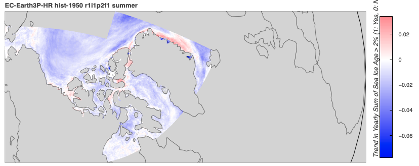
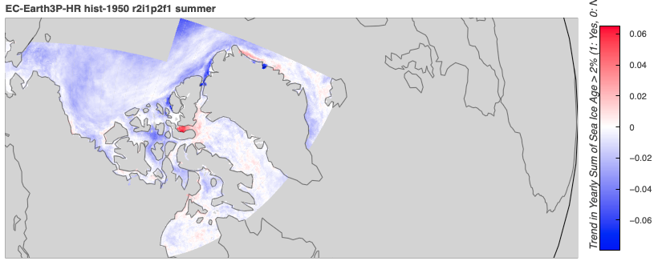
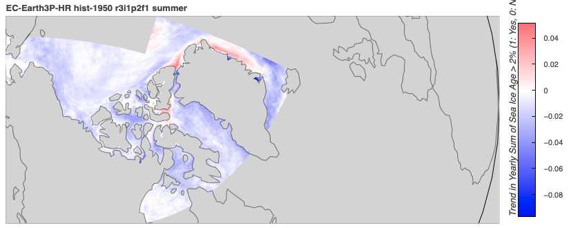

```python
import numpy as np
import xarray as xr 
from arctichoke.analysis import sum_by_year
from arctichoke.dataset import make_mask, select_months
from arctichoke.plot import make_trend_map

for this_variant in [
    'r1i1p1f1', 
    'r1i2p1f1', 
    'r1i3p1f1',
]:
    make_trend_map(
        this_source_id = 'HadGEM3-GC31-MM',
        this_var = 'simultiyear',
        this_variant_label = this_variant,
        this_modification = 'trim_CAA_',
        mask_where_zero_across_time = True,
        select_summer = True,
    )
```
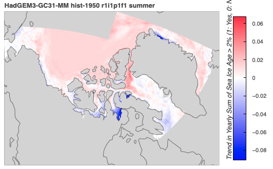
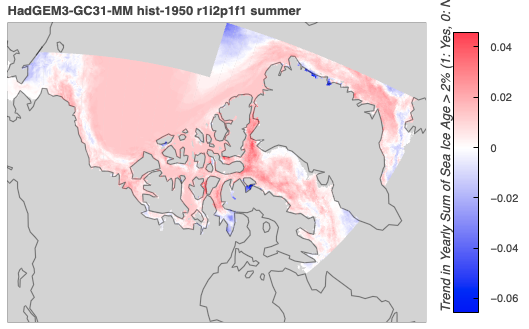
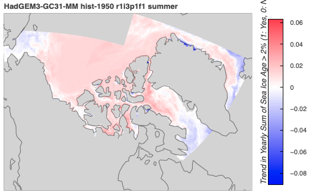
