# Trend significance

Below, I describe how I the significance of trends over time for different variables.
This assumes you have already gone through {doc}`Trends in landfast ice over time  <../docs_analysis/landfast_trends>`.

## Contents

- [Introduction](#introduction)
- [Minimal example following Statology](#minimal-example-following-statology)
    - [Standard error for a minimal example](#standard-error-for-a-minimal-example)
    - [Significance for a minimal example](#significance-for-a-minimal-example)
- [Minimal example with multiple values](#minimal-example-with-multiple-values)
    - [Standard error for multiple values](#standard-error-for-multiple-values)
    - [Trend significance for multiple values](#trend-significance-for-multiple-values)
- [Trend significance test in Nares Strait](#trend-significance-test-in-nares-strait)
- [Trend significance test across the CAA](#trend-significance-test-across-the-caa)

---

## Introduction
[back to top](#trend-significance)

In {doc}`Trends in landfast ice over time  <../docs_analysis/landfast_trends>`, I make maps of the trends in time for each grid cell in a map. 
I do something very similar for other variables, including sea ice concentration and speed.
Here, I will calculate whether the trends in each grid cell are statistically significant.

When making a map of trend, I use the `xarray.polyfit` function. 
For example:
```python
polyfit = (dataset[var].polyfit(time_dim, 1, skipna=True, full=True) )
```
where `var` is the variable of the dataset for which I want to get the trends, `time_dim` is the name of the time dimension across which to take the trends, `1` represents taking a 1st-order (linear) fit, `skipna=True` skips `nan` values to treat them as missing, and `full=True` means that diagnostic information is also returned, not just the coefficients of the fit.

This returns values for the slope, intercept, and residuals of the linear regression. 
I can use the returned residuals to calculate the standard error and, in using the standard error, I can calculate whether the trend is statistically significant.

---

## Minimal example following Statology 
[back to top](#trend-significance)

The first step to finding whether a trend is significant is calculating the standard error. 
First, I'll create a minimal dataset following an example where the standard error is known.
After, I'll use that standard error to determine whether the trend of the minimal example is significant or not.

### Standard error for a minimal example
[back to top](#trend-significance)

I am following the Statology article [Understanding the Standard Error of the Regression](https://www.statology.org/standard-error-regression/) to be able to compare the standard error I find to theirs.
Below, I recreate the first dataset they use, which is meant to represent the number of hours different students spent studying and their resulting scores on a test.
```python
from arctichoke.dataset import make_example_dataset

test_xr = make_example_dataset(
    n = 1,
    test_var_name = 'score',
    time_dim = 'year',
    time_len = 12,
    start_year = 0,
)
test_xr['score'] = test_xr['score'].isel(year=0)
test_xr = test_xr.drop_dims('year')
test_xr = test_xr.expand_dims(
    dim={'hours': [0.5, 0.5, 1, 1, 1, 1.5, 2, 2.5, 2.5, 3, 3, 4]}, 
    axis=0)
test_xr['score'].values = [[[76]], [[78]], [[74]], [[80]], [[84]], [[79]], [[86]], [[90]], [[92]], [[84]], [[83]], [[97]]]
print(test_xr)
```
```
<xarray.Dataset> Size: 224B
Dimensions:    (hours: 12, j: 1, i: 1)
Coordinates:
  * hours      (hours) float64 96B 0.5 0.5 1.0 1.0 1.0 ... 2.5 2.5 3.0 3.0 4.0
  * j          (j) float64 8B 0.0
  * i          (i) float64 8B 2.0
    longitude  (j, i) float64 8B 3.0
    latitude   (j, i) float64 8B 4.0
Data variables:
    score      (hours, j, i) int64 96B 76 78 74 80 84 79 86 90 92 84 83 97
```

Next, I use the `polyfit` function built in to `xarray`, specifying `full=True` such that it returns diagnostic values as well as the coefficients of the fit. 
```python
polyfit = test_xr['score'].polyfit('hours', 1, skipna=True, full=True)
print(polyfit)
```
```
<xarray.Dataset> Size: 80B
Dimensions:                (degree: 2, j: 1, i: 1)
Coordinates:
  * degree                 (degree) int64 16B 1 0
  * j                      (j) float64 8B 0.0
  * i                      (i) float64 8B 2.0
Data variables:
    hours_matrix_rank      int64 8B 2
    hours_singular_values  (degree) float64 16B 1.366 0.366
    polyfit_coefficients   (degree, j, i) float64 16B 4.898 74.4
    polyfit_residuals      (j, i) float64 8B 175.6
```

Here, I find the following relevant values:
- Slope: 4.989
- Intercept: 74.4
- Residuals: 175.6

These match the values reported in the Statology article.

Below, I'll plot the original data points as well as the linear fit from `polyfit()`.
```python
import matplotlib.pyplot as plt

plt.scatter(test_xr['hours'].values, test_xr['score'], label='data')
polyfit_line = test_xr['hours'].values * polyfit['polyfit_coefficients'].isel(degree=0).values + polyfit['polyfit_coefficients'].isel(degree=1).values
plt.plot(test_xr['hours'].values, polyfit_line[0], label='fit')
plt.xlabel('hours')
plt.ylabel('score')
plt.legend()
plt.show()
```
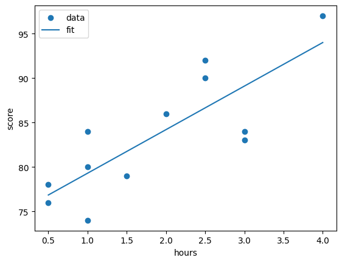

The `polyfit_residuals` are defined on the [`xarray.polyfit` docs page](https://docs.xarray.dev/en/stable/generated/xarray.DataArray.polyfit.html) to be:
> "polyfit_residuals - The residuals of the least-square computation (only included if full=True). When the matrix rank is deficient, np.nan is returned."

I find this definition a bit confusing because there are such things as residuals which are not the sum of the square residuals. 
However, if I look at the [`numpy.polyfit` docs page](https://numpy.org/doc/stable/reference/generated/numpy.polyfit.html), they have the definition:
> "residuals – sum of squared residuals of the least squares fit"

Using the same data as above, I'll find the results of using `numpy.polyfit`.
```python
import numpy as np 
x = [0.5, 0.5, 1, 1, 1, 1.5, 2, 2.5, 2.5, 3, 3, 4]
y = [76, 78, 74, 80, 84, 79, 86, 90, 92, 84, 83, 97]
np.polyfit(x, y, 1, full=True)
```
```
(array([ 4.89777778, 74.4       ]),
 array([175.58222222]),
 np.int32(2),
 array([1.3660254, 0.3660254]),
 np.float64(2.6645352591003757e-15))
```

Here, I find the following relevant values:
- Slope: 4.89777778
- Intercept: 74.4
- Residuals: 175.58222222

These match the values I found using `xarray.polyfit`.

Since the `xarray.polyfit` function says in the docs that "This replicates the behaviour of numpy.polyfit but differs by skipping invalid values when skipna = True" and also because, when testing, I get the same value for the residuals from both functions using the same data, I am going to assume that the `polyfit_residuals` from the `xarray.polyfit` function are the sum of the square residuals. 

From here, I would like to use the residuals to calculate the standard error from the following equation.

$ \text{Standard Error} = \sqrt{\frac{S}{n-2}} $

where $S$ is the sum of square residuals and $n$ is the number of degrees of freedom.
```python
import numpy as np

n = test_xr['score'].sizes['hours']
np.sqrt(polyfit['polyfit_residuals'].values / (n - 2))
```
```
array([[4.19025324]])
```

This standard error value of 4.19025324 matches the value reported by Statology of 4.190253241.

I wrote this calculation into a function called `find_standard_error()` which works on both single valued inputs and `xarray.DataArray`s. 
Here is the function using the `polyfit` data array created above.
```python
from arctichoke.analysis import find_standard_error

ex_stderr = find_standard_error(
    polyfit['polyfit_residuals'],
    test_xr['score'].sizes['hours'],
)
ex_stderr.values
```
```
array([[4.19025324]])
```

This returns the expected value from Statology.
Below is the function using the residual value and the number of data points directly.
```python
from arctichoke.analysis import find_standard_error

find_standard_error(
    175.58222222,
    12,
)
```
```
np.float64(4.190253240795835)
```

Again, this returns the expected standard error value.

### Significance for a minimal example
[back to top](#trend-significance)

The Statology article [Understanding the Standard Error of the Regression](https://www.statology.org/standard-error-regression/) I was following above does not do the second step of using the standard error to see whether the trend is significant. 

The significance of a trend can be evaluated by looking at an interval one standard error to either side of the value of the trend at the end of the series.
In the plot below, this is marked by the vertical red error bars.
The baseline value is the value of the trend at the beginning of the series.
This is marked below as the green horizontal line.
If the baseline value falls outside the interval, as it does below, then the trend is significant.
```python
import matplotlib.pyplot as plt

# Get the x-axis values
x = test_xr['hours'].values
# Get the fit coefficients
m = polyfit['polyfit_coefficients'].isel(degree=0).values
b = polyfit['polyfit_coefficients'].isel(degree=1).values
# Get the standard error value
this_stderr = ex_stderr.values[0]

# Plot the original data and the fit line
plt.scatter(x, test_xr['score'], label='data')
polyfit_line = m * x  + b
plt.plot(x, polyfit_line[0], label='fit')
# Plot the standard error interval
plt.errorbar(x[-1], polyfit_line[0][-1], yerr=this_stderr, linewidth=0, elinewidth=1, capsize=2, color='red', label='std err interval')
# Plot baseline
plt.axhline(polyfit_line[0][0], color='g', label='baseline')
# Add axis labels
plt.xlabel('hours')
plt.ylabel('score')
plt.legend()
plt.show()
```
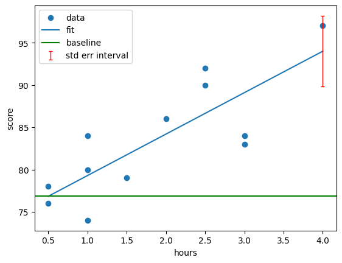

However, if the baseline falls within the interval, the trend is not significant.
Below, I modify two values in the dataset which causes this to occur.
```python
test_xr['score'][0,0,0] = 100
test_xr['score'][1,0,0] = 99

polyfit = test_xr['score'].polyfit('hours', 1, skipna=True, full=True)

from arctichoke.analysis import find_standard_error

ex_stderr = find_standard_error(
    polyfit['polyfit_residuals'],
    test_xr['score'].sizes['hours'],
)

import matplotlib.pyplot as plt

# Get the x-axis values
x = test_xr['hours'].values
# Get the fit coefficients
m = polyfit['polyfit_coefficients'].isel(degree=0).values
b = polyfit['polyfit_coefficients'].isel(degree=1).values
# Get the standard error value
this_stderr = ex_stderr.values[0]

# Plot the original data and the fit line
plt.scatter(x, test_xr['score'], label='data')
polyfit_line = m * x  + b
plt.plot(x, polyfit_line[0], label='fit')
# Plot the standard error interval
plt.errorbar(x[-1], polyfit_line[0][-1], yerr=this_stderr, linewidth=0, elinewidth=1, capsize=2, color='red', label='std err interval')
# Plot baseline
plt.axhline(polyfit_line[0][0], color='g', label='baseline')
# Add axis labels
plt.xlabel('hours')
plt.ylabel('score')
plt.legend()
plt.show()
```
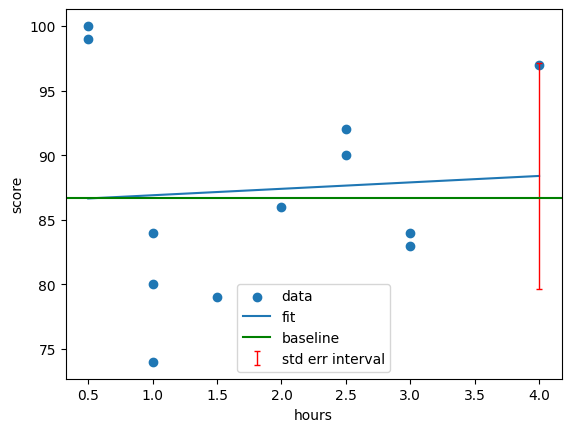

---

## Minimal example with multiple values
[back to top](#trend-significance)

My goal for this is to develop code that can find the significance of trends across many spatial grid cells.
Here, I will expand the example from Statology used above to create a dataset with 2x2 grid cells.
Each of the 4 cells will have a series of data across which I will find the trend, standard error, and significance of the trend.
I will construct the dataset such that the first grid cell is the same series as copied from Statology, with the other three being slightly different such that half the cells have significant trends.
```python
from arctichoke.dataset import make_example_dataset

small_xr = make_example_dataset(
    n = 2,
    test_var_name = 'score',
    time_dim = 'year',
    time_len = 12,
    start_year = 0,
)
small_xr['score'] = small_xr['score'].isel(year=0)
small_xr = small_xr.drop_dims('year')
small_xr = small_xr.expand_dims(
    dim={'year': [0.5, 0.5, 1, 1, 1, 1.5, 2, 2.5, 2.5, 3, 3, 4]}, 
    axis=0)
small_xr['score'].values = [
    [[76, 100], [100, 100]], 
    [[78,  78], [100, 100]], 
    [[74,  74], [ 74, 100]], 
    [[80,  80], [ 80,  80]], 
    [[84,  84], [ 84,  84]], 
    [[79,  79], [ 79,  79]], 
    [[86,  86], [ 86,  86]], 
    [[90,  90], [ 90,  90]], 
    [[92,  92], [ 92,  92]], 
    [[84,  84], [ 84,  84]], 
    [[83,  83], [ 83,  83]], 
    [[97,  97], [ 97,  97]]
]
print(small_xr)
```
```
<xarray.Dataset> Size: 576B
Dimensions:    (year: 12, j: 2, i: 2)
Coordinates:
  * year       (year) float64 96B 0.5 0.5 1.0 1.0 1.0 ... 2.5 2.5 3.0 3.0 4.0
  * j          (j) float64 16B 0.0 1.0
  * i          (i) float64 16B 3.0 4.0
    longitude  (j, i) float64 32B 5.0 6.0 5.0 6.0
    latitude   (j, i) float64 32B 7.0 7.0 8.0 8.0
Data variables:
    score      (year, j, i) int64 384B 76 100 100 100 78 78 ... 83 97 97 97 97
```

Next, I'll will use `polyfit` to find the trend of all the series.
```python
small_polyfit = small_xr['score'].polyfit('year', 1, skipna=True, full=True)
print(small_polyfit)
```
```
<xarray.Dataset> Size: 168B
Dimensions:               (degree: 2, j: 2, i: 2)
Coordinates:
  * degree                (degree) int64 16B 1 0
  * j                     (j) float64 16B 0.0 1.0
  * i                     (i) float64 16B 3.0 4.0
Data variables:
    year_matrix_rank      int64 8B 2
    year_singular_values  (degree) float64 16B 1.366 0.366
    polyfit_coefficients  (degree, j, i) float64 64B 4.898 2.551 ... 86.67 91.87
    polyfit_residuals     (j, i) float64 32B 175.6 585.4 784.7 688.1
```

Next, I'll plot all four series with their trend lines.
```python
import matplotlib.pyplot as plt

# Create a figure with 4 subplots
fig, axs = plt.subplots(2,2, figsize=(10,6))

# Loop through all 4 grid cells
for i in range(2):
    for j in range(2):
        # Select the axis
        ax = axs[i][j]
        # Select the x values
        x = small_xr['year'].values
        # Plot this series
        ax.scatter(x, small_xr['score'].isel(j=i, i=j).values, label='data')
        # Calculate the trend line
        m = small_polyfit['polyfit_coefficients'].isel(degree=0).isel(j=i, i=j).values
        b = small_polyfit['polyfit_coefficients'].isel(degree=1).isel(j=i, i=j).values
        polyfit_line = x * m + b
        ax.plot(x, polyfit_line, label='fit')
        ax.set_xlabel('year')
        ax.set_ylabel('score')
        ax.set_ylim(70,105)
        if i==0 and j==0:
            ax.legend()
plt.show()
```
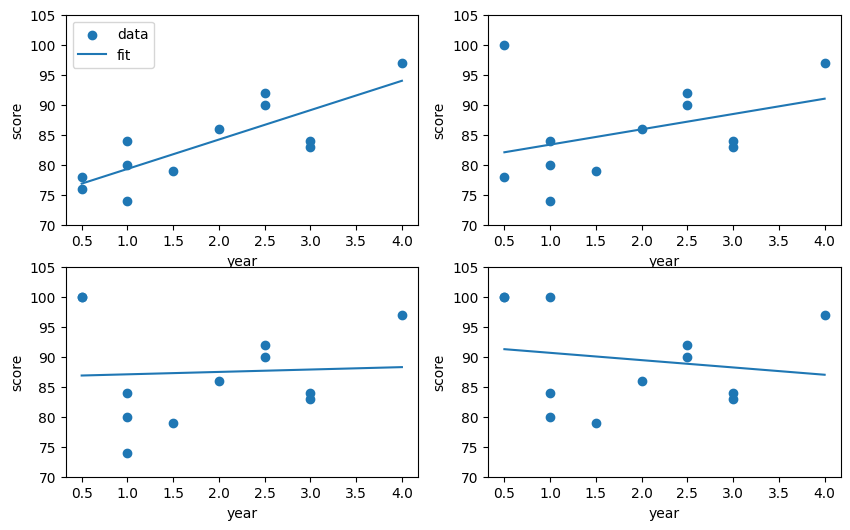

### Standard error for multiple values
[back to top](#trend-significance)

Now, I'll confirm that my `find_standard_error()` function can find all 4 values at once.
```python
from arctichoke.analysis import find_standard_error

small_stderr = find_standard_error(
    small_polyfit['polyfit_residuals'],
    small_xr['score'].sizes['year'],
)
print(small_stderr)
```
```
<xarray.DataArray 'polyfit_residuals' (j: 2, i: 2)> Size: 32B
array([[4.19025324, 7.65111466],
       [8.85814126, 8.29495161]])
Coordinates:
  * j        (j) float64 16B 0.0 1.0
  * i        (i) float64 16B 3.0 4.0
```

### Trend significance for multiple values
[back to top](#trend-significance)

Using a similar logic to above, I'll now plot all 4 series, adding in the standard error interval at the end of each as well as adding the baseline.
```python
import matplotlib.pyplot as plt

# Create a figure with 4 subplots
fig, axs = plt.subplots(2,2, figsize=(10,6))

# Loop through all 4 grid cells
for i in range(2):
    for j in range(2):
        # Select the axis
        ax = axs[i][j]
        # Select the x values
        x = small_xr['year'].values
        # Plot this series
        ax.scatter(x, small_xr['score'].isel(j=i, i=j).values, label='data')
        # Calculate the trend line
        m = small_polyfit['polyfit_coefficients'].isel(degree=0).isel(j=i, i=j).values
        b = small_polyfit['polyfit_coefficients'].isel(degree=1).isel(j=i, i=j).values
        polyfit_line = x * m + b
        # Plot the standard error interval
        ax.errorbar(x[-1], polyfit_line[-1], yerr=small_stderr.isel(j=i, i=j).values, linewidth=0, elinewidth=1, capsize=2, color='red', label='std err interval')
        # Plot baseline
        ax.axhline(polyfit_line[0], color='g', label='baseline')
        # Label the plot
        ax.plot(x, polyfit_line, label='fit')
        ax.set_xlabel('year')
        ax.set_ylabel('score')
        ax.set_ylim(70,105)
        if i==0 and j==0:
            ax.legend()
plt.show()
```
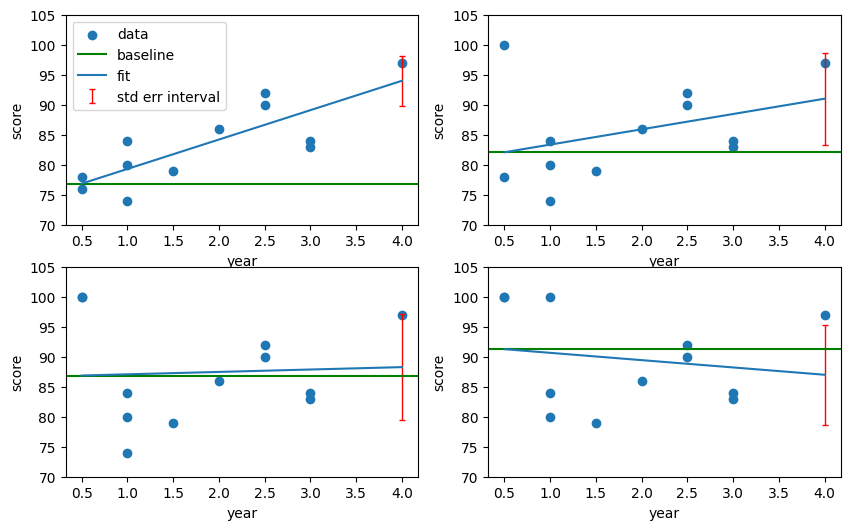

From this, I can see that I should expect the first two trends (the top row) to be significant, but the others to not be significant.
I wrote a function to calculate trend significance, but first, I'll use my `trends_in_time()` function to get a trend dataset which I will then use to get the significance.
```python
from arctichoke.analysis import trend_in_time 

small_trend_xr = trend_in_time(
    small_xr,
    'score',
    time_dim = 'year',
    verbose = True,
)
print(small_trend_xr)
```
```
(trend_in_time) `save_as`: None
(trend_in_time) Getting a first-degree polyfit
(trend_in_time) Geting the coefficients and residuals
(trend_in_time) Modifing dataset attributes
<xarray.Dataset> Size: 200B
Dimensions:           (j: 2, i: 2)
Coordinates:
  * j                 (j) float64 16B 0.0 1.0
  * i                 (i) float64 16B 3.0 4.0
    longitude         (j, i) float64 32B 5.0 6.0 5.0 6.0
    latitude          (j, i) float64 32B 7.0 7.0 8.0 8.0
    degree            int64 8B 1
Data variables:
    score_trends      (j, i) float64 32B 4.898 2.551 0.4 -1.218
    score_intercepts  (j, i) float64 32B 74.4 80.8 86.67 91.87
    score_residuals   (j, i) float64 32B 175.6 585.4 784.7 688.1
Attributes:
    history:               2026-10-08T18:53:21Z altered by `arctichoke`: Calc...
    original_variable:     score
    original_time_length:  12
```

Below, I use both the original dataset as well as the trend dataset I just found to calculate the significance of all 4 trends at once. 
I use the following logic to avoid doing multiple comparisons in each grid cell:
- The significance interval is the range between the value of the trend at the end of the series, plus or minus the standard error of the trend
- The baseline value is the value of the trend at the beginning of the series
- If the baseline value is within the significance interval, then the trend is not significant
- When the baseline value is within the significance interval, then we know:
    - Subtracting the baseline from the bottom of the interval will give a negative result
    - Subtracting the baseline from the top of the interval will give a positive result
- When the baseline value is below the significance interval, then we know:
    - Subtracting the baseline from the bottom of the interval will give a positive result
    - Subtracting the baseline from the top of the interval will give a positive result
- When the baseline value is above the significance interval, then we know:
    - Subtracting the baseline from the bottom of the interval will give a negative result
    - Subtracting the baseline from the top of the interval will give a negative result
- Therefore, the product of those two differences will be negative if and only if the trend is not significant

I call the product of those two differences the `significance_test`.
I'm then able to just check whether the values of the `significance_test` are positive or negative to assign significance to the individual trends all at the same time using the CDO function `setrtoc2` within my wrapper function `make_mask()`.
```python
import numpy as np

from arctichoke.analysis import find_standard_error, trend_in_time, make_mask

def find_significance(
    dataset,
    trend_dataset,
    var,
    time_dim,
    verbose = True,
):
    # Find the trend lines
    x = dataset[time_dim].values
    m = trend_dataset[f'{var}_trends'].values
    b = trend_dataset[f'{var}_intercepts'].values
    trend_start = m * x[0] + b
    trend_end = m * x[-1] + b
    # Find the standard error
    stderr = find_standard_error(
        trend_dataset[f'{var}_residuals'],
        trend_dataset.attrs['original_time_length'],
    )
    # Find the standard error interval from the trend end
    interval_upper = trend_end + stderr
    interval_lower = trend_end - stderr
    # If trend_start is between interval_upper and interval_lower, then we will find
    #  (interval_lower - trend_start) is negative and (interval_upper - trend_start) is positive
    # If trend_start is below the interval, both those will be positive
    # If trend_start is above the interval, both those will be negative
    # Therefore, the trend isn't significant if and only if the following result is negative
    trend_dataset[f'{var}_significance_test'] = (interval_lower - trend_start) * (interval_upper - trend_start)

    # Get the minimum possible integer to cover all reasonable values
    numpy_int32_min = np.iinfo(np.int32).min
    val_inside_range = 0
    val_outside_range = 1
    # Mask out trends that aren't significant below the threshold
    trend_sig_dataset = make_mask(
        trend_dataset,
        var = f'{var}_significance_test',
        mask_var_name = f'{var}_trends_sig',
        mask_this_range = [numpy_int32_min, 0],
        val_inside_range = val_inside_range,
        val_outside_range = val_outside_range,
        verbose = verbose,
    )

    # Add the trend significance to the trend dataset
    trend_dataset[f'{var}_trends_sig'] = trend_sig_dataset[f'{var}_trends_sig']

    # Get the long name of the original dataset, if available
    try:
        old_long_name = dataset[var].attrs['long_name']
    except:
        old_long_name = var
    # Modify the attributes of the dataset to reflect the changes
    trend_dataset[f'{var}_trends_sig'].attrs['long_name'] = f'Stat. sig. trend in {old_long_name}'
    trend_dataset[f'{var}_trends_sig'].attrs['units'] = f'{val_inside_range}: False, {val_outside_range}: True'
    return trend_dataset

find_significance(
    small_xr,
    small_trend_xr, 
    'score', 
    'year',
)['score_trends_sig'].values
```
```
(make_mask) `save_as`: None
(make_mask) `input_command`: cdo setrtoc2,-2147483648,0,0,1 dataset
(add_mask_attributes) Adding mask-related attributes to the dataset.

array([[1., 1.],
       [0., 0.]])
```

And there we have it.
The trends I know should be significant get a value of 1 and the ones I know should not be significant get a value of 0.

I wrote the above `find_significance()` function into the module `arctichoke.analysis.significance`.

---

## Trend significance test in Nares Strait
[back to top](#trend-significance)

As introduced in {doc}`Investigating specific regions <../docs_analysis/Investigate specific regions>`, I defined the Nares Strait region.
```python
from arctichoke.params import NS_BBOX
# Define the boundaries of the Nares Strait region
NS_BBOX
```
```
[82, 78.4, -59, -77]
```

Here, I'll load the `sispeed` data from `EC-Earth3P-HR` just within Nares Strait to use as an example of calculating significance in trends across an entire area. 
```python
import xarray as xr

from arctichoke.analysis import sum_by_year, trend_in_time, trend_in_time_scipy
from arctichoke.dataset import select_months
import arctichoke.params as sps
from arctichoke.path import list_variable_files

this_source_id = 'EC-Earth3P-HR'
this_var = 'sispeed'
this_variant_label = 'r1i1p2f1'
this_modification = 'trim_NS_'
calc_pvals = False 
mask_where_zero_across_time = True
select_summer = True 
call_sum_by_year = True
find_mean = True
verbose = True

if True:
    # Get the list of `this_var` files
    filelist = list_variable_files(
        source_id = this_source_id,
        variable_id = this_var,
        variant_label = this_variant_label,
        with_modification = this_modification,
        verbose = verbose,
        # **kwargs,
    )
    # Open those files into a multi-file dataset
    if select_summer:
        dataset = select_months(
            filelist,
            verbose = verbose,
        )
    else:
        dataset = xr.open_mfdataset(
            filelist,
            data_vars = 'all'
        )
    # 
    if isinstance(call_sum_by_year, type(None)):
        # Check whether this variable is in the sea ice vars dictionary
        if this_var in sps.sea_ice_vars.keys():
            # Check whether this is a marker variable or not
            if sps.sea_ice_vars[this_var]['marker_var']: 
                call_sum_by_year = True 
            else:
                call_sum_by_year = False
        if verbose:
            print(f"(make_trend_map) `this_var` ({this_var}) is marker variable: {call_sum_by_year}")
    # Sum the data across time
    if call_sum_by_year:
        ## Overwrite the `dataset` variable to reduce memory overhead
        dataset = sum_by_year(
            dataset,
            find_mean = find_mean,
            verbose = verbose,
        )
        if find_mean:
            var_for_trend = f'{this_var}_year_mean'
        else:
            var_for_trend = f'{this_var}_year_sum'
        this_time_dim = 'year'
    else:
        var_for_trend = this_var
        this_time_dim = 'time'
    # Take the trend across time
    if calc_pvals:
        dataset = trend_in_time_scipy(
            dataset = dataset,
            var = var_for_trend,
            mask_where_zero_across_time = False,
            verbose = verbose,
            time_dim = this_time_dim,
        )
    else:
        trend_dataset = trend_in_time(
            dataset = dataset,
            var = var_for_trend,
            mask_where_zero_across_time = mask_where_zero_across_time,
            verbose = verbose,
            time_dim = this_time_dim,
        )

print(dataset)
```
```
(list_variable_files) Found 65 files.
(select_months) When passing a list of files, ensure their coordinates match as that is not verified in this function.
(select_months) Selecting months: [6, 7, 8, 9, 10]
(sum_by_year) `save_as`: None
(sum_by_year) `data_var_list`: ['time_bnds', 'longitude_bnds', 'latitude_bnds', 'sispeed']
(sum_by_year) Removing `meta_var`: time_bnds
(sum_by_year) Removing `meta_var`: latitude_bnds
(sum_by_year) Removing `meta_var`: longitude_bnds
(sum_by_year) Completed taking the mean by year.
(sum_by_year) Modifying the dataset attributes.
(trend_in_time) `save_as`: None
(trend_in_time) Getting a first-degree polyfit
(trend_in_time) Geting the coefficients and residuals
(trend_in_time) Modifing dataset attributes
<xarray.Dataset> Size: 485kB
Dimensions:            (year: 65, j: 41, i: 44)
Coordinates:
  * year               (year) int64 520B 1950 1951 1952 1953 ... 2012 2013 2014
  * j                  (j) float64 328B 968.0 969.0 ... 1.007e+03 1.008e+03
  * i                  (i) float64 352B 970.0 971.0 ... 1.012e+03 1.013e+03
    longitude          (j, i) float32 7kB dask.array<chunksize=(41, 44), meta=np.ndarray>
    latitude           (j, i) float32 7kB dask.array<chunksize=(41, 44), meta=np.ndarray>
Data variables:
    sispeed_year_mean  (year, j, i) float32 469kB dask.array<chunksize=(1, 41, 44), meta=np.ndarray>
Attributes: (12/49)
...
    contact:                cmip6-data@ec-earth.org
    history:                2026-10-08T18:58:43Z altered by `arctichoke`: Cal...
    CDO:                    Climate Data Operators version 2.5.1 (https://mpi...
    select_months:          [6, 7, 8, 9, 10]
```

```python
print(trend_dataset)
```
```
<xarray.Dataset> Size: 58kB
Dimensions:                       (j: 41, i: 44)
Coordinates:
  * j                             (j) float64 328B 968.0 969.0 ... 1.008e+03
  * i                             (i) float64 352B 970.0 971.0 ... 1.013e+03
    longitude                     (j, i) float32 7kB dask.array<chunksize=(41, 44), meta=np.ndarray>
    latitude                      (j, i) float32 7kB dask.array<chunksize=(41, 44), meta=np.ndarray>
    degree                        int64 8B 1
Data variables:
    sispeed_year_mean_trends      (j, i) float64 14kB dask.array<chunksize=(41, 44), meta=np.ndarray>
    sispeed_year_mean_intercepts  (j, i) float64 14kB dask.array<chunksize=(41, 44), meta=np.ndarray>
    sispeed_year_mean_residuals   (j, i) float64 14kB dask.array<chunksize=(41, 44), meta=np.ndarray>
Attributes: (12/51)
    CDI:                    Climate Data Interface version 2.5.1 (https://mpi...
    Conventions:            CF-1.7 CMIP-6.2
    source:                 EC-Earth3P-HR (2017): \naerosol: none\natmos: IFS...
    institution:            AEMET, Spain; BSC, Spain; CNR-ISAC, Italy; DMI, D...
    activity_id:            HighResMIP
    branch_method:          none provided
    ...                     ...
    contact:                cmip6-data@ec-earth.org
    history:                2026-10-08T18:58:43Z altered by `arctichoke`: Cal...
    CDO:                    Climate Data Operators version 2.5.1 (https://mpi...
    select_months:          [6, 7, 8, 9, 10]
    original_variable:      sispeed_year_mean
    original_time_length:   65
```

I'll make a plot of the trends over time to get an idea of what the general trends are.
```python
from arctichoke.plot import quadmesh_map 
from arctichoke.params import sea_ice_vars

quadmesh_map(
    trend_dataset,
    'sispeed_year_mean_trends',
    map_bbox = NS_BBOX,
    clims = sea_ice_vars['sispeed']['trend_clims'],
    diverging_cbar = True,
)
```
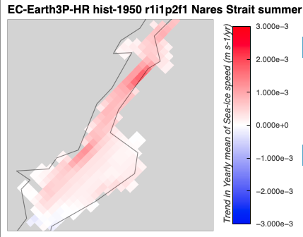

Next, I'll calculate the significance of these trends.
```python
from arctichoke.analysis.significance import find_significance 

trend_sig_dataset = find_significance(
    dataset,
    trend_dataset, 
    'sispeed_year_mean', 
    'year',
)

print(trend_sig_dataset)
```
```
<xarray.Dataset> Size: 87kB
Dimensions:                              (j: 41, i: 44)
Coordinates:
  * j                                    (j) float64 328B 968.0 ... 1.008e+03
  * i                                    (i) float64 352B 970.0 ... 1.013e+03
    longitude                            (j, i) float32 7kB dask.array<chunksize=(41, 44), meta=np.ndarray>
    latitude                             (j, i) float32 7kB dask.array<chunksize=(41, 44), meta=np.ndarray>
    degree                               int64 8B 1
Data variables:
    sispeed_year_mean_trends             (j, i) float64 14kB dask.array<chunksize=(41, 44), meta=np.ndarray>
    sispeed_year_mean_intercepts         (j, i) float64 14kB dask.array<chunksize=(41, 44), meta=np.ndarray>
    sispeed_year_mean_residuals          (j, i) float64 14kB dask.array<chunksize=(41, 44), meta=np.ndarray>
    sispeed_year_mean_significance_test  (j, i) float64 14kB dask.array<chunksize=(41, 44), meta=np.ndarray>
    sispeed_year_mean_trends_sig         (j, i) float64 14kB ...
Attributes: (12/51)
    CDI:                    Climate Data Interface version 2.5.1 (https://mpi...
    Conventions:            CF-1.7 CMIP-6.2
    source:                 EC-Earth3P-HR (2017): \naerosol: none\natmos: IFS...
    institution:            AEMET, Spain; BSC, Spain; CNR-ISAC, Italy; DMI, D...
    activity_id:            HighResMIP
    branch_method:          none provided
    ...                     ...
    contact:                cmip6-data@ec-earth.org
    history:                2026-10-08T18:58:43Z altered by `arctichoke`: Cal...
    CDO:                    Climate Data Operators version 2.5.1 (https://mpi...
    select_months:          [6, 7, 8, 9, 10]
    original_variable:      sispeed_year_mean
    original_time_length:   65
```

Then, I'll make a map plot to show where the trends are significant.
```python
from arctichoke.plot import quadmesh_map 

quadmesh_map(
    trend_sig_dataset,
    'sispeed_year_mean_trends_sig',
    map_bbox = NS_BBOX,
)
```
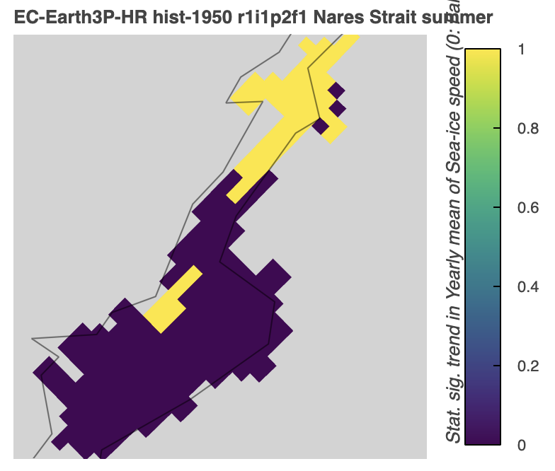

Here, I can see that the trends in the north of Nares Strait are significant and that regions where the trends are very close to zero tend to not be significant, as I would expect.

---

## Trend significance test across the CAA
[back to top](#trend-significance)

Here, I'll do something similar to what I did for Nares Strait above, but across the entire CAA.
Below, I'll plot the maps of the trends in landfast ice followed by maps of the significance of those trends for all three variants of `EC-Earth3P-HR`. 
```python
import xarray as xr

from arctichoke.analysis import sum_by_year, trend_in_time, trend_in_time_scipy
from arctichoke.dataset import select_months
import arctichoke.params as sps
from arctichoke.path import list_variable_files
from arctichoke.plot import quadmesh_map 
from arctichoke.params import sea_ice_vars
from arctichoke.analysis.significance import find_significance 

this_source_id = 'EC-Earth3P-HR'
this_var = 'silandfast'
this_version_id = 'v20260617'
this_modification = 'trim_CAA_'
calc_pvals = False 
mask_where_zero_across_time = True
select_summer = True 
call_sum_by_year = None
find_mean = False
set_verbose = False

for this_variant_label in [
    'r1i1p2f1',
    'r2i1p2f1',
    'r3i1p2f1',
]:
    # Get the list of `this_var` files
    filelist = list_variable_files(
        source_id = this_source_id,
        variable_id = this_var,
        variant_label = this_variant_label,
        version_id = this_version_id,
        with_modification = this_modification,
        verbose = set_verbose,
        # **kwargs,
    )
    # Open those files into a multi-file dataset
    if select_summer:
        dataset = select_months(
            filelist,
            verbose = set_verbose,
        )
    else:
        dataset = xr.open_mfdataset(
            filelist,
            data_vars = 'all'
        )
    # 
    if isinstance(call_sum_by_year, type(None)):
        # Check whether this variable is in the sea ice vars dictionary
        if this_var in sps.sea_ice_vars.keys():
            # Check whether this is a marker variable or not
            if sps.sea_ice_vars[this_var]['marker_var']: 
                call_sum_by_year = True 
            else:
                call_sum_by_year = False
        if set_verbose:
            print(f"(make_trend_map) `this_var` ({this_var}) is marker variable: {call_sum_by_year}")
    # Sum the data across time
    if call_sum_by_year:
        ## Overwrite the `dataset` variable to reduce memory overhead
        dataset = sum_by_year(
            dataset,
            find_mean = find_mean,
            verbose = set_verbose,
        )
        if find_mean:
            var_for_trend = f'{this_var}_year_mean'
        else:
            var_for_trend = f'{this_var}_year_sum'
        this_time_dim = 'year'
    else:
        var_for_trend = this_var
        this_time_dim = 'time'
    # Take the trend across time
    if calc_pvals:
        trend_dataset = trend_in_time_scipy(
            dataset = dataset,
            var = var_for_trend,
            mask_where_zero_across_time = False,
            verbose = set_verbose,
            time_dim = this_time_dim,
        )
    else:
        trend_dataset = trend_in_time(
            dataset = dataset,
            var = var_for_trend,
            mask_where_zero_across_time = mask_where_zero_across_time,
            verbose = set_verbose,
            time_dim = this_time_dim,
        )

    this_map = quadmesh_map(
        trend_dataset,
        'silandfast_year_sum_trends',
        clims = sea_ice_vars['silandfast']['trend_clims'],
        diverging_cbar = True,
        verbose = set_verbose,
    )
    display(this_map)

    trend_sig_dataset = find_significance(
        dataset,
        trend_dataset, 
        'silandfast_year_sum', 
        'year',
        verbose = set_verbose,
    )

    this_map = quadmesh_map(
        trend_sig_dataset,
        'silandfast_year_sum_trends_sig',
        verbose = set_verbose,
    )
    display(this_map)
```
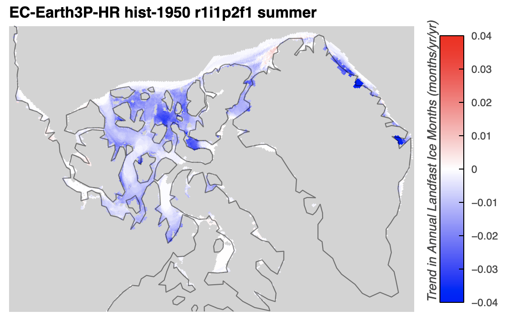

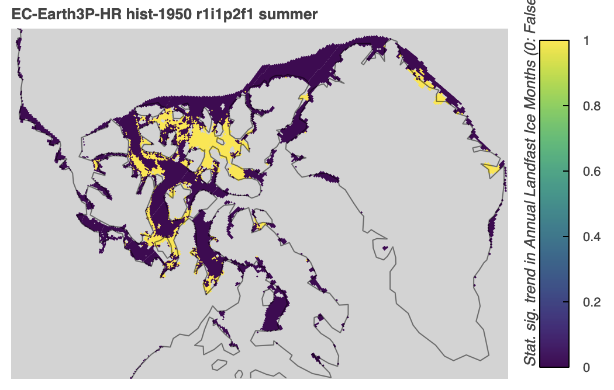

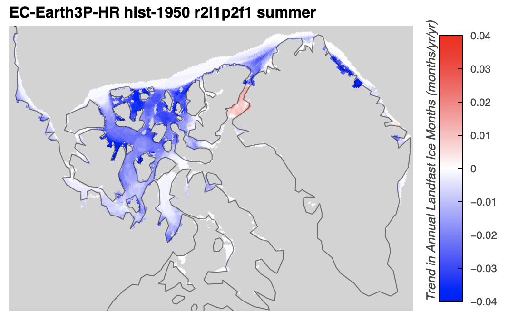

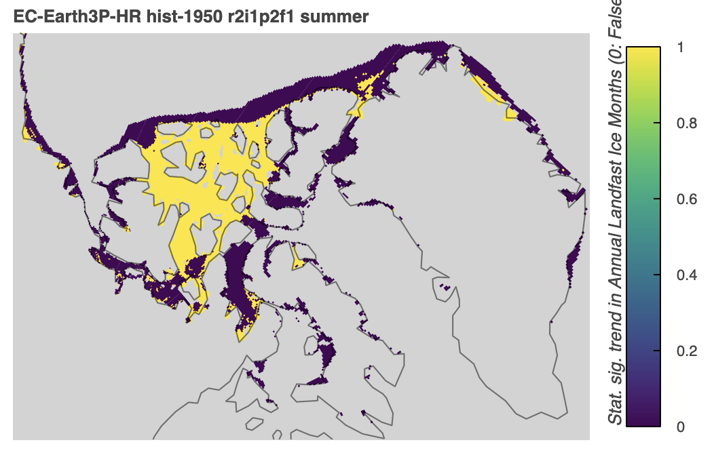

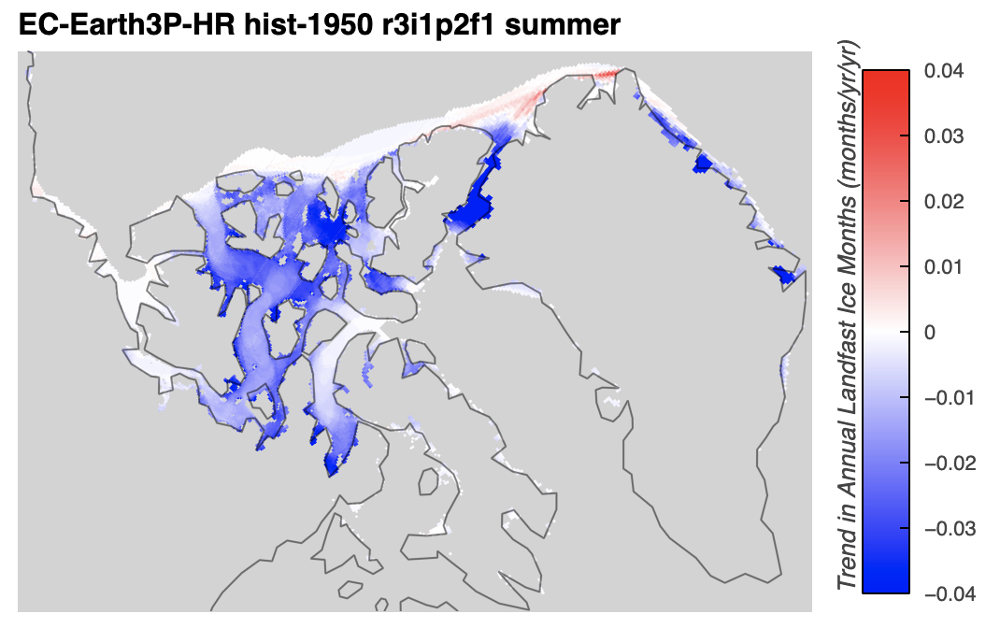

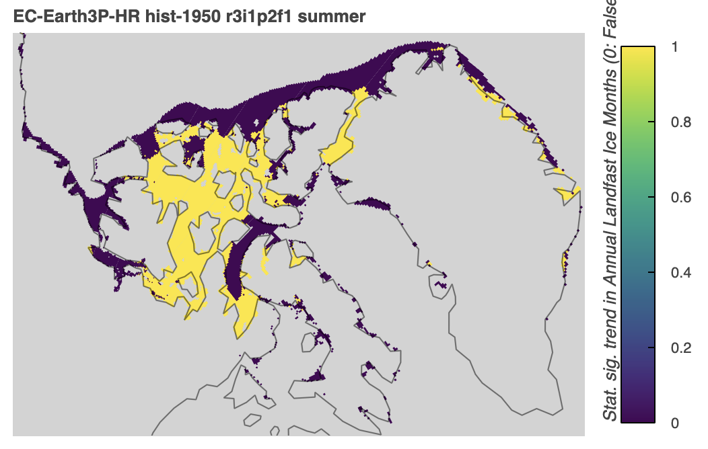