# Calculating `siconc` from `sithick` and `sivol` 

Below, I describe how I calculated sea ice concentration (`siconc`) from sea ice thickness (`sithick`) and sea ice volume (`sivol`) for the `HadGEM3-GC31-HM` and `HadGEM3-GC31-MM` models.
For details on how the data for those models was downloaded, see the {doc}`Downloading model data with `esgpull` <../docs_data/esgpull_downloads>` guide. 
For details on how to prepare the data for the `HadGEM3-GC31-HH` model, see {doc}`Trimming data to the CAA region <../docs_data/trim_to_CAA_region>`.

## Contents

- [Introduction](#introduction)
- [Example file from EC-Earth3P-HR](#example-file-from-ec-earth3p-hr)
    - [Calculating `siconc`](#calculating-siconc)
    - [Validating the `siconc` calculation](#validating-the-siconc-calculation)
- [Writing calculated `siconc` data to file](#writing-calculated-siconc-data-to-file)
- [Calculating `siconc` for an example HadGEM3-GC31-MM dataset](#calculating-siconc-for-an-example-hadgem3-gc31-mm-dataset)
    - [Validating the `siconc` calculation by interpolating to a regular grid](#validating-the-siconc-calculation-by-interpolating-to-a-regular-grid)
- [Writing calculated HadGEM3-GC31-MM `siconc` data to file](#writing-calculated-hadgem3-gc31-mm-siconc-data-to-file)
- [Writing calculated HadGEM3-GC31-HM `siconc` data to file](#writing-calculated-hadgem3-gc31-hm-siconc-data-to-file)
- [Calculating `siconc` for an example `HadGEM3-GC31-HH` dataset](#calculating-siconc-for-an-example-hadgem3-gc31-hh-dataset)
- [Writing calculated HadGEM3-GC31-HH `siconc` data to file](#writing-calculated-hadgem3-gc31-hh-siconc-data-to-file)


---

## Introduction
[back to top](#calculating-siconc-from-sithick-and-sivol)

In order to calculate landfast ice (`silandfast`) as shown in the {doc}`Calculating landfast ice <../docs_analysis/landfast_ice>` guide, I use sea ice concentration (`siconc`) and sea ice speed (`sispeed`) data. 
For the `EC-Earth3P-HR` model, the `siconc` and `sispeed` files available for download are on the same irregular grid.
However, for the `HadGEM3-GC31-HM` and `HadGEM3-GC31-MM` models, `siconc` is on a lower-resolution regular grid while `sispeed` is on the full-resolution irregular grid.
For the `silandfast` calculation, `siconc` and `sispeed` must be on the same grid.

The `HadGEM3-GC31-HM` and `HadGEM3-GC31-MM` models have variables for sea ice thickness (`sithick`) and sea ice volume (`sivol`) available, and those variables are on the same irregular grid as `sispeed`. 
Therefore, I use `sithick` and `sivol` to calculate `siconc` for the `HadGEM3-GC31-HM` and `HadGEM3-GC31-MM` models. 

---

## Example file from EC-Earth3P-HR 
[back to top](#calculating-siconc-from-sithick-and-sivol)


The EC-Earth3P-HR model has all three of these variables on the same irregular grid, so I'll start there to get functions set up to do this calculation, as it will be easier to check that they did it correctly.

Since the `EC-Earth3P-HR` model already has `siconc` on the irregular grid, I will use that model as a test to see whether the sea ice concentration values I get by combining `sithick` and `sivol` match with the `siconc` that are available for download.
This will give me an idea of how confident I can be in the values of `siconc` I get by combining `sithick` and `sivol` from the `HadGEM3-GC31-HM` and `HadGEM3-GC31-MM` models. 

First, I'll list the available variables as they are now.

```python
from arctichoke.path.variable_paths import list_available_variables

list_available_variables(
    source_id = 'EC-Earth3P-HR',
    experiment_id = 'hist-1950',
    list_var_mods = True,
)
```
```console
{'EC-Earth-Consortium/EC-Earth3P-HR': {'hist-1950': {'r1i1p2f1': {'SImon': {'siu': {'': 65},
     'siv': {'': 65},
     'sithick': {'': 65, 'trim_NWP_': 65},
     'siage': {'': 65},
     'siconc': {'': 65, 'trim_NWP_': 65},
     'sispeed': {'': 65, 'trim_NWP_': 65},
     'silandfast': {'trim_CAA_': 65},
     'sivol': {'': 65}}},
   'r2i1p2f1': {'SImon': {'siage': {'': 65},
     'sithick': {'': 65, 'trim_NWP_': 65},
     'siv': {'': 65},
     'siu': {'': 65},
     'siconc': {'': 65, 'trim_NWP_': 65},
     'sispeed': {'': 65, 'trim_NWP_': 65},
     'silandfast': {'trim_CAA_': 65},
     'sivol': {'': 65}}},
   'r3i1p2f1': {'SImon': {'sithick': {'': 65, 'trim_NWP_': 65},
     'siage': {'': 65, 'trim_NWP_': 65},
     'siu': {'': 65},
     'siv': {'': 65},
     'siconc': {'': 65, 'trim_NWP_': 65},
     'sispeed': {'': 65, 'trim_NWP_': 65},
     'silandfast': {'trim_CAA_': 65},
     'sivol': {'': 65}}}}}}
```

Next, I'll load example files from the year 2000 for `siconc`, `sithick`, and `sivol` and plot them in April.

```python
import xarray as xr

EC_Earth3P_HR_hist_siconc_2000 = '/arctichoke_data/bergybits/data/CMIP6/HighResMIP/EC-Earth-Consortium/EC-Earth3P-HR/hist-1950/r1i1p2f1/SImon/siconc/gn/v20181212/siconc_SImon_EC-Earth3P-HR_hist-1950_r1i1p2f1_gn_200001-200012.nc'

EC_Earth3P_HR_hist_siconc_2000_xr = xr.open_dataset(EC_Earth3P_HR_hist_siconc_2000)

from arctichoke.dataset.trim_dataset import trim_latlon
from arctichoke.params import CAA_BBOX

EC_Earth3P_HR_hist_siconc_2000_xr_trim = trim_latlon(
    EC_Earth3P_HR_hist_siconc_2000_xr,
    map_bbox = CAA_BBOX,
    precise_trim = False,
    verbose = False,
)

from arctichoke.plot.hvplots import quadmesh_map

EC_Earth3P_HR_hist_siconc_2000_trim_map = quadmesh_map(
    EC_Earth3P_HR_hist_siconc_2000_xr_trim.isel(time=3),
    'siconc',
    map_projection = 'Orthographic',
)
EC_Earth3P_HR_hist_siconc_2000_trim_map
```
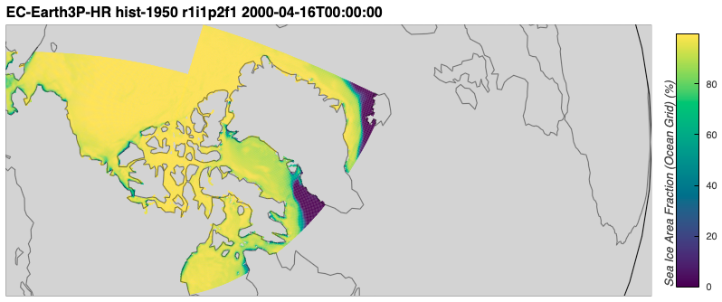

```python
import xarray as xr

EC_Earth3P_HR_hist_sithick_2000 = '/arctichoke_data/bergybits/data/CMIP6/HighResMIP/EC-Earth-Consortium/EC-Earth3P-HR/hist-1950/r1i1p2f1/SImon/sithick/gn/v20181212/sithick_SImon_EC-Earth3P-HR_hist-1950_r1i1p2f1_gn_200001-200012.nc'

EC_Earth3P_HR_hist_sithick_2000_xr = xr.open_dataset(EC_Earth3P_HR_hist_sithick_2000)

from arctichoke.dataset.trim_dataset import trim_latlon
from arctichoke.params import CAA_BBOX

EC_Earth3P_HR_hist_sithick_2000_xr_trim = trim_latlon(
    EC_Earth3P_HR_hist_sithick_2000_xr,
    map_bbox = CAA_BBOX,
    precise_trim = False,
    verbose = False,
)

from arctichoke.plot.hvplots import quadmesh_map

EC_Earth3P_HR_hist_sithick_2000_trim_map = quadmesh_map(
    EC_Earth3P_HR_hist_sithick_2000_xr_trim.isel(time=3),
    'sithick',
    map_projection = 'Orthographic',
)
EC_Earth3P_HR_hist_sithick_2000_trim_map
```
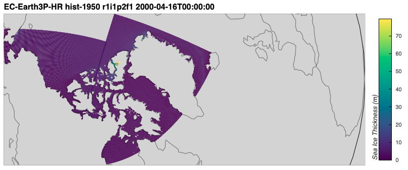

```python
import xarray as xr

EC_Earth3P_HR_hist_sivol_2000 = '/arctichoke_data/bergybits/data/CMIP6/HighResMIP/EC-Earth-Consortium/EC-Earth3P-HR/hist-1950/r1i1p2f1/SImon/sivol/gn/v20181212/sivol_SImon_EC-Earth3P-HR_hist-1950_r1i1p2f1_gn_200001-200012.nc'

EC_Earth3P_HR_hist_sivol_2000_xr = xr.open_dataset(EC_Earth3P_HR_hist_sivol_2000)

from arctichoke.dataset.trim_dataset import trim_latlon
from arctichoke.params import CAA_BBOX

EC_Earth3P_HR_hist_sivol_2000_xr_trim = trim_latlon(
    EC_Earth3P_HR_hist_sivol_2000_xr,
    map_bbox = CAA_BBOX,
    precise_trim = False,
    verbose = False,
)

from arctichoke.plot.hvplots import quadmesh_map

EC_Earth3P_HR_hist_sivol_2000_trim_map = quadmesh_map(
    EC_Earth3P_HR_hist_sivol_2000_xr_trim.isel(time=3),
    'sivol',
    map_projection = 'Orthographic',
)
EC_Earth3P_HR_hist_sivol_2000_trim_map
```


### Calculating `siconc`
[back to top](#calculating-siconc-from-sithick-and-sivol)

The units for the variables involved are:
- `siconc`: Sea Ice Area Fraction (\%)
- `sithick`: Sea Ice Thickness (m)
- `sivol`: Sea-ice volume per area (m)
    - Total volume of sea ice divided by grid-cell area (this used to be called ice thickness in CMIP5)

I want `siconc`, which can be thought of as:
$$ \text{Sea Ice Concentration} = \frac{\text{Area of ice in grid cell}}{\text{Area of grid cell}}\times 100 $$

So, if `sivol` is already:
$$ \text{Sea Ice Volume} = \frac{\text{Volume of ice in grid cell}}{\text{Area of grid cell}} $$

And area is volume divided by thickness, then `siconc` could be calculated as:
$$ \text{Sea Ice Concentration} = \frac{\text{Volume of ice in grid cell}}{\text{Area of grid cell}} \times \frac{1}{\text{Sea Ice Thickness}} \times 100 $$

Or, `siconc` = `sivol` / `sithick` * 100.

Below, I will calculate sea ice concentration from the `EC-Earth3P-HR` sea ice thickness and volume datasets I've loaded above.

```python
EC_Earth3P_HR_hist_siconc2_2000_xr_trim = EC_Earth3P_HR_hist_siconc_2000_xr_trim.copy()
EC_Earth3P_HR_hist_siconc2_2000_xr_trim['siconc'] = EC_Earth3P_HR_hist_sivol_2000_xr_trim['sivol'] / EC_Earth3P_HR_hist_sithick_2000_xr_trim['sithick'] * 100

from arctichoke.plot.hvplots import quadmesh_map

EC_Earth3P_HR_hist_siconc2_2000_trim_map = quadmesh_map(
    EC_Earth3P_HR_hist_siconc2_2000_xr_trim.isel(time=3),
    'siconc',
    map_projection = 'Orthographic',
)
EC_Earth3P_HR_hist_siconc2_2000_trim_map
```
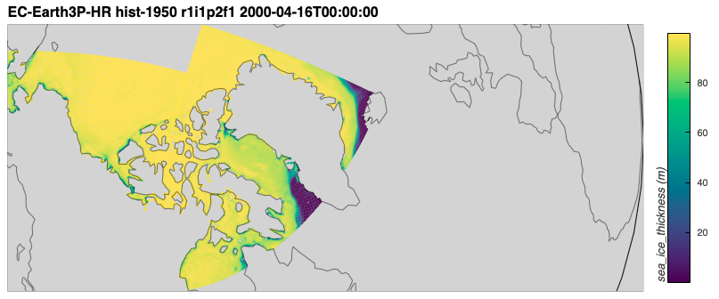

Visually, it looks pretty close to the plot above from the actual `siconc` data file.
The colorbar is labeled `sea_ice_thickness()` because I didn't edit the attributes when I overwrote `sithick` with `siconc`. 
I wrote a function called `calc_siconc()` which takes in `sithick` and `sivol` datasets and calculates sea ice concentration, making sure to update the dataset attributes. 
To avoid confusion with the `siconc` data that I've downloaded, I called the sea ice concentration that I calculate from `sithick` and `sivol` to be `siconc2` and set the `long_name` attribute to "Recalculated Sea Ice Area Fraction."
```python
from arctichoke.analysis import calc_siconc 

EC_Earth3P_HR_hist_siconc2_2000_xr_trim = calc_siconc(
    EC_Earth3P_HR_hist_sithick_2000_xr_trim,
    EC_Earth3P_HR_hist_sivol_2000_xr_trim,
)

from arctichoke.plot.hvplots import quadmesh_map

EC_Earth3P_HR_hist_siconc2_2000_trim_map = quadmesh_map(
    EC_Earth3P_HR_hist_siconc2_2000_xr_trim.isel(time=3),
    'siconc2',
    map_projection = 'Orthographic',
)
EC_Earth3P_HR_hist_siconc2_2000_trim_map
```
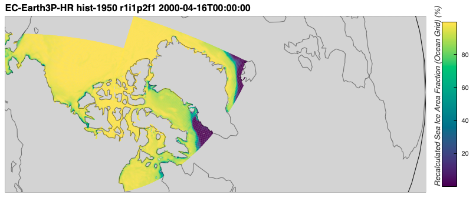

### Validating the `siconc` calculation
[back to top](#calculating-siconc-from-sithick-and-sivol)

If I take the difference between the result from my `calc_siconc()` function and the original `siconc` datafile from `EC-Earth3P-HR`, I can see that most values are relatively close to zero. 
```python
EC_Earth3P_HR_hist_siconc2_2000_xr_trim['siconc_diff'] = EC_Earth3P_HR_hist_siconc_2000_xr_trim['siconc'] - EC_Earth3P_HR_hist_siconc2_2000_xr_trim['siconc2']

from arctichoke.plot.hvplots import quadmesh_map

EC_Earth3P_HR_hist_siconc_diff_2000_trim_map = quadmesh_map(
    EC_Earth3P_HR_hist_siconc2_2000_xr_trim.isel(time=3),
    'siconc_diff',
    map_projection = 'Orthographic',
    diverging_cbar = True,
)
EC_Earth3P_HR_hist_siconc_diff_2000_trim_map
```
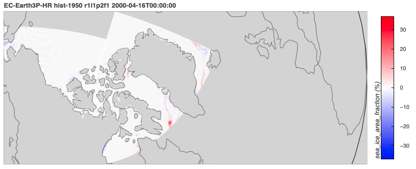

There are a couple areas where the differences are fairly large, however these areas are generally not within the CAA.
I can limit the colorbar to the range [-1, 1] to show more detail around differences close to zero.
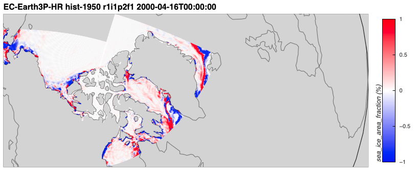

Below, I calculate the number of grid cells that differ by more than 0.1 percent between my recalculation (`siconc2`) and the original `siconc`.
The cell below took a full minute to execute on my laptop.

```python
import numpy as np

siconc1 = EC_Earth3P_HR_hist_siconc_2000_xr_trim['siconc'].values.flatten()
siconc2 = EC_Earth3P_HR_hist_siconc2_2000_xr_trim['siconc2'].values.flatten()

print('siconc1:', len(siconc1), 'siconc2:', len(siconc2))

diff_count = 0
for i in range(len(siconc1)):
    if not np.allclose(
        [siconc1[i]],
        [siconc2[i]],
        rtol = 1,
        atol = 0.1,
        equal_nan = True,
    ):
        diff_count += 1
print('diff_count:', diff_count, '/', len(siconc1), '(',diff_count/len(siconc1)*100,'%)')
```
```console
siconc1: 1564140 siconc2: 1564140
diff_count: 62807 / 1564140 ( 4.015433401102203 %)
```

Only about 4% of values differ by more than 0.1 percent.
If I take instances of `np.nan` to equal zero, that percentage drops to 0.34.
```python
diff_count = 0
for i in range(len(siconc1)):
    if not np.allclose(
        [siconc1[i]],
        [siconc2[i]],
        rtol = 1,
        atol = 0.1,
        equal_nan = True,
    ):
        if np.isnan(siconc1[i]) and siconc2[i] == 0:
            foo = 2
        elif siconc1[i] == 0 and np.isnan(siconc2[i]):
            foo = 2
        else:
            diff_count += 1
print('diff_count:', diff_count, '/', len(siconc1), '(',diff_count/len(siconc1)*100,'%)')
```
```console
diff_count: 5384 / 1564140 ( 0.34421471223803498 %)
```

I'm concluding that this function I wrote to calculate `siconc` from `sithick` and `sivol` is sufficient for testing with HadGEM3-GC31-HM/MM, where I do not have `siconc` on an irregular grid.

---

## Writing calculated `siconc` data to file
[back to top](#calculating-siconc-from-sithick-and-sivol)

Next, I'll write a function which will take the `siconc2` data calculated by `calc_siconc()` and write it to netCDF files that I can access later.
First, I'll make lists of all the `sithick` and `sivol` files I will use in the calculation.
```python
from arctichoke.path import list_variable_files

sithick_list = list_variable_files(
    source_id = 'EC-Earth3P-HR',
    variable_id = 'sithick',
    experiment_id = 'hist-1950',
    variant_label = 'r1i1p2f1',
)
sithick_list
```
```console
['/arctichoke_data/bergybits/data/CMIP6/HighResMIP/EC-Earth-Consortium/EC-Earth3P-HR/hist-1950/r1i1p2f1/SImon/sithick/gn/v20181212/sithick_SImon_EC-Earth3P-HR_hist-1950_r1i1p2f1_gn_195001-195012.nc',
 '/arctichoke_data/bergybits/data/CMIP6/HighResMIP/EC-Earth-Consortium/EC-Earth3P-HR/hist-1950/r1i1p2f1/SImon/sithick/gn/v20181212/sithick_SImon_EC-Earth3P-HR_hist-1950_r1i1p2f1_gn_195101-195112.nc',
 '/arctichoke_data/bergybits/data/CMIP6/HighResMIP/EC-Earth-Consortium/EC-Earth3P-HR/hist-1950/r1i1p2f1/SImon/sithick/gn/v20181212/sithick_SImon_EC-Earth3P-HR_hist-1950_r1i1p2f1_gn_195201-195212.nc',
...
 '/arctichoke_data/bergybits/data/CMIP6/HighResMIP/EC-Earth-Consortium/EC-Earth3P-HR/hist-1950/r1i1p2f1/SImon/sithick/gn/v20181212/sithick_SImon_EC-Earth3P-HR_hist-1950_r1i1p2f1_gn_201201-201212.nc',
 '/arctichoke_data/bergybits/data/CMIP6/HighResMIP/EC-Earth-Consortium/EC-Earth3P-HR/hist-1950/r1i1p2f1/SImon/sithick/gn/v20181212/sithick_SImon_EC-Earth3P-HR_hist-1950_r1i1p2f1_gn_201301-201312.nc',
 '/arctichoke_data/bergybits/data/CMIP6/HighResMIP/EC-Earth-Consortium/EC-Earth3P-HR/hist-1950/r1i1p2f1/SImon/sithick/gn/v20181212/sithick_SImon_EC-Earth3P-HR_hist-1950_r1i1p2f1_gn_201401-201412.nc']
```
```python
from arctichoke.path import list_variable_files

sivol_list = list_variable_files(
    source_id = 'EC-Earth3P-HR',
    variable_id = 'sivol',
    experiment_id = 'hist-1950',
    variant_label = 'r1i1p2f1',
)
sivol_list
```
```console
['/arctichoke_data/bergybits/data/CMIP6/HighResMIP/EC-Earth-Consortium/EC-Earth3P-HR/hist-1950/r1i1p2f1/SImon/sivol/gn/v20181212/sivol_SImon_EC-Earth3P-HR_hist-1950_r1i1p2f1_gn_195001-195012.nc',
 '/arctichoke_data/bergybits/data/CMIP6/HighResMIP/EC-Earth-Consortium/EC-Earth3P-HR/hist-1950/r1i1p2f1/SImon/sivol/gn/v20181212/sivol_SImon_EC-Earth3P-HR_hist-1950_r1i1p2f1_gn_195101-195112.nc',
 '/arctichoke_data/bergybits/data/CMIP6/HighResMIP/EC-Earth-Consortium/EC-Earth3P-HR/hist-1950/r1i1p2f1/SImon/sivol/gn/v20181212/sivol_SImon_EC-Earth3P-HR_hist-1950_r1i1p2f1_gn_195201-195212.nc',
...
 '/arctichoke_data/bergybits/data/CMIP6/HighResMIP/EC-Earth-Consortium/EC-Earth3P-HR/hist-1950/r1i1p2f1/SImon/sivol/gn/v20181212/sivol_SImon_EC-Earth3P-HR_hist-1950_r1i1p2f1_gn_201201-201212.nc',
 '/arctichoke_data/bergybits/data/CMIP6/HighResMIP/EC-Earth-Consortium/EC-Earth3P-HR/hist-1950/r1i1p2f1/SImon/sivol/gn/v20181212/sivol_SImon_EC-Earth3P-HR_hist-1950_r1i1p2f1_gn_201301-201312.nc',
 '/arctichoke_data/bergybits/data/CMIP6/HighResMIP/EC-Earth-Consortium/EC-Earth3P-HR/hist-1950/r1i1p2f1/SImon/sivol/gn/v20181212/sivol_SImon_EC-Earth3P-HR_hist-1950_r1i1p2f1_gn_201401-201412.nc']
```
Then, I'll go through a loop across all three variants and calculate the `siconc2` files.
```python
from arctichoke.path import list_variable_files
from arctichoke.analysis import make_siconc_files
from arctichoke.params import CAA_BBOX
this_model = 'EC-Earth3P-HR'
for this_variant_label in [
    'r1i1p2f1', 
    'r2i1p2f1', 
    'r3i1p2f1',
]:
    for this_experiment in ['hist-1950']:
        sithick_list = list_variable_files(
            source_id = this_model,
            variable_id = 'sithick',
            experiment_id = this_experiment,
            variant_label = this_variant_label,
        )
        sivol_list = list_variable_files(
            source_id = this_model,
            variable_id = 'sivol',
            experiment_id = this_experiment,
            variant_label = this_variant_label,
        )
        make_siconc_files(
            sithick_files = sithick_list,
            sivol_files = sivol_list,
            map_bbox = CAA_BBOX,
            precise_trim = False,
        )
```
```console
	(make_siconc_files) Writing file `/arctichoke_data/bergybits/data/CMIP6/HighResMIP/EC-Earth-Consortium/EC-Earth3P-HR/hist-1950/r1i1p2f1/SImon/siconc2/gn/v20260617/trim_CAA_siconc2_SImon_EC-Earth3P-HR_hist-1950_r1i1p2f1_gn_195001-195012.nc`.
	(make_siconc_files) Writing file `/arctichoke_data/bergybits/data/CMIP6/HighResMIP/EC-Earth-Consortium/EC-Earth3P-HR/hist-1950/r1i1p2f1/SImon/siconc2/gn/v20260617/trim_CAA_siconc2_SImon_EC-Earth3P-HR_hist-1950_r1i1p2f1_gn_195101-195112.nc`.
    ...
	(make_siconc_files) Writing file `/arctichoke_data/bergybits/data/CMIP6/HighResMIP/EC-Earth-Consortium/EC-Earth3P-HR/hist-1950/r1i1p2f1/SImon/siconc2/gn/v20260617/trim_CAA_siconc2_SImon_EC-Earth3P-HR_hist-1950_r1i1p2f1_gn_201401-201412.nc`.
	(make_siconc_files) Writing file `/arctichoke_data/bergybits/data/CMIP6/HighResMIP/EC-Earth-Consortium/EC-Earth3P-HR/hist-1950/r2i1p2f1/SImon/siconc2/gn/v20260617/trim_CAA_siconc2_SImon_EC-Earth3P-HR_hist-1950_r2i1p2f1_gn_195001-195012.nc`.
	...
	(make_siconc_files) Writing file `/arctichoke_data/bergybits/data/CMIP6/HighResMIP/EC-Earth-Consortium/EC-Earth3P-HR/hist-1950/r2i1p2f1/SImon/siconc2/gn/v20260617/trim_CAA_siconc2_SImon_EC-Earth3P-HR_hist-1950_r2i1p2f1_gn_201401-201412.nc`.
	(make_siconc_files) Writing file `/arctichoke_data/bergybits/data/CMIP6/HighResMIP/EC-Earth-Consortium/EC-Earth3P-HR/hist-1950/r3i1p2f1/SImon/siconc2/gn/v20260617/trim_CAA_siconc2_SImon_EC-Earth3P-HR_hist-1950_r3i1p2f1_gn_195001-195012.nc`.
	...
	(make_siconc_files) Writing file `/arctichoke_data/bergybits/data/CMIP6/HighResMIP/EC-Earth-Consortium/EC-Earth3P-HR/hist-1950/r3i1p2f1/SImon/siconc2/gn/v20260617/trim_CAA_siconc2_SImon_EC-Earth3P-HR_hist-1950_r3i1p2f1_gn_201301-201312.nc`.
	(make_siconc_files) Writing file `/arctichoke_data/bergybits/data/CMIP6/HighResMIP/EC-Earth-Consortium/EC-Earth3P-HR/hist-1950/r3i1p2f1/SImon/siconc2/gn/v20260617/trim_CAA_siconc2_SImon_EC-Earth3P-HR_hist-1950_r3i1p2f1_gn_201401-201412.nc`.
```

---

## Calculating `siconc` for an example HadGEM3-GC31-MM dataset
[back to top](#calculating-siconc-from-sithick-and-sivol)

The HadGEM3-GC31-HM/MM models have `siconc` on a regular grid by default, but I need it on the finer irregular grid. 
Below, I use the code I developed above to calculate `siconc2` from `sithick` and `sivol` for the year 2000 of the HadGEM3-GC31-MM model.

First, I'll list what variables are currently available for this model.
```python
from arctichoke.path.variable_paths import list_available_variables

list_available_variables(
    source_id = 'HadGEM3-GC31-MM',
    experiment_id = 'hist-1950',
    list_var_mods = True,
)
```
```console
{'MOHC/HadGEM3-GC31-MM': {'hist-1950': {
    'r1i1p1f1': {'Ofx': {'areacello': {'': 1}},
    'SImon': {'siu': {'': 65},
     'sithick': {'': 65},
     'siage': {'': 65},
     'siconc': {'': 65},
     'siv': {'': 65},
     'sispeed': {'': 65},
     'sivol': {'': 65}}},
   'r1i2p1f1': {'SImon': {'sithick': {'': 65},
     'siv': {'': 65},
     'siu': {'': 65},
     'siage': {'': 65},
     'siconc': {'': 65},
     'sispeed': {'': 65},
     'sivol': {'': 65}}},
   'r1i3p1f1': {'SImon': {'siu': {'': 65},
     'siconc': {'': 65},
     'sithick': {'': 65},
     'siage': {'': 65},
     'siv': {'': 65},
     'sispeed': {'': 65},
     'sivol': {'': 62}}}
}}}
```

Next, I'll load example files from the year 2000 for `siconc`, `sithick`, and `sivol` and plot them in April.
```python
HadGEM3_GC31_MM_hist_siconc_2000 = '/arctichoke_data/bergybits/data/CMIP6/HighResMIP/MOHC/HadGEM3-GC31-MM/hist-1950/r1i1p1f1/SImon/siconc/gn/v20170928/siconc_SImon_HadGEM3-GC31-MM_hist-1950_r1i1p1f1_gn_200001-200012.nc'

HadGEM3_GC31_MM_hist_siconc_2000_xr = xr.open_dataset(HadGEM3_GC31_MM_hist_siconc_2000)

from arctichoke.dataset.trim_dataset import trim_latlon
from arctichoke.params import CAA_BBOX

HadGEM3_GC31_MM_hist_siconc_2000_xr_trim = trim_latlon(
    HadGEM3_GC31_MM_hist_siconc_2000_xr,
    map_bbox = CAA_BBOX,
    precise_trim = False,
    verbose = False,
)

from arctichoke.plot.hvplots import quadmesh_map

HadGEM3_GC31_MM_hist_siconc_2000_trim_map = quadmesh_map(
    HadGEM3_GC31_MM_hist_siconc_2000_xr_trim.isel(time=3),
    'siconc',
    map_projection = 'Orthographic',
)
HadGEM3_GC31_MM_hist_siconc_2000_trim_map
```
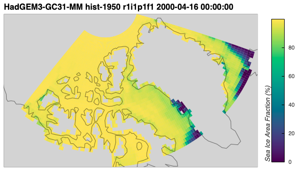

The map for `siconc` from the `HadGEM3-GC31-MM` model covers a different spatial domain compared to the maps of `sithick` and `sivol` below because `siconc` is a on a regular grid instead of an irregular grid.

```python
HadGEM3_GC31_MM_hist_sithick_2000 = '/arctichoke_data/bergybits/data/CMIP6/HighResMIP/MOHC/HadGEM3-GC31-MM/hist-1950/r1i1p1f1/SImon/sithick/gn/v20170928/sithick_SImon_HadGEM3-GC31-MM_hist-1950_r1i1p1f1_gn_200001-200012.nc'

HadGEM3_GC31_MM_hist_sithick_2000_xr = xr.open_dataset(HadGEM3_GC31_MM_hist_sithick_2000)

from arctichoke.dataset.trim_dataset import trim_latlon
from arctichoke.params import CAA_BBOX

HadGEM3_GC31_MM_hist_sithick_2000_xr_trim = trim_latlon(
    HadGEM3_GC31_MM_hist_sithick_2000_xr,
    map_bbox = CAA_BBOX,
    precise_trim = False,
    verbose = False,
)

from arctichoke.plot.hvplots import quadmesh_map

HadGEM3_GC31_MM_hist_sithick_2000_trim_map = quadmesh_map(
    HadGEM3_GC31_MM_hist_sithick_2000_xr_trim.isel(time=3),
    'sithick',
    map_projection = 'Orthographic',
)
HadGEM3_GC31_MM_hist_sithick_2000_trim_map
```
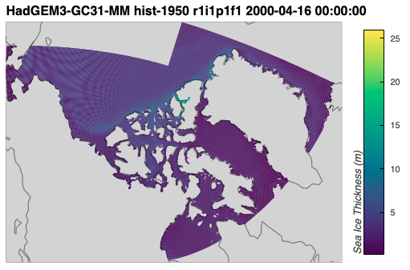

```python
HadGEM3_GC31_MM_hist_sivol_2000 = '/arctichoke_data/bergybits/data/CMIP6/HighResMIP/MOHC/HadGEM3-GC31-MM/hist-1950/r1i1p1f1/SImon/sivol/gn/v20170928/sivol_SImon_HadGEM3-GC31-MM_hist-1950_r1i1p1f1_gn_200001-200012.nc'

HadGEM3_GC31_MM_hist_sivol_2000_xr = xr.open_dataset(HadGEM3_GC31_MM_hist_sivol_2000)

from arctichoke.dataset.trim_dataset import trim_latlon
from arctichoke.params import CAA_BBOX

HadGEM3_GC31_MM_hist_sivol_2000_xr_trim = trim_latlon(
    HadGEM3_GC31_MM_hist_sivol_2000_xr,
    map_bbox = CAA_BBOX,
    precise_trim = False,
    verbose = False,
)

from arctichoke.plot.hvplots import quadmesh_map

HadGEM3_GC31_MM_hist_sivol_2000_trim_map = quadmesh_map(
    HadGEM3_GC31_MM_hist_sivol_2000_xr_trim.isel(time=3),
    'sivol',
    map_projection = 'Orthographic',
)
HadGEM3_GC31_MM_hist_sivol_2000_trim_map
```
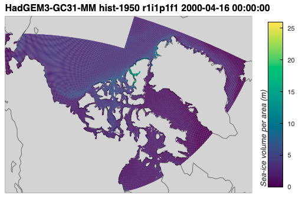

Next, I'll calculate `siconc2` from `sithick` and `sivol` using my `calc_siconc()` function.
```python
from arctichoke.analysis import calc_siconc 

HadGEM3_GC31_MM_hist_siconc2_2000_xr_trim = calc_siconc(
    HadGEM3_GC31_MM_hist_sithick_2000_xr_trim,
    HadGEM3_GC31_MM_hist_sivol_2000_xr_trim,
)

from arctichoke.plot.hvplots import quadmesh_map

HadGEM3_GC31_MM_hist_siconc2_2000_trim_map = quadmesh_map(
    HadGEM3_GC31_MM_hist_siconc2_2000_xr_trim.isel(time=3),
    'siconc2',
    map_projection = 'Orthographic',
)
HadGEM3_GC31_MM_hist_siconc2_2000_trim_map
```
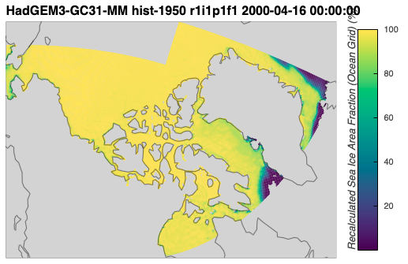

That visually matches with the plot of the `siconc` data on the regular grid above. 
In order to compare the two for validation, I'll need to interpolate the irregular grid data of `siconc2` onto the regular grid of `siconc`.

### Validating the `siconc` calculation by interpolating to a regular grid
[back to top](#calculating-siconc-from-sithick-and-sivol)

<TODO: Fill in this section>

---

## Writing calculated HadGEM3-GC31-MM `siconc` data to file
[back to top](#calculating-siconc-from-sithick-and-sivol)

Having validated that calculating `siconc` from `sithick` and `sivol` works for `HadGEM3-GC31-MM`, I'll use my function `make_siconc_files()` to write all the `siconc2` data to files that I can use later.
I can do this from the original `sithick` and `sivol` files, trimming them to the CAA during the process.
```python
from arctichoke.path import list_variable_files
from arctichoke.analysis import make_siconc_files
from arctichoke.params import CAA_BBOX
this_model = 'HadGEM3-GC31-MM'
for this_variant_label in [
    'r1i1p1f1', 
    'r1i2p1f1', 
    'r1i3p1f1',
]:
    for this_experiment in ['hist-1950']:
        sithick_list = list_variable_files(
            source_id = this_model,
            variable_id = 'sithick',
            experiment_id = this_experiment,
            variant_label = this_variant_label,
        )
        sivol_list = list_variable_files(
            source_id = this_model,
            variable_id = 'sivol',
            experiment_id = this_experiment,
            variant_label = this_variant_label,
        )
        make_siconc_files(
            sithick_files = sithick_list,
            sivol_files = sivol_list,
            map_bbox = CAA_BBOX,
            precise_trim = False,
        )
```
```console
	(make_siconc_files) Writing file `/arctichoke_data/bergybits/data/CMIP6/HighResMIP/MOHC/HadGEM3-GC31-MM/hist-1950/r1i1p1f1/SImon/siconc2/gn/v20260617/trim_CAA_siconc2_SImon_HadGEM3-GC31-MM_hist-1950_r1i1p1f1_gn_195001-195012.nc`.
	(make_siconc_files) Writing file `/arctichoke_data/bergybits/data/CMIP6/HighResMIP/MOHC/HadGEM3-GC31-MM/hist-1950/r1i1p1f1/SImon/siconc2/gn/v20260617/trim_CAA_siconc2_SImon_HadGEM3-GC31-MM_hist-1950_r1i1p1f1_gn_195101-195112.nc`.
    ...
	(make_siconc_files) Writing file `/arctichoke_data/bergybits/data/CMIP6/HighResMIP/MOHC/HadGEM3-GC31-MM/hist-1950/r1i1p1f1/SImon/siconc2/gn/v20260617/trim_CAA_siconc2_SImon_HadGEM3-GC31-MM_hist-1950_r1i1p1f1_gn_201401-201412.nc`.
	(make_siconc_files) Writing file `/arctichoke_data/bergybits/data/CMIP6/HighResMIP/MOHC/HadGEM3-GC31-MM/hist-1950/r1i2p1f1/SImon/siconc2/gn/v20260617/trim_CAA_siconc2_SImon_HadGEM3-GC31-MM_hist-1950_r1i2p1f1_gn_195001-195012.nc`.
    ...
	(make_siconc_files) Writing file `/arctichoke_data/bergybits/data/CMIP6/HighResMIP/MOHC/HadGEM3-GC31-MM/hist-1950/r1i2p1f1/SImon/siconc2/gn/v20260617/trim_CAA_siconc2_SImon_HadGEM3-GC31-MM_hist-1950_r1i2p1f1_gn_201401-201412.nc`.
	(make_siconc_files) Writing file `/arctichoke_data/bergybits/data/CMIP6/HighResMIP/MOHC/HadGEM3-GC31-MM/hist-1950/r1i3p1f1/SImon/siconc2/gn/v20260617/trim_CAA_siconc2_SImon_HadGEM3-GC31-MM_hist-1950_r1i3p1f1_gn_195001-195012.nc`.
    ...
	(make_siconc_files) Writing file `/arctichoke_data/bergybits/data/CMIP6/HighResMIP/MOHC/HadGEM3-GC31-MM/hist-1950/r1i3p1f1/SImon/siconc2/gn/v20260617/trim_CAA_siconc2_SImon_HadGEM3-GC31-MM_hist-1950_r1i3p1f1_gn_201301-201312.nc`.
	(make_siconc_files) Writing file `/arctichoke_data/bergybits/data/CMIP6/HighResMIP/MOHC/HadGEM3-GC31-MM/hist-1950/r1i3p1f1/SImon/siconc2/gn/v20260617/trim_CAA_siconc2_SImon_HadGEM3-GC31-MM_hist-1950_r1i3p1f1_gn_201401-201412.nc`.
```

---

## Writing calculated HadGEM3-GC31-HM `siconc` data to file
[back to top](#calculating-siconc-from-sithick-and-sivol)

The `HadGEM3-GC31-HM` model has the same grid issue as `HadGEM3-GC31-MM`, that being the `siconc` variable is on a regular grid as opposed to an irregular grid.
I can take a look at the variables available as of right now for `HadGEM3-GC31-HM`.
```python
from arctichoke.path.variable_paths import list_available_variables

list_available_variables(
    source_id = 'HadGEM3-GC31-HM',
    experiment_id = 'hist-1950',
    list_var_mods = True,
)
```
```console
{'MOHC/HadGEM3-GC31-HM': {'hist-1950': {
    'r1i1p1f1': {'Ofx': {'areacello': {'': 1}},
    'SImon': {'siage': {'': 65},
     'siv': {'': 65},
     'siu': {'': 65},
     'siconc': {'': 65},
     'sithick': {'': 65},
     'sispeed': {'': 65},
     'sivol': {'': 65}}},
   'r1i3p1f1': {'SImon': {'siconc': {'': 65},
     'sithick': {'': 65},
     'siu': {'': 65},
     'siage': {'': 65},
     'siv': {'': 65},
     'sispeed': {'': 65},
     'sivol': {'': 65}}}
 }},
 'NERC/HadGEM3-GC31-HM': {'hist-1950': {
    'r1i2p1f1': {'SImon': {
     'siconc': {'': 65},
     'siu': {'': 65},
     'sithick': {'': 65},
     'siv': {'': 65},
     'siage': {'': 65},
     'sispeed': {'': 65},
     'sivol': {'': 65}}}
 }}
}
```

The only difference here compared to `HadGEM3-GC31-MM` is the resolution is higher, so I'll use my function `make_siconc_files()` to write all the `siconc2` data to files that I can use later, just as above.
```python
from arctichoke.path import list_variable_files
from arctichoke.analysis import make_siconc_files
from arctichoke.params import CAA_BBOX
this_model = 'HadGEM3-GC31-HM'
for this_variant_label in [
    'r1i1p1f1', 
    'r1i2p1f1', 
    'r1i3p1f1',
]:
    for this_experiment in ['hist-1950']:
        sithick_list = list_variable_files(
            source_id = this_model,
            variable_id = 'sithick',
            experiment_id = this_experiment,
            variant_label = this_variant_label,
        )
        sivol_list = list_variable_files(
            source_id = this_model,
            variable_id = 'sivol',
            experiment_id = this_experiment,
            variant_label = this_variant_label,
        )
        make_siconc_files(
            sithick_files = sithick_list,
            sivol_files = sivol_list,
            map_bbox = CAA_BBOX,
            precise_trim = False,
        )
```
```console
	(make_siconc_files) Writing file `/arctichoke_data/bergybits/data/CMIP6/HighResMIP/MOHC/HadGEM3-GC31-HM/hist-1950/r1i1p1f1/SImon/siconc2/gn/v20260617/trim_CAA_siconc2_SImon_HadGEM3-GC31-HM_hist-1950_r1i1p1f1_gn_195001-195012.nc`.
	(make_siconc_files) Writing file `/arctichoke_data/bergybits/data/CMIP6/HighResMIP/MOHC/HadGEM3-GC31-HM/hist-1950/r1i1p1f1/SImon/siconc2/gn/v20260617/trim_CAA_siconc2_SImon_HadGEM3-GC31-HM_hist-1950_r1i1p1f1_gn_195101-195112.nc`.
    ...
	(make_siconc_files) Writing file `/arctichoke_data/bergybits/data/CMIP6/HighResMIP/MOHC/HadGEM3-GC31-HM/hist-1950/r1i1p1f1/SImon/siconc2/gn/v20260617/trim_CAA_siconc2_SImon_HadGEM3-GC31-HM_hist-1950_r1i1p1f1_gn_201401-201412.nc`.
	(make_siconc_files) Writing file `/arctichoke_data/bergybits/data/CMIP6/HighResMIP/MOHC/HadGEM3-GC31-HM/hist-1950/r1i2p1f1/SImon/siconc2/gn/v20260617/trim_CAA_siconc2_SImon_HadGEM3-GC31-HM_hist-1950_r1i2p1f1_gn_195001-195012.nc`.
    ...
	(make_siconc_files) Writing file `/arctichoke_data/bergybits/data/CMIP6/HighResMIP/MOHC/HadGEM3-GC31-HM/hist-1950/r1i2p1f1/SImon/siconc2/gn/v20260617/trim_CAA_siconc2_SImon_HadGEM3-GC31-HM_hist-1950_r1i2p1f1_gn_201401-201412.nc`.
	(make_siconc_files) Writing file `/arctichoke_data/bergybits/data/CMIP6/HighResMIP/MOHC/HadGEM3-GC31-HM/hist-1950/r1i3p1f1/SImon/siconc2/gn/v20260617/trim_CAA_siconc2_SImon_HadGEM3-GC31-HM_hist-1950_r1i3p1f1_gn_195001-195012.nc`.
    ...
	(make_siconc_files) Writing file `/arctichoke_data/bergybits/data/CMIP6/HighResMIP/MOHC/HadGEM3-GC31-HM/hist-1950/r1i3p1f1/SImon/siconc2/gn/v20260617/trim_CAA_siconc2_SImon_HadGEM3-GC31-HM_hist-1950_r1i3p1f1_gn_201301-201312.nc`.
	(make_siconc_files) Writing file `/arctichoke_data/bergybits/data/CMIP6/HighResMIP/MOHC/HadGEM3-GC31-HM/hist-1950/r1i3p1f1/SImon/siconc2/gn/v20260617/trim_CAA_siconc2_SImon_HadGEM3-GC31-HM_hist-1950_r1i3p1f1_gn_201401-201412.nc`.
```

---

## Calculating `siconc` for an example `HadGEM3-GC31-HH` dataset
[back to top](#calculating-siconc-from-sithick-and-sivol)

The `HadGEM3-GC31-HH` model has `siconc` on the irregular grid by default, however I have been unable to figure out how to actually open those data files and work with them. 
Below, I use the code I developed above to calculate `siconc2` from `sithick` and `sivol` for the year 2000 of the `HadGEM3-GC31-HH` model.

First, I'll list what variables are currently available for this model.
```python
from arctichoke.path.variable_paths import list_available_variables

list_available_variables(
    source_id = 'HadGEM3-GC31-HH',
    experiment_id = 'hist-1950',
    list_var_mods = True,
)
```
```console
{'MOHC/HadGEM3-GC31-HH': {'hist-1950': None},
 'NERC/HadGEM3-GC31-HH': {'hist-1950': {
    'r1i1p1f1': {'SImon': {
     'sithick': {'': 65},
     'siv': {'': 65},
     'siu': {'': 65},
     'siconc': {'': 64, 'trim_CAA_': 3},
     'siage': {'': 65},
     'sispeed': {'': 65, 'trim_CAA_': 65},
     'sivol': {'': 65}}}
}}}
```

Next, I'll load example files from the year 2000 for `siconc`, `sithick`, and `sivol` and plot them in April.
```python
HadGEM3_GC31_HH_hist_siconc_2000 = '/arctichoke_data/bergybits/data/CMIP6/HighResMIP/NERC/HadGEM3-GC31-HH/hist-1950/r1i1p1f1/SImon/siconc/gn/v20210416/siconc_SImon_HadGEM3-GC31-HH_hist-1950_r1i1p1f1_gn_200001-200012.nc'

from arctichoke.dataset.trim_dataset import trim_latlon
from arctichoke.params import CAA_BBOX

HadGEM3_GC31_HH_hist_siconc_2000_xr_trim = trim_latlon(
    HadGEM3_GC31_HH_hist_siconc_2000,
    save_as = 'HadGEM3_GC31_HH_hist_siconc_2000_xr_trim.nc',
    map_bbox = CAA_BBOX,
    precise_trim = False,
    verbose = True,
)

HadGEM3_GC31_HH_hist_siconc_2000_xr_trim
```
As mentioned above, I can't seem to work with the `HadGEM3-GC31-HH` data for the `siconc` variable.
```python
HadGEM3_GC31_HH_hist_sithick_2000 = '/arctichoke_data/bergybits/data/CMIP6/HighResMIP/NERC/HadGEM3-GC31-HH/hist-1950/r1i1p1f1/SImon/sithick/gn/v20210416/sithick_SImon_HadGEM3-GC31-HH_hist-1950_r1i1p1f1_gn_200001-200012.nc'

from arctichoke.dataset.trim_dataset import trim_latlon
from arctichoke.params import CAA_BBOX

HadGEM3_GC31_HH_hist_sithick_2000_xr_trim = trim_latlon(
    HadGEM3_GC31_HH_hist_sithick_2000,
    map_bbox = CAA_BBOX,
    precise_trim = False,
    verbose = True,
)

import xarray as xr

from arctichoke.plot.hvplots import quadmesh_map
from arctichoke.params import sea_ice_vars

si_var = 'sithick'

HadGEM3_GC31_HH_hist_sithick_2000_trim_map = quadmesh_map(
    HadGEM3_GC31_HH_hist_sithick_2000_xr_trim.isel(time=3),
    si_var,
    map_projection = 'Orthographic',
    clims = sea_ice_vars[si_var]['plot_range'],
    verbose = True,
)
HadGEM3_GC31_HH_hist_sithick_2000_trim_map
```
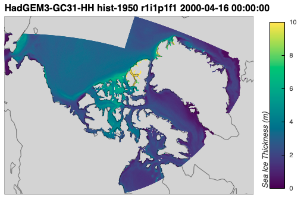

```python
HadGEM3_GC31_HH_hist_sivol_2000 = '/arctichoke_data/bergybits/data/CMIP6/HighResMIP/NERC/HadGEM3-GC31-HH/hist-1950/r1i1p1f1/SImon/sivol/gn/v20210416/sivol_SImon_HadGEM3-GC31-HH_hist-1950_r1i1p1f1_gn_200001-200012.nc'

from arctichoke.dataset.trim_dataset import trim_latlon
from arctichoke.params import CAA_BBOX

HadGEM3_GC31_HH_hist_sivol_2000_xr_trim = trim_latlon(
    HadGEM3_GC31_HH_hist_sivol_2000,
    map_bbox = CAA_BBOX,
    precise_trim = False,
    verbose = True,
)

import xarray as xr

from arctichoke.plot.hvplots import quadmesh_map
from arctichoke.params import sea_ice_vars

si_var = 'sivol'

HadGEM3_GC31_HH_hist_sivol_2000_trim_map = quadmesh_map(
    HadGEM3_GC31_HH_hist_sivol_2000_xr_trim.isel(time=3),
    si_var,
    map_projection = 'Orthographic',
    clims = sea_ice_vars[si_var]['plot_range'],
    verbose = True,
)
HadGEM3_GC31_HH_hist_sivol_2000_trim_map
```
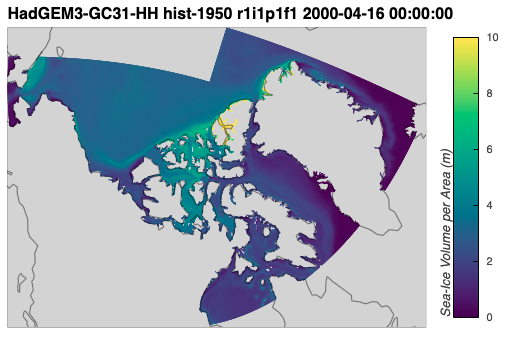

Now, I'll calculate `siconc2` from `sithick` and `sivol` using my `calc_siconc()` function.
```python
from arctichoke.analysis import calc_siconc 

HadGEM3_GC31_HH_hist_siconc2_2000_xr_trim = calc_siconc(
    HadGEM3_GC31_HH_hist_sithick_2000_xr_trim,
    HadGEM3_GC31_HH_hist_sivol_2000_xr_trim,
)

from arctichoke.plot.hvplots import quadmesh_map
from arctichoke.params import sea_ice_vars

si_var = 'siconc2'

HadGEM3_GC31_HH_hist_siconc2_2000_trim_map = quadmesh_map(
    HadGEM3_GC31_HH_hist_siconc2_2000_xr_trim.isel(time=3),
    si_var,
    map_projection = 'Orthographic',
    clims = sea_ice_vars[si_var]['plot_range'],
    verbose = True,
)
HadGEM3_GC31_HH_hist_siconc2_2000_trim_map
```
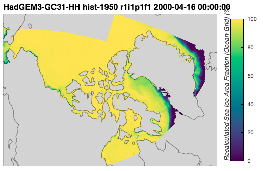

---

## Writing calculated HadGEM3-GC31-HH `siconc` data to file
[back to top](#calculating-siconc-from-sithick-and-sivol)

For the `HadGEM3-GC31-HM` model, the data files are big enough that I need to be careful about loading too much into memory or else my kernel crashes. 
Therefore, when I loop through to calculate `siconc2` files, I will specify `with_modification = 'trim_CAA_'`.
This will select `sithick` and `sivol` files that have already been cut down to just the CAA region, reducing their size.
For details on that process, see {doc}`Trimming data to the CAA region <../docs_data/trim_to_CAA_region>`.
This is opposed to when I calculated `siconc2` for `HadGEM3-GC31-MM` and `HadGEM3-GC31-HM` where I could specify `map_bbox = CAA_BBOX` in the `make_siconc_files()` function. 
For `HadGEM3-GC31-HM`, it is important to not pass a value for `map_bbox` to `make_siconc_files()`.
Also note here, there is only one variant for `HadGEM3-GC31-HH`.
```python
from arctichoke.path import list_variable_files
from arctichoke.analysis import make_siconc_files
from arctichoke.params import CAA_BBOX
this_model = 'HadGEM3-GC31-HH'
for this_variant_label in [
    'r1i1p1f1', 
]:
    for this_experiment in ['hist-1950']:
        sithick_list = list_variable_files(
            source_id = this_model,
            variable_id = 'sithick',
            experiment_id = this_experiment,
            variant_label = this_variant_label,
            with_modification = 'trim_CAA_',
        )
        sivol_list = list_variable_files(
            source_id = this_model,
            variable_id = 'sivol',
            experiment_id = this_experiment,
            variant_label = this_variant_label,
            with_modification = 'trim_CAA_',
        )
        make_siconc_files(
            sithick_files = sithick_list,
            sivol_files = sivol_list,
            precise_trim = False,
        )
```
```console
	(make_siconc_files) Writing file `/arctichoke_data/bergybits/data/CMIP6/HighResMIP/MOHC/HadGEM3-GC31-HH/hist-1950/r1i1p1f1/SImon/siconc2/gn/v20260617/trim_CAA_siconc2_SImon_HadGEM3-GC31-HH_hist-1950_r1i1p1f1_gn_195001-195012.nc`.
	(make_siconc_files) Writing file `/arctichoke_data/bergybits/data/CMIP6/HighResMIP/MOHC/HadGEM3-GC31-HH/hist-1950/r1i1p1f1/SImon/siconc2/gn/v20260617/trim_CAA_siconc2_SImon_HadGEM3-GC31-HH_hist-1950_r1i1p1f1_gn_195101-195112.nc`.
    ...
	(make_siconc_files) Writing file `/arctichoke_data/bergybits/data/CMIP6/HighResMIP/MOHC/HadGEM3-GC31-HH/hist-1950/r1i1p1f1/SImon/siconc2/gn/v20260617/trim_CAA_siconc2_SImon_HadGEM3-GC31-HH_hist-1950_r1i1p1f1_gn_201301-201312.nc`.
	(make_siconc_files) Writing file `/arctichoke_data/bergybits/data/CMIP6/HighResMIP/MOHC/HadGEM3-GC31-HH/hist-1950/r1i1p1f1/SImon/siconc2/gn/v20260617/trim_CAA_siconc2_SImon_HadGEM3-GC31-HH_hist-1950_r1i1p1f1_gn_201401-201412.nc`.
```

With that, I now have data files of sea ice concentration for all `HadGEM3-GC31` models that I can use in {doc}`Identifying landfast ice <../docs_analysis/landfast_ice>`.