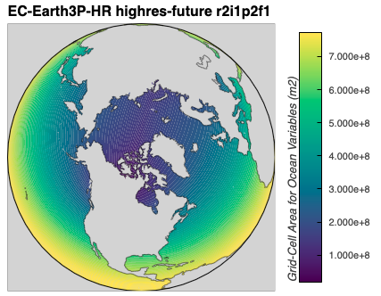
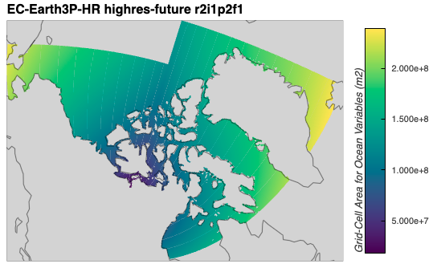
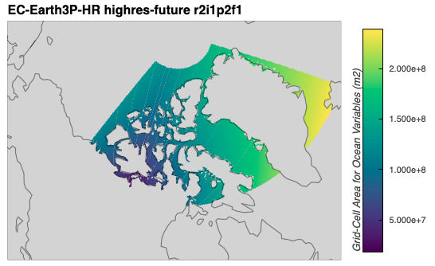
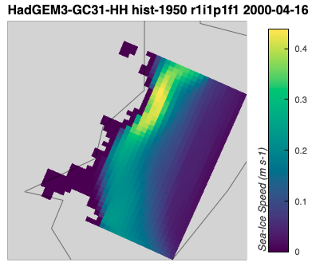

# Trim data to the CAA region

Below, I describe how I sea ice variable files to cover just the Canadian Arctic Archipelago region for the `EC-Earth3P-HR` and `HadGEM3-GC31` models.
For details on how the data for those models were downloaded, see the {doc}`Downloading model data with 'esgpull' <../docs_data/esgpull_downloads>` guide. 

## Contents

- [Defining the CAA](#defining-the-caa)
- [Test trim to small region](#test-trim-to-small-region)
- [Trimming files for EC-Earth3P-HR](#trimming-files-for-ec-earth3p-hr)
- [Trimming files for HadGEM3-GC31-HH](#trimming-files-for-hadgem3-gc31-hh)

---
## Defining the CAA
[back to top](#trim-data-to-the-caa-region)

Here, I define a bounding box to cover the Canadian Arctic Archipelago (CAA) region.
My goal will be to choose coordinates such that the box includes the entire archipelago as well as the west and north coasts of Greenland.

First, I'll load an example dataset of `areacello` from `EC-Earth3P-HR` and plot it over the entire globe.
```python
import xarray as xr 

EC_Earth3P_HR_areacello = '/arctichoke_data/bergybits/data/CMIP6/HighResMIP/EC-Earth-Consortium/EC-Earth3P-HR/highres-future/r2i1p2f1/Ofx/areacello/gn/v20210412/areacello_Ofx_EC-Earth3P-HR_highres-future_r2i1p2f1_gn.nc'

EC_Earth3P_HR_areacello_xr = xr.open_dataset(EC_Earth3P_HR_areacello)

from arctichoke.plot.hvplots import quadmesh_map

EC_Earth3P_HR_areacello_globe = quadmesh_map(
    EC_Earth3P_HR_areacello_xr,
    'areacello',
    map_projection = 'Orthographic',
)
EC_Earth3P_HR_areacello_globe
```


Next, I will define the boundaries of the CAA region using coordinates that I've added to the `arctichoke.params` module.
```python
from arctichoke.params import CAA_BBOX
# Define the boundaries of the CAA
CAA_BBOX
```
```console
[85, 65, -15, -130]
```

Then, if I use my function `trim_latlon()`, which uses the `cdo` package under the hood, to trim the example datafile to that bounding box, I can plot that on a map to see the result.
```
from arctichoke.dataset.trim_dataset import trim_latlon

EC_Earth3P_HR_areacello_xr_trim = trim_latlon(
    EC_Earth3P_HR_areacello_xr,
    map_bbox = CAA_BBOX,
    precise_trim = False,
    verbose = True,
)

from arctichoke.plot.hvplots import quadmesh_map

EC_Earth3P_HR_areacello_globe_trim = quadmesh_map(
    EC_Earth3P_HR_areacello_xr_trim,
    'areacello',
    map_projection = 'Orthographic',
)
EC_Earth3P_HR_areacello_globe_trim
```
```console
(trim_latlon) `save_as`: None
(trim_latlon) `lon_type`: PM_centered
(trim_latlon) `this_bbox`: 230,345,65,85
(trim_latlon) `data_vars` all: ['longitude_bnds', 'latitude_bnds', 'areacello']
(trim_latlon) `data_vars` after cleaning: ['areacello']
(trim_latlon) `lat_var`: latitude
(trim_latlon) `lon_var`: longitude
(trim_latlon)     For variable areacello, `nanmin`:18155656.0, `nanmax`:239215792.0
```


From this plot I can see that the result is not quite what is expected.
This is because the dataset used here is on an irregular grid.
```python
from arctichoke.dataset import get_grid_type

get_grid_type(EC_Earth3P_HR_areacello_xr)
```
```console
'irregular'
```

When using a dataset on an `irregular` grid, the `trim_latlon()` function takes the dimensions in `j` and `i` that will be sure to include the entire specified bounding box.
However, in interest of efficiency, `trim_latlon()` does not specifically check each spatial index for the latitude and longitude values by default, meaning that more area is kept in the resulting dataset than just within the bounding box.

By using the `precise_trim=True` argument in `trim_latlon()`, I can get just the values exactly within the specified bounding box.
However, this takes more time, especially for larger datasets, as each index needs to be checked individually.
```python
from arctichoke.dataset.trim_dataset import trim_latlon

EC_Earth3P_HR_areacello_xr_precise_trim = trim_latlon(
    EC_Earth3P_HR_areacello_xr,
    map_bbox = CAA_BBOX,
    precise_trim = True,
    verbose = True,
)

from arctichoke.plot.hvplots import quadmesh_map

EC_Earth3P_HR_areacello_globe_precise_trim = quadmesh_map(
    EC_Earth3P_HR_areacello_xr_precise_trim,
    'areacello',
    map_projection = 'Orthographic',
)
EC_Earth3P_HR_areacello_globe_precise_trim
```
```console
(trim_latlon) `save_as`: None
(trim_latlon) `lon_type`: PM_centered
(trim_latlon) `this_bbox`: 230,345,65,85
(trim_latlon) `data_vars` all: ['longitude_bnds', 'latitude_bnds', 'areacello']
(trim_latlon) `data_vars` after cleaning: ['areacello']
(trim_latlon) `lat_var`: latitude
(trim_latlon) `lon_var`: longitude
(trim_latlon) After `cdo` trim, before precise trim.
(trim_latlon)     For variable areacello, `nanmin`:18155656.0, `nanmax`:239215792.0
(trim_latlon) Trimming grid type: irregular
(trim_latlon) After precise trim.
(trim_latlon)     For variable areacello, `nanmin`:18155656.0, `nanmax`:239215792.0
```


---
## Test trim to small region
[back to top](#trim-data-to-the-caa-region)

I wrote a function called `trim_files()` which will save out new versions of the given datafiles which have been trimmed to the specified region.
However, for the `EC-Earth3P-HR`, `HadGEM3-GC31-HM`,  and `HadGEM3-GC31-MM` models, it isn't strictly necessary to trim the datasets to the CAA and save them to their own files.
This is because these datafiles are small enough to load into memory, trim, and perform a subsequent computation without running out of memory.
See the examples in {doc}`Identifying landfast ice <../docs_analysis/landfast_ice>` where the `make_landfast_files()` function is given `CAA_BBOX` as the `map_bbox` argument. 

On the other hand, the `HadGEM3-GC31-HH` model data files are large enough that I need to specifically save out files that are trimmed to the CAA region before doing subsequent calculations.
They are each individually large enough (around 200 MB) that, when trying to use the Python implementation of `cdo`, the kernel crashes. 
However, using the `cdo` command line interface works just fine. 
Therefore, I modified `trim_latlon()` to accept strings of file paths as well as `xarray.Dataset`s. 
When given a file string, the function will use the `subprocess.run()` command instead of `cdo.sellonlatbox()`.

When working out the procedure with the `HadGEM3-GC31-HH` model, I found it useful to define a small bounding box of a test region so that the processing time in each step was much shorter.
```python
from arctichoke.params import TEST_BBOX
# Define the boundaries of the test region
TEST_BBOX
```
```console
[80, 79, -70, -75]
```

I can trim an example `sispeed` file from  `HadGEM3-GC31-HH` and plot it on a map to show that the region selected is in a channel between two islands of the CAA.
```python
from arctichoke.dataset import trim_latlon

HadGEM3_GC31_HH_hist_1950_sispeed_xr_test_trim = trim_latlon(
    dataset = '/arctichoke_data/bergybits/data/CMIP6/HighResMIP/NERC/HadGEM3-GC31-HH/hist-1950/r1i1p1f1/SImon/sispeed/gn/v20210416/sispeed_SImon_HadGEM3-GC31-HH_hist-1950_r1i1p1f1_gn_200001-200012.nc',
    save_as = 'test_trim1_HGHH.nc',
    map_bbox = TEST_BBOX,
    verbose = True,
)
print(f"For trimming to the test bounding box:")
print(f"    Dimension sizes: (time:{HadGEM3_GC31_HH_hist_1950_sispeed_xr_test_trim['time'].size}, j:{HadGEM3_GC31_HH_hist_1950_sispeed_xr_test_trim['j'].size}, i:{HadGEM3_GC31_HH_hist_1950_sispeed_xr_test_trim['i'].size})")

from arctichoke.plot.hvplots import quadmesh_map

HadGEM3_GC31_HH_hist_1950_sispeed_test_trim_map = quadmesh_map(
    HadGEM3_GC31_HH_hist_1950_sispeed_xr_test_trim.isel(time=3),
    'sispeed',
    map_projection = 'Orthographic',
)
HadGEM3_GC31_HH_hist_1950_sispeed_test_trim_map
```
```console
(trim_latlon) `save_as`: test_trim1_HGHH.nc
(trim_latlon) `lon_type`: IDL_centered
(trim_latlon) `this_bbox`: -75,-70,79,80
(trim_latlon) Using `cdo` directly, `cdo_command`: cdo -O -s -f nc -sellonlatbox,-75,-70,79,80 /arctichoke_data/bergybits/data/CMIP6/HighResMIP/NERC/HadGEM3-GC31-HH/hist-1950/r1i1p1f1/SImon/sispeed/gn/v20210416/sispeed_SImon_HadGEM3-GC31-HH_hist-1950_r1i1p1f1_gn_200001-200012.nc ./cdo_tmp/tmp_sellonlatbox_file.nc
(trim_latlon) `data_vars` all: ['time_bnds', 'longitude_bnds', 'latitude_bnds', 'sispeed']
(trim_latlon) `data_vars` after cleaning: ['sispeed']
(trim_latlon) `lat_var`: latitude
(trim_latlon) `lon_var`: longitude
(trim_latlon)     For variable sispeed, `nanmin`:0.0, `nanmax`:0.9504191875457764
For trimming to the test bounding box:
    Dimension sizes: (time:12, j:36, i:38)
```


---

## Trimming files for EC-Earth3P-HR
[back to top](#trim-data-to-the-caa-region)

As an exmaple of how to use the `trim_files()` function, below I trim files from the `EC-Earth3P-HR` model for `siconc` and `sispeed`. 
```python
import xarray as xr

from arctichoke.dataset import trim_files
from arctichoke.params import CAA_BBOX
from arctichoke.path import list_variable_files

this_model = 'EC-Earth3P-HR'

for this_variant_label in [
    'r1i1p2f1', 
    'r2i1p2f1', 
    'r3i1p2f1',
]:
    for si_var in ['siconc', 'sispeed']:
        for this_experiment in ['hist-1950']:
            sivar_list = list_variable_files(
                source_id = this_model,
                variable_id = si_var,
                experiment_id = this_experiment,
                variant_label = this_variant_label,
            )
            trim_files(
                files_to_trim = sivar_list,
                name_prefix = 'trim_CAA_',
                map_bbox = CAA_BBOX,
                precise_trim = False,
            )
```
```console
(trim_files) `name_prefix`: trim_CAA_
	(trim_files) Writing file `/arctichoke_data/bergybits/data/CMIP6/HighResMIP/EC-Earth-Consortium/EC-Earth3P-HR/hist-1950/r1i1p2f1/SImon/siconc/gn/v20181212/trim_CAA_siconc_SImon_EC-Earth3P-HR_hist-1950_r1i1p2f1_gn_195001-195012.nc`.
	(trim_files) Writing file `/arctichoke_data/bergybits/data/CMIP6/HighResMIP/EC-Earth-Consortium/EC-Earth3P-HR/hist-1950/r1i1p2f1/SImon/siconc/gn/v20181212/trim_CAA_siconc_SImon_EC-Earth3P-HR_hist-1950_r1i1p2f1_gn_195101-195112.nc`.
    ...
	(trim_files) Writing file `/arctichoke_data/bergybits/data/CMIP6/HighResMIP/EC-Earth-Consortium/EC-Earth3P-HR/hist-1950/r3i1p2f1/SImon/sispeed/gn/v20190214/trim_CAA_sispeed_SImon_EC-Earth3P-HR_hist-1950_r3i1p2f1_gn_201301-201312.nc`.
	(trim_files) Writing file `/arctichoke_data/bergybits/data/CMIP6/HighResMIP/EC-Earth-Consortium/EC-Earth3P-HR/hist-1950/r3i1p2f1/SImon/sispeed/gn/v20190214/trim_CAA_sispeed_SImon_EC-Earth3P-HR_hist-1950_r3i1p2f1_gn_201401-201412.nc`.
```

---
## Trimming files for HadGEM3-GC31-HH
[back to top](#trim-data-to-the-caa-region)

Special considerations needed to be taken in order to trim the `HadGEM3-GC31-HH` data files. 
They are each individually large enough (around 200 MB) that, when trying to use the Python implementation of `cdo`, the kernel crashes. 
However, using the `cdo` command line interface works just fine. 
Therefore, I modified `trim_latlon()` to accept strings of file paths as well as `xarray.Dataset`s. 
When given a file string, the function will use the `subprocess.run()` command instead of `cdo.sellonlatbox()`.

There is also a strange issue with the `sispeed` variable when trimming to a specified region for this high-resolution model.
When trimming any other variable to the defined CAA bounding box, the dimensions are all the same. 
However, when trimming `sispeed` to the CAA, the dimensions of `j` and `i` are one shorter.
```python
import xarray as xr

from arctichoke.dataset import trim_latlon
from arctichoke.params import CAA_BBOX

for si_var in ['siage', 'sithick', 'sivol', 'sispeed']:
    HadGEM3_GC31_HH_hist_1950_sivar = f'/arctichoke_data/bergybits/data/CMIP6/HighResMIP/NERC/HadGEM3-GC31-HH/hist-1950/r1i1p1f1/SImon/{si_var}/gn/v20210416/{si_var}_SImon_HadGEM3-GC31-HH_hist-1950_r1i1p1f1_gn_195001-195012.nc'
    HadGEM3_GC31_HH_hist_1950_sivar_xr = xr.open_dataset(HadGEM3_GC31_HH_hist_1950_sivar)
    print(f"For `si_var`: {si_var}")
    HadGEM3_GC31_HH_hist_1950_sivar_xr_CAA = trim_latlon(
        HadGEM3_GC31_HH_hist_1950_sivar_xr,
        map_bbox = CAA_BBOX,
    )
    print(f"    Dimension sizes: (time:{HadGEM3_GC31_HH_hist_1950_sivar_xr_CAA['time'].size}, j:{HadGEM3_GC31_HH_hist_1950_sivar_xr_CAA['j'].size}, i:{HadGEM3_GC31_HH_hist_1950_sivar_xr_CAA['i'].size})")
```
```console
For `si_var`: siage
    Dimension sizes: (time:12, j:592, i:1966)
For `si_var`: sithick
    Dimension sizes: (time:12, j:592, i:1966)
For `si_var`: sivol
    Dimension sizes: (time:12, j:592, i:1966)
For `si_var`: sispeed
    Dimension sizes: (time:12, j:591, i:1965)
```

By trial and error, I found values that I can adjust the `CAA_BBOX` by to get the same dimension sizes for `sispeed`.
```python
import xarray as xr

from arctichoke.dataset import trim_latlon
from arctichoke.params import CAA_LAT_MAX, CAA_LAT_MIN, CAA_LON_MAX, CAA_LON_MIN

for si_var in ['sispeed']:
    HadGEM3_GC31_HH_hist_1950_sivar = f'/arctichoke_data/bergybits/data/CMIP6/HighResMIP/NERC/HadGEM3-GC31-HH/hist-1950/r1i1p1f1/SImon/{si_var}/gn/v20210416/{si_var}_SImon_HadGEM3-GC31-HH_hist-1950_r1i1p1f1_gn_195001-195012.nc'
    HadGEM3_GC31_HH_hist_1950_sivar_xr = xr.open_dataset(HadGEM3_GC31_HH_hist_1950_sivar)
    print(f"For `si_var`: {si_var}")
    HadGEM3_GC31_HH_hist_1950_sivar_xr_CAA = trim_latlon(
        HadGEM3_GC31_HH_hist_1950_sivar_xr,
        map_bbox = [CAA_LAT_MAX, CAA_LAT_MIN-0.05, CAA_LON_MAX, CAA_LON_MIN-0.3],
        verbose = True,
    )
    print(f"    Dimension sizes: (time:{HadGEM3_GC31_HH_hist_1950_sivar_xr_CAA['time'].size}, j:{HadGEM3_GC31_HH_hist_1950_sivar_xr_CAA['j'].size}, i:{HadGEM3_GC31_HH_hist_1950_sivar_xr_CAA['i'].size})")
```
```console
For `si_var`: sispeed
(trim_latlon) `save_as`: None
(trim_latlon) `lon_type`: IDL_centered
(trim_latlon) `this_bbox`: -130.3,-15,64.95,85
(trim_latlon) `data_vars` all: ['time_bnds', 'longitude_bnds', 'latitude_bnds', 'sispeed']
(trim_latlon) `data_vars` after cleaning: ['sispeed']
(trim_latlon) `lat_var`: latitude
(trim_latlon) `lon_var`: longitude
(trim_latlon)     For variable sispeed, `nanmin`:0.0, `nanmax`:1.4457271099090576
    Dimension sizes: (time:12, j:592, i:1966)
```

With those considerations in mind, I trim data files from `HadGEM3-GC31-HH` to cover just the CAA region below.
```python
from arctichoke.path import list_variable_files

HadGEM3_GC31_HH_hist_sispeed_list = list_variable_files(
    source_id = 'HadGEM3-GC31-HH',
    variable_id = 'sispeed',
)

from arctichoke.dataset import trim_files
from arctichoke.params import CAA_LAT_MAX, CAA_LAT_MIN, CAA_LON_MAX, CAA_LON_MIN

trim_files(
    files_to_trim = HadGEM3_GC31_HH_hist_sispeed_list,
    name_prefix = 'trim_CAA_',
    use_cdo_python = False,
    map_bbox = [CAA_LAT_MAX, CAA_LAT_MIN-0.05, CAA_LON_MAX, CAA_LON_MIN-0.3],
    verbose = True,
)
```
```console
(trim_files) `name_prefix`: trim_CAA_
	(trim_files) Writing file `/arctichoke_data/bergybits/data/CMIP6/HighResMIP/NERC/HadGEM3-GC31-HH/hist-1950/r1i1p1f1/SImon/sispeed/gn/v20210416/trim_CAA_sispeed_SImon_HadGEM3-GC31-HH_hist-1950_r1i1p1f1_gn_195001-195012.nc`.
(trim_latlon) `save_as`: /arctichoke_data/bergybits/data/CMIP6/HighResMIP/NERC/HadGEM3-GC31-HH/hist-1950/r1i1p1f1/SImon/sispeed/gn/v20210416/trim_CAA_sispeed_SImon_HadGEM3-GC31-HH_hist-1950_r1i1p1f1_gn_195001-195012.nc
(trim_latlon) `lon_type`: IDL_centered
(trim_latlon) `this_bbox`: -130.3,-15,64.95,85
(trim_latlon) Using `cdo` directly, `cdo_command`: cdo -O -s -f nc -sellonlatbox,-130.3,-15,64.95,85 /arctichoke_data/bergybits/data/CMIP6/HighResMIP/NERC/HadGEM3-GC31-HH/hist-1950/r1i1p1f1/SImon/sispeed/gn/v20210416/sispeed_SImon_HadGEM3-GC31-HH_hist-1950_r1i1p1f1_gn_195001-195012.nc ./cdo_tmp/tmp_sellonlatbox_file.nc
(trim_latlon) `data_vars` all: ['time_bnds', 'longitude_bnds', 'latitude_bnds', 'sispeed']
(trim_latlon) `data_vars` after cleaning: ['sispeed']
(trim_latlon) `lat_var`: latitude
(trim_latlon) `lon_var`: longitude
(trim_latlon)     For variable sispeed, `nanmin`:0.0, `nanmax`:1.4457271099090576
	(trim_files) Writing file `/arctichoke_data/bergybits/data/CMIP6/HighResMIP/NERC/HadGEM3-GC31-HH/hist-1950/r1i1p1f1/SImon/sispeed/gn/v20210416/trim_CAA_sispeed_SImon_HadGEM3-GC31-HH_hist-1950_r1i1p1f1_gn_195101-195112.nc`.
(trim_latlon) `save_as`: /arctichoke_data/bergybits/data/CMIP6/HighResMIP/NERC/HadGEM3-GC31-HH/hist-1950/r1i1p1f1/SImon/sispeed/gn/v20210416/trim_CAA_sispeed_SImon_HadGEM3-GC31-HH_hist-1950_r1i1p1f1_gn_195101-195112.nc
(trim_latlon) `lon_type`: IDL_centered
(trim_latlon) `this_bbox`: -130.3,-15,64.95,85
(trim_latlon) Using `cdo` directly, `cdo_command`: cdo -O -s -f nc -sellonlatbox,-130.3,-15,64.95,85 /arctichoke_data/bergybits/data/CMIP6/HighResMIP/NERC/HadGEM3-GC31-HH/hist-1950/r1i1p1f1/SImon/sispeed/gn/v20210416/sispeed_SImon_HadGEM3-GC31-HH_hist-1950_r1i1p1f1_gn_195101-195112.nc ./cdo_tmp/tmp_sellonlatbox_file.nc
(trim_latlon) `data_vars` all: ['time_bnds', 'longitude_bnds', 'latitude_bnds', 'sispeed']
(trim_latlon) `data_vars` after cleaning: ['sispeed']
(trim_latlon) `lat_var`: latitude
(trim_latlon) `lon_var`: longitude
(trim_latlon)     For variable sispeed, `nanmin`:0.0, `nanmax`:1.4066814184188843
...
	(trim_files) Writing file `/arctichoke_data/bergybits/data/CMIP6/HighResMIP/NERC/HadGEM3-GC31-HH/hist-1950/r1i1p1f1/SImon/sispeed/gn/v20210416/trim_CAA_sispeed_SImon_HadGEM3-GC31-HH_hist-1950_r1i1p1f1_gn_201301-201312.nc`.
(trim_latlon) `save_as`: /arctichoke_data/bergybits/data/CMIP6/HighResMIP/NERC/HadGEM3-GC31-HH/hist-1950/r1i1p1f1/SImon/sispeed/gn/v20210416/trim_CAA_sispeed_SImon_HadGEM3-GC31-HH_hist-1950_r1i1p1f1_gn_201301-201312.nc
(trim_latlon) `lon_type`: IDL_centered
(trim_latlon) `this_bbox`: -130.3,-15,64.95,85
(trim_latlon) Using `cdo` directly, `cdo_command`: cdo -O -s -f nc -sellonlatbox,-130.3,-15,64.95,85 /arctichoke_data/bergybits/data/CMIP6/HighResMIP/NERC/HadGEM3-GC31-HH/hist-1950/r1i1p1f1/SImon/sispeed/gn/v20210416/sispeed_SImon_HadGEM3-GC31-HH_hist-1950_r1i1p1f1_gn_201301-201312.nc ./cdo_tmp/tmp_sellonlatbox_file.nc
(trim_latlon) `data_vars` all: ['time_bnds', 'longitude_bnds', 'latitude_bnds', 'sispeed']
(trim_latlon) `data_vars` after cleaning: ['sispeed']
(trim_latlon) `lat_var`: latitude
(trim_latlon) `lon_var`: longitude
(trim_latlon)     For variable sispeed, `nanmin`:0.0, `nanmax`:1.6943098306655884
	(trim_files) Writing file `/arctichoke_data/bergybits/data/CMIP6/HighResMIP/NERC/HadGEM3-GC31-HH/hist-1950/r1i1p1f1/SImon/sispeed/gn/v20210416/trim_CAA_sispeed_SImon_HadGEM3-GC31-HH_hist-1950_r1i1p1f1_gn_201401-201412.nc`.
(trim_latlon) `save_as`: /arctichoke_data/bergybits/data/CMIP6/HighResMIP/NERC/HadGEM3-GC31-HH/hist-1950/r1i1p1f1/SImon/sispeed/gn/v20210416/trim_CAA_sispeed_SImon_HadGEM3-GC31-HH_hist-1950_r1i1p1f1_gn_201401-201412.nc
(trim_latlon) `lon_type`: IDL_centered
(trim_latlon) `this_bbox`: -130.3,-15,64.95,85
(trim_latlon) Using `cdo` directly, `cdo_command`: cdo -O -s -f nc -sellonlatbox,-130.3,-15,64.95,85 /arctichoke_data/bergybits/data/CMIP6/HighResMIP/NERC/HadGEM3-GC31-HH/hist-1950/r1i1p1f1/SImon/sispeed/gn/v20210416/sispeed_SImon_HadGEM3-GC31-HH_hist-1950_r1i1p1f1_gn_201401-201412.nc ./cdo_tmp/tmp_sellonlatbox_file.nc
(trim_latlon) `data_vars` all: ['time_bnds', 'longitude_bnds', 'latitude_bnds', 'sispeed']
(trim_latlon) `data_vars` after cleaning: ['sispeed']
(trim_latlon) `lat_var`: latitude
(trim_latlon) `lon_var`: longitude
(trim_latlon)     For variable sispeed, `nanmin`:0.0, `nanmax`:1.455885410308838
```

```python
from arctichoke.path import list_variable_files

from arctichoke.dataset import trim_files
from arctichoke.params import CAA_BBOX

for si_var in ['sithick', 'sivol', 'siage']:
    HadGEM3_GC31_HH_hist_si_var_list = list_variable_files(
        source_id = 'HadGEM3-GC31-HH',
        variable_id = si_var,
    )

    trim_files(
        files_to_trim = HadGEM3_GC31_HH_hist_si_var_list,
        name_prefix = 'trim_CAA_',
        use_cdo_python = False,
        map_bbox = CAA_BBOX,
    )
```
```console
(trim_files) `name_prefix`: trim_CAA_
	(trim_files) Writing file `/arctichoke_data/bergybits/data/CMIP6/HighResMIP/NERC/HadGEM3-GC31-HH/hist-1950/r1i1p1f1/SImon/sithick/gn/v20210416/trim_CAA_sithick_SImon_HadGEM3-GC31-HH_hist-1950_r1i1p1f1_gn_195101-195112.nc`.
	(trim_files) Writing file `/arctichoke_data/bergybits/data/CMIP6/HighResMIP/NERC/HadGEM3-GC31-HH/hist-1950/r1i1p1f1/SImon/sithick/gn/v20210416/trim_CAA_sithick_SImon_HadGEM3-GC31-HH_hist-1950_r1i1p1f1_gn_195201-195212.nc`.
...
	(trim_files) Writing file `/arctichoke_data/bergybits/data/CMIP6/HighResMIP/NERC/HadGEM3-GC31-HH/hist-1950/r1i1p1f1/SImon/siage/gn/v20210416/trim_CAA_siage_SImon_HadGEM3-GC31-HH_hist-1950_r1i1p1f1_gn_201301-201312.nc`.
	(trim_files) Writing file `/arctichoke_data/bergybits/data/CMIP6/HighResMIP/NERC/HadGEM3-GC31-HH/hist-1950/r1i1p1f1/SImon/siage/gn/v20210416/trim_CAA_siage_SImon_HadGEM3-GC31-HH_hist-1950_r1i1p1f1_gn_201401-201412.nc`.
```